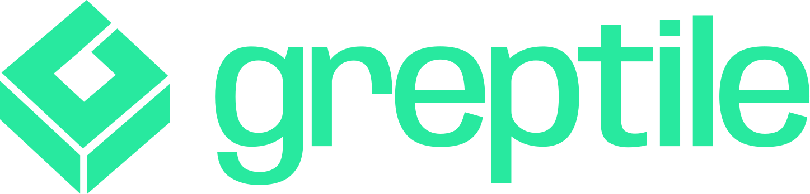
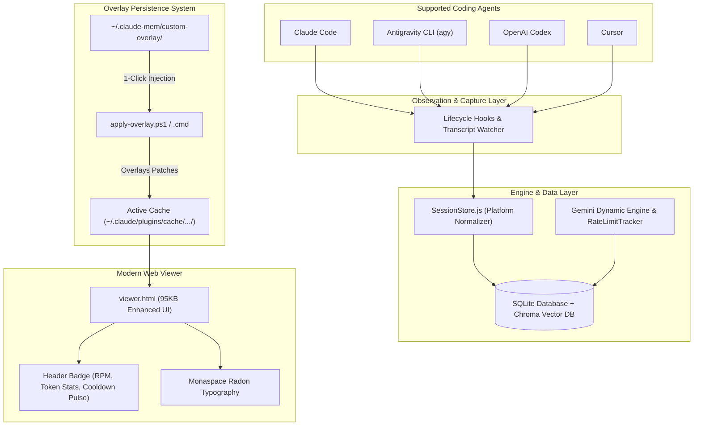

<h1 align="center">
  <br>
  <a href="https://github.com/thedotmack/claude-mem">
    <picture>
      <source media="(prefers-color-scheme: dark)" srcset="docs/public/claude-mem-logo-for-dark-mode.webp">
      <source media="(prefers-color-scheme: light)" srcset="docs/public/claude-mem-logo-for-light-mode.webp">
      
    </picture>
  </a>
</h1>

<p align="center">
  
  &nbsp;&nbsp;&nbsp;
  
  &nbsp;&nbsp;&nbsp;
  
</p>

<p align="center">
  <a href="docs/i18n/README.zh.md">🇨🇳 中文</a> •
  <a href="docs/i18n/README.zh-tw.md">🇹🇼 繁體中文</a> •
  <a href="docs/i18n/README.ja.md">🇯🇵 日本語</a> •
  <a href="docs/i18n/README.pt.md">🇵🇹 Português</a> •
  <a href="docs/i18n/README.pt-br.md">🇧🇷 Português</a> •
  <a href="docs/i18n/README.ko.md">🇰🇷 한국어</a> •
  <a href="docs/i18n/README.es.md">🇪🇸 Español</a> •
  <a href="docs/i18n/README.de.md">🇩🇪 Deutsch</a> •
  <a href="docs/i18n/README.fr.md">🇫🇷 Français</a> •
  <a href="docs/i18n/README.he.md">🇮🇱 עברית</a> •
  <a href="docs/i18n/README.ar.md">🇸🇦 العربية</a> •
  <a href="docs/i18n/README.ru.md">🇷🇺 Русский</a> •
  <a href="docs/i18n/README.pl.md">🇵🇱 Polski</a> •
  <a href="docs/i18n/README.cs.md">🇨🇿 Čeština</a> •
  <a href="docs/i18n/README.nl.md">🇳🇱 Nederlands</a> •
  <a href="docs/i18n/README.tr.md">🇹🇷 Türkçe</a> •
  <a href="docs/i18n/README.uk.md">🇺🇦 Українська</a> •
  <a href="docs/i18n/README.vi.md">🇻🇳 Tiếng Việt</a> •
  <a href="docs/i18n/README.tl.md">🇵🇭 Tagalog</a> •
  <a href="docs/i18n/README.id.md">🇮🇩 Indonesia</a> •
  <a href="docs/i18n/README.th.md">🇹🇭 ไทย</a> •
  <a href="docs/i18n/README.hi.md">🇮🇳 हिन्दी</a> •
  <a href="docs/i18n/README.bn.md">🇧🇩 বাংলা</a> •
  <a href="docs/i18n/README.ur.md">🇵🇰 اردو</a> •
  <a href="docs/i18n/README.ro.md">🇷🇴 Română</a> •
  <a href="docs/i18n/README.sv.md">🇸🇪 Svenska</a> •
  <a href="docs/i18n/README.it.md">🇮🇹 Italiano</a> •
  <a href="docs/i18n/README.el.md">🇬🇷 Ελληνικά</a> •
  <a href="docs/i18n/README.hu.md">🇭🇺 Magyar</a> •
  <a href="docs/i18n/README.fi.md">🇫🇮 Suomi</a> •
  <a href="docs/i18n/README.da.md">🇩🇰 Dansk</a> •
  <a href="docs/i18n/README.no.md">🇳🇴 Norsk</a>
</p>

<h4 align="center">Persistent memory compression system built for <a href="https://claude.com/claude-code" target="_blank">Claude Code</a>.</h4>

<p align="center">
  <a href="LICENSE">
    
  </a>
  <a href="package.json">
    
  </a>
  <a href="package.json">
    
  </a>
  <a href="https://github.com/thedotmack/awesome-claude-code">
    
  </a>
</p>

<p align="center">
  <a href="https://trendshift.io/repositories/15496" target="_blank">
    <picture>
      <source media="(prefers-color-scheme: dark)" srcset="https://raw.githubusercontent.com/thedotmack/claude-mem/main/docs/public/trendshift-badge-dark.svg">
      <source media="(prefers-color-scheme: light)" srcset="https://raw.githubusercontent.com/thedotmack/claude-mem/main/docs/public/trendshift-badge.svg">
      
    </picture>
  </a>
</p>

<br>

<table align="center">
  <tr>
    <td align="center">
      <a href="https://github.com/thedotmack/claude-mem">
        <picture>
          
        </picture>
      </a>
    </td>
    <td align="center">
      <a href="https://www.star-history.com/#thedotmack/claude-mem&Date">
        <picture>
          <source
            media="(prefers-color-scheme: dark)"
            srcset="https://api.star-history.com/image?repos=thedotmack/claude-mem&type=date&theme=dark&legend=top-left"
          />
          <source
            media="(prefers-color-scheme: light)"
            srcset="https://api.star-history.com/image?repos=thedotmack/claude-mem&type=date&legend=top-left"
          />
          
        </picture>
      </a>
    </td>
  </tr>
</table>

<p align="center">
  <a href="#-enhanced-fork-overview">Fork Overview</a> •
  <a href="#-fork-adjustments--features">Fork Features</a> •
  <a href="#-installation--setup-guide">Installation</a> •
  <a href="#-system-architecture">Architecture</a> •
  <a href="#-overlay-automation--update-immunity">Overlay Automation</a> •
  <a href="#quick-start">Upstream Quick Start</a> •
  <a href="#how-it-works">How It Works</a> •
  <a href="#mcp-search-tools">Search Tools</a> •
  <a href="#configuration">Configuration</a> •
  <a href="#troubleshooting">Troubleshooting</a>
</p>

<p align="center">
  Claude-Mem seamlessly preserves context across sessions by automatically capturing tool usage observations, generating semantic summaries, and making them available to future sessions. This enables Claude to maintain continuity of knowledge about projects even after sessions end or reconnect.
</p>

---

## ⚡ Enhanced Fork: Gemini Dynamic Engine & Antigravity Edition

> **A custom fork engineered for multi-agent workflows, native Antigravity CLI (`agy`) support, intelligent Gemini Rate-Limiting & Quota Management, and zero-downtime auto-update overlay immunity.**

<p align="center">
  
  
  
</p>

---

### 🌟 Key Fork Adjustments & Features

#### 1. 🧠 Gemini Dynamic Engine & Adaptive Rate Limiter
- **Header Status Badge:** Interactive badge in the Web Viewer header displaying current active model, live RPM limits, token consumption, and dynamic cooldown statuses.
- **Visual Cooldown Indicator (`is-paused`):** Pulsating visual indicator in the UI during `quota_exhausted` states with precise countdown timer until resume.
- **Fail-Safe Observation Queue:** When Google Gemini rate limits are hit, observations are preserved safely in an in-memory & SQLite buffer without dropping events or crashing the worker.
- **Cascading Failure Mitigation:** Intelligent exponential backoff preventing API hammering during upstream provider quota limits.

#### 2. 🪐 First-Class Antigravity CLI (`agy`) Integration
- **Platform Recognition in `SessionStore.js`:** Native normalization and detection of `antigravity-cli` and `agy` alongside Claude, Codex, and Cursor.
- **Dedicated Tag Styles & Visual Accents:** Distinct visual badges (`.source-antigravity-cli`) with modern sky-blue accents in both light and dark modes.
- **Cross-Agent Memory Context:** Seamlessly preserves and surfaces tool observations across Claude Code, Antigravity CLI, and Codex within the same project.

#### 3. 🛡️ Custom Overlay Architecture (Auto-Update Immunity)
Claude Code's plugin manager automatically wipes cache folders (`~/.claude/plugins/cache/thedotmack/claude-mem/<version>`) when upstream releases new versions. This fork solves that with a **persistent overlay system**:
- **Persistent Overlay Store:** Custom files, typography, and SQLite patches are stored in `~/.claude-mem/custom-overlay/`.
- **1-Click Restore Scripts:**
  - `apply-overlay.cmd` (Windows double-click launcher)
  - `apply-overlay.ps1` (Automated PowerShell script with auto-detection of active version from `installed_plugins.json`)
- **Safety Pre-Backups:** Automatically backs up clean upstream files to `.backup-before-overlay` before injecting patches.

#### 4. 🎨 Modernized Web Viewer UI
- **Refined Typography:** Bundled with `Monaspace Radon` custom fonts for optimal legibility of code snippets and memory diffs.
- **Enhanced Responsive Layout:** Redesigned responsive grid accommodating side-by-side terminal logs, timeline search, and live observation feeds.
- **Optimized Dark Mode:** Contrast-tuned color palette adhering to modern IDE themes.

---

### 📦 Installation & Setup Guide

#### Option A: Quick Install via 1-Click Custom Overlay (Recommended)
If you already have Claude-Mem installed or want to stay compatible with upstream releases:
1. Ensure the overlay files exist in `~/.claude-mem/custom-overlay/`.
2. Run the restore script anytime after an update:
   ```cmd
   # Via Command Prompt / Explorer:
   C:\Users\<User>\.claude-mem\custom-overlay\apply-overlay.cmd
   ```
   Or via PowerShell:
   ```powershell
   powershell.exe -ExecutionPolicy Bypass -File "C:\Users\<User>\.claude-mem\custom-overlay\apply-overlay.ps1"
   ```
3. The script automatically detects the active installed version in `installed_plugins.json`, creates a backup, and re-injects the custom interface and Antigravity drivers.

#### Option B: Installing This Fork into Claude Code Marketplace
To point Claude Code directly to this fork:
1. Clone this repository into your marketplaces folder or point `known_marketplaces.json`:
   ```json
   {
     "thedotmack": {
       "source": {
         "source": "github",
         "repo": "<your-github-username>/claude-mem"
       },
       "installLocation": "C:\\Users\\<User>\\.claude\\plugins\\marketplaces\\thedotmack",
       "autoUpdate": true
     }
   }
   ```
2. In Claude Code, install or refresh:
   ```bash
   /plugin marketplace update
   /plugin install claude-mem
   ```

#### Option C: Antigravity CLI (`agy`) Setup
To use Claude-Mem inside Antigravity CLI:
1. Register the MCP server in your Antigravity configuration (`~/.gemini/antigravity-cli/mcp/claude-mem/` or `settings.json`):
   ```json
   {
     "mcpServers": {
       "claude-mem": {
         "command": "node",
         "args": [
           "C:/Users/<User>/.claude/plugins/cache/thedotmack/claude-mem/<active-version>/scripts/mcp-server.cjs"
         ]
       }
     }
   }
   ```
2. Observations from Antigravity sessions will automatically be recorded with `source: antigravity-cli` and appear in the Web Viewer.

---

### 🏗️ System Architecture



---

### ⚙️ Configuration Reference

| Environment Variable / Setting | Description | Default |
|--------------------------------|-------------|---------|
| `GEMINI_API_KEY` | Google Gemini API key for observation extraction | Read from environment |
| `CLAUDE_MEM_MODE` | Active workflow mode and language (e.g. `code`, `code--zh`, `code--pt-br`) | `code` |
| `CLAUDE_MEM_WORKER_PORT` | HTTP port for worker service & web viewer | `37777` |
| `CLAUDE_MEM_RATE_LIMIT_BACKOFF` | Automatic backoff multiplier during cooldowns | `1.5` |

---

### ❓ Troubleshooting & Cooldown FAQ

- **Why is the Web Viewer badge showing "Paused" with a pulsing animation?**  
  This indicates a temporary `quota_exhausted` cooldown on your AI provider (e.g., Gemini API free tier rate limits).  
  > **Important:** Do **NOT** restart the worker service. Restarting resets the exponential backoff counter and sends redundant requests. Incoming observations stay safely queued and will automatically be written as soon as the timer expires.

- **Claude Code updated and my custom UI disappeared!**  
  Simply run `apply-overlay.cmd` (or `apply-overlay.ps1`) located at `~/.claude-mem/custom-overlay/`. It will restore all enhancements in seconds.

- **How do I check worker health?**  
  Open `http://127.0.0.1:37777/api/gemini/status` in your browser or run `curl http://127.0.0.1:37777/api/gemini/status`.

---

## Quick Start

Install claude-mem for Grok Bot:

```bash
npx claude-mem install --ide grok-bot
```

Grok Bot has no host hooks, so we watch the chat log files. Default is CMEM Pro, the hosted memory. Local observer is opt-in: `--provider host`. Installing this plugin does not install Cursor.

**Awareness push pilot (LFG + Orifice):** needle observations (`decision`, `bugfix`, `security_alert`, `sensitive`) are appended as dated `- YYYY-MM-DD [awareness] …` lines into that bot's `memory/log/YYYY-MM.md`. Grok Bot already re-reads the log from disk. This does not write `profile.md`, user-memory, or project memory. Disable with `CLAUDE_MEM_GROK_BOT_AWARENESS_ENABLED=false`.

Install with a single command:

```bash
npx claude-mem install
```

The installer sets everything up first, then asks you to sign in to claude-mem in your browser (email magic link — no card required). Signing in provisions a memory key for your account and unlocks the **claude-mem observer**: memory that runs off-plan, free for your first 30 days, so you get up to 100% more usage from your plan. When the free trial ends, memory automatically falls back to your Anthropic plan unless you subscribe. After sign-in you pick your memory provider — the claude-mem observer, your own OpenRouter or Gemini key, or your Anthropic plan.

Prefer to skip the sign-in? Pass an explicit `--provider` flag, set `CLAUDE_MEM_ONLINE_OPTIN=false`, or run in CI/non-interactive shells — the installer completes without any account interaction.

Or install for OpenCode:

```bash
npx claude-mem install --ide opencode
```

Or install for Antigravity CLI ([setup guide](https://docs.claude-mem.ai/antigravity-cli/setup)):

```bash
npx claude-mem install --ide antigravity
```

Or install from the plugin marketplace inside Claude Code:

```bash
/plugin marketplace add thedotmack/claude-mem

/plugin install claude-mem
```

Restart Claude Code. Context from previous sessions will automatically appear in new sessions.

> **Note:** Claude-Mem is also published on npm, but `npm install -g claude-mem` installs the **SDK/library only** — it does not register the plugin hooks or set up the worker service. Always install via `npx claude-mem install` or the `/plugin` commands above.

### 🦞 OpenClaw Gateway

Install claude-mem as a persistent memory plugin on [OpenClaw](https://openclaw.ai) gateways with a single command:

```bash
curl -fsSL https://install.cmem.ai/openclaw.sh | bash
```

The installer handles dependencies, plugin setup, AI provider configuration, worker startup, and optional real-time observation feeds to Telegram, Discord, Slack, and more. See the [OpenClaw Integration Guide](https://docs.claude-mem.ai/openclaw-integration) for details.

**Key Features:**

- 🧠 **Persistent Memory** - Context survives across sessions
- 📊 **Progressive Disclosure** - Layered memory retrieval with token cost visibility
- 🔍 **Skill-Based Search** - Query your project history with mem-search skill
- 🖥️ **Web Viewer UI** - Real-time memory stream at the worker URL printed on startup
- 💻 **Claude Desktop Skill** - Search memory from Claude Desktop conversations
- 🔒 **Privacy Control** - Use `<private>` tags to exclude sensitive content from storage
- ⚙️ **Context Configuration** - Fine-grained control over what context gets injected
- 🤖 **Automatic Operation** - No manual intervention required
- 🔗 **Citations** - Reference past observations with IDs through the worker API or view all in the web viewer

---

## Documentation

📚 **[View Full Documentation](https://docs.claude-mem.ai/)** - Browse on official website

### Getting Started

- **[Installation Guide](https://docs.claude-mem.ai/installation)** - Quick start & advanced installation
- **[Usage Guide](https://docs.claude-mem.ai/usage/getting-started)** - How Claude-Mem works automatically
- **[Search Tools](https://docs.claude-mem.ai/usage/search-tools)** - Query your project history with natural language
- **[Cloud Sync](https://docs.claude-mem.ai/cloud-sync)** - Back up your memories to cmem.ai — no daemon, the worker syncs on write

### Best Practices

- **[Context Engineering](https://docs.claude-mem.ai/context-engineering)** - AI agent context optimization principles
- **[Progressive Disclosure](https://docs.claude-mem.ai/progressive-disclosure)** - Philosophy behind Claude-Mem's context priming strategy

### Architecture

- **[Overview](https://docs.claude-mem.ai/architecture/overview)** - System components & data flow
- **[Architecture Evolution](https://docs.claude-mem.ai/architecture-evolution)** - The journey from v3 to v5
- **[Hooks Architecture](https://docs.claude-mem.ai/hooks-architecture)** - How Claude-Mem uses lifecycle hooks
- **[Hooks Reference](https://docs.claude-mem.ai/architecture/hooks)** - 7 hook scripts explained
- **[Worker Service](https://docs.claude-mem.ai/architecture/worker-service)** - HTTP API & Bun management
- **[Database](https://docs.claude-mem.ai/architecture/database)** - SQLite schema & FTS5 search
- **[Search Architecture](https://docs.claude-mem.ai/architecture/search-architecture)** - Hybrid search with Chroma vector database

### Configuration & Development

- **[Configuration](https://docs.claude-mem.ai/configuration)** - Environment variables & settings
- **[Development](https://docs.claude-mem.ai/development)** - Building, testing, contributing
- **[Release Branches](https://docs.claude-mem.ai/branches)** - Stable, core-dev, and community-edge branch flow
- **[Troubleshooting](https://docs.claude-mem.ai/troubleshooting)** - Common issues & solutions

---

## How It Works

**Core Components:**

1. **5 Lifecycle Hooks** - SessionStart, UserPromptSubmit, PostToolUse, Stop, SessionEnd (6 hook scripts)
2. **Smart Install** - Cached dependency checker (pre-hook script, not a lifecycle hook)
3. **Worker Service** - Local HTTP API with web viewer UI and search endpoints, managed by Bun
4. **SQLite Database** - Stores sessions, observations, summaries
5. **mem-search Skill** - Natural language queries with progressive disclosure
6. **Chroma Vector Database** - Hybrid semantic + keyword search for intelligent context retrieval

See [Architecture Overview](https://docs.claude-mem.ai/architecture/overview) for details.

---

## MCP Search Tools

Claude-Mem provides intelligent memory search through **4 MCP tools** following a token-efficient **3-layer workflow pattern**:

**The 3-Layer Workflow:**

1. **`search`** - Get compact index with IDs (~50-100 tokens/result)
2. **`timeline`** - Get chronological context around interesting results
3. **`get_observations`** - Fetch full details ONLY for filtered IDs (~500-1,000 tokens/result)

**How It Works:**
- Claude uses MCP tools to search your memory
- Start with `search` to get an index of results
- Use `timeline` to see what was happening around specific observations
- Use `get_observations` to fetch full details for relevant IDs
- **~10x token savings** by filtering before fetching details

**Available MCP Tools:**

1. **`search`** - Search memory index with full-text queries, filters by type/date/project
2. **`timeline`** - Get chronological context around a specific observation or query
3. **`get_observations`** - Fetch full observation details by IDs (always batch multiple IDs)

**Example Usage:**

```typescript
// Step 1: Search for index
search(query="authentication bug", type="bugfix", limit=10)

// Step 2: Review index, identify relevant IDs (e.g., #123, #456)

// Step 3: Fetch full details
get_observations(ids=[123, 456])
```

See [Search Tools Guide](https://docs.claude-mem.ai/usage/search-tools) for detailed examples.

---

## Release Branches

Stable releases ship from `main` and are published to npm. `core-dev` and
`community-edge` are source-run branches for early reliability fixes and
community integrations. See **[Release Branches](https://docs.claude-mem.ai/branches)**
for the branch flow and non-stable run instructions.

---

## System Requirements

- **Node.js**: 20.0.0 or higher
- **Claude Code**: Latest version with plugin support
- **Bun**: JavaScript runtime and process manager (auto-installed if missing)
- **uv**: Python package manager for vector search (auto-installed if missing)
- **SQLite 3**: For persistent storage (bundled)

---
### Windows Setup Notes

If you see an error like:

```powershell
npm : The term 'npm' is not recognized as the name of a cmdlet
```

Make sure Node.js and npm are installed and added to your PATH. Download the latest Node.js installer from https://nodejs.org and restart your terminal after installation.

---

## Configuration

Settings are managed in `~/.claude-mem/settings.json` (auto-created with defaults on first run). Configure AI model, worker port, data directory, log level, and context injection settings.

See the **[Configuration Guide](https://docs.claude-mem.ai/configuration)** for all available settings and examples.

### Mode & Language Configuration

Claude-Mem supports multiple workflow modes and languages via the `CLAUDE_MEM_MODE` setting.

This option controls both:
- The workflow behavior (e.g. code, chill, investigation)
- The language used in generated observations

#### How to Configure

Edit your settings file at `~/.claude-mem/settings.json`:

```json
{
  "CLAUDE_MEM_MODE": "code--zh"
}
```

Modes are defined in `plugin/modes/`. To see all available modes locally:

```bash
ls ~/.claude/plugins/marketplaces/thedotmack/plugin/modes/
```

#### Available Modes

| Mode | Description |
|------------|-------------------------|
| `code` | Default English mode |
| `code--zh` | Simplified Chinese mode |
| `code--ja` | Japanese mode |

Language-specific modes follow the pattern `code--[lang]` where `[lang]` is the ISO 639-1 language code (e.g., `zh` for Chinese, `ja` for Japanese, `es` for Spanish).

> Note: `code--zh` (Simplified Chinese) is already built-in — no additional installation or plugin update is required.

#### After Changing Mode

Restart Claude Code to apply the new mode configuration.
---

## Development

See the **[Development Guide](https://docs.claude-mem.ai/development)** for build instructions, testing, and contribution workflow.

---

## Troubleshooting

If experiencing issues, describe the problem to Claude and the troubleshoot skill will automatically diagnose and provide fixes.

See the **[Troubleshooting Guide](https://docs.claude-mem.ai/troubleshooting)** for common issues and solutions.

---

## Bug Reports

Create comprehensive bug reports with the automated generator:

```bash
cd ~/.claude/plugins/marketplaces/thedotmack
npm run bug-report
```

## Contributing

Contributions are welcome! Please:

1. Fork the repository
2. Create a feature branch
3. Make your changes with tests
4. Update documentation
5. Submit a Pull Request

Claude-Mem ships from three branches: `main` (stable), `core-dev`, and
`community-edge`. Only `main` is published to npm; the others are run from
source. See [Release Branches](https://docs.claude-mem.ai/branches) for the
strategy and local run instructions.

See [Development Guide](https://docs.claude-mem.ai/development) for contribution workflow.

---

## License

Claude-Mem is licensed under the Apache License 2.0.

We chose Apache-2.0 because durable agentic memory should be easy to embed in
developer tools, local agents, MCP servers, enterprise systems, robotics stacks,
and production agent harnesses.

See the [LICENSE](LICENSE) file for full details. See [docs/license.md](docs/license.md)
and [docs/ip-boundary.md](docs/ip-boundary.md) for licensing scope and the
open/commercial boundary.

**Note on Ragtime**: The `ragtime/` directory is licensed under the **Apache License 2.0**. See [ragtime/LICENSE](ragtime/LICENSE) for details.

---

## Support

- **Documentation**: [docs/](docs/)
- **Issues**: [GitHub Issues](https://github.com/thedotmack/claude-mem/issues)
- **Repository**: [github.com/thedotmack/claude-mem](https://github.com/thedotmack/claude-mem)
- **Official X Account**: [@Claude_Memory](https://x.com/Claude_Memory)
- **Official Discord**: [Join Discord](https://discord.com/invite/J4wttp9vDu)
- **Author**: Alex Newman ([@thedotmack](https://github.com/thedotmack))

---

**Built with Claude Agent SDK** | **Works with Claude Code** | **Made with TypeScript**

---

### What About CMEM?

CMEM is a token created by a 3rd party but officially embraced by the creator of Claude-Mem (Alex Newman, @thedotmack). The token acts as a community catalyst for growth and a vehicle for bringing CMEM to the developers and knowledge workers that need it most.

Official BASE CA: 0x76b1967eec0ccaeb001bbbb2b40dc4badba31ba3
