<!-- /autoplan restore point: /Users/alexnewman/.gstack/projects/thedotmack-claude-mem/claude-mem-system-redesign-flowchart-autoplan-restore-20260424-192446.md -->

# claude-mem — Clean-Path Redesign Flowchart

A ground-up redesign of every system, drawn as it **should be**, not as it is.
Anchors the PATHFINDER-2026-04-22 rewrite.

## Principles (the whole thing obeys these)

1. No recovery code for fixable failures
2. Fail-fast over grace-degrade
3. UNIQUE constraints over dedup windows
4. Event-driven over polling
5. OS-supervised process groups over hand-rolled reapers
6. One helper, N callers
7. Delete code in the same PR it becomes unused

Anti-patterns that do not exist in this design:
`setInterval` recovery loops, `coerce*/recover*/heal*/repair*/reap*/killOrphans*`,
try/catch returning fallback, schema columns whose only reader is a recovery query,
strategy classes where a config object would do, HTTP endpoints for manual repair.

---

## 0. Top-level system map

```mermaid
flowchart LR
    subgraph Edge["Edge — user's Claude Code session"]
        CC[Claude Code harness]
        HOOKS[5 lifecycle hooks<br/>TS→ESM, single binary each]
        MCP[MCP server<br/>tool surface]
        SKILLS[Skills<br/>mem-search, make-plan, do, ...]
    end

    subgraph Boundary["Boundary — privacy & shape"]
        TAGSTRIP[Tag stripping<br/>single regex, single call site]
        PARSE[parseAgentXml<br/>discriminated union: valid | invalid]
    end

    subgraph Core["Core — long-lived localhost:37777"]
        API[Worker HTTP API<br/>Express, thin routes]
        CLAIM[Self-healing claim<br/>WHERE pid NOT IN live_pids]
        SDK[Claude Agent SDK pool<br/>detached process groups]
        RENDER[renderObservations<br/>one fn, RenderStrategy config]
        SEARCH[SearchOrchestrator<br/>one read path]
    end

    subgraph Store["Store — single source of truth"]
        DB[(SQLite<br/>~/.claude-mem/claude-mem.db<br/>UNIQUE constraints enforced)]
        CHROMA[(Chroma<br/>vectors, upsert-native)]
    end

    subgraph Sup["Supervisor — OS-level"]
        SPAWN[lazy spawn on hook<br/>detached + unref]
        PG[process groups<br/>pgid = proc.pid]
    end

    subgraph UI["UI"]
        VIEWER[React viewer<br/>localhost:37777/viewer]
    end

    CC --> HOOKS
    HOOKS --> TAGSTRIP
    TAGSTRIP --> API
    HOOKS -->|spawn-if-dead| SPAWN
    SPAWN --> API
    SPAWN --> PG

    MCP --> API
    SKILLS --> MCP
    SKILLS --> API

    API --> DB
    API --> CLAIM
    CLAIM --> SDK
    SDK --> PG
    SDK --> PARSE
    PARSE --> DB
    DB --> CHROMA

    API --> SEARCH
    SEARCH --> DB
    SEARCH --> CHROMA
    SEARCH --> RENDER
    RENDER --> API

    VIEWER --> API
```

---

## 1. Write path — capture to persisted observation

One inbound path. One parser. One writer. No coercion, no in-memory pairing, no dedup window.

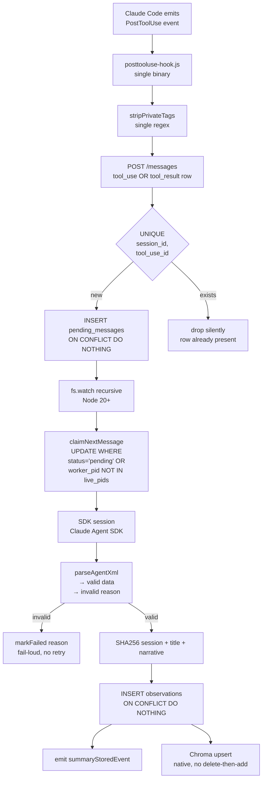

Everything deleted from today:
`pendingTools` Map, `DEDUP_WINDOW_MS`, `findDuplicateObservation`,
`coerceObservationToSummary`, circuit breaker counters,
5-second `setInterval` rescan, `TranscriptParser` class, `observationHandler.execute()` loopback,
`clearFailedOlderThan`, `repairMalformedSchema`.

---

## 2. Read path — search + context injection

One search entry point. One renderer. One recency constant.

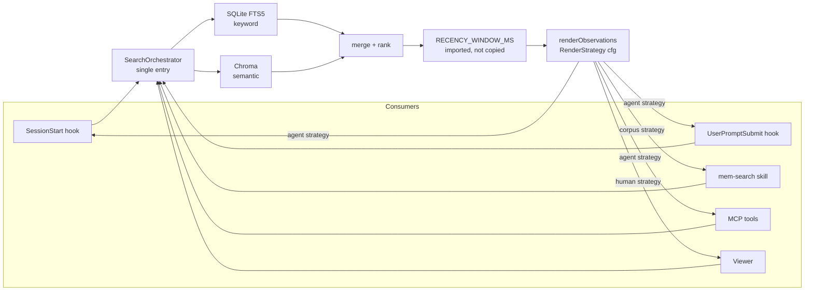

`AgentFormatter`, `HumanFormatter`, `ResultFormatter`, `CorpusRenderer` are deleted.
`SearchManager.findByConcept/findByFile/findByType` deleted — all routes go through `SearchOrchestrator`.
The seven hand-rolled recency filters collapse to one import.

---

## 3. Process lifecycle — OS process groups, no reapers

No supervisor polling. No orphan sweeper. No idle eviction. No fallback agent chain.

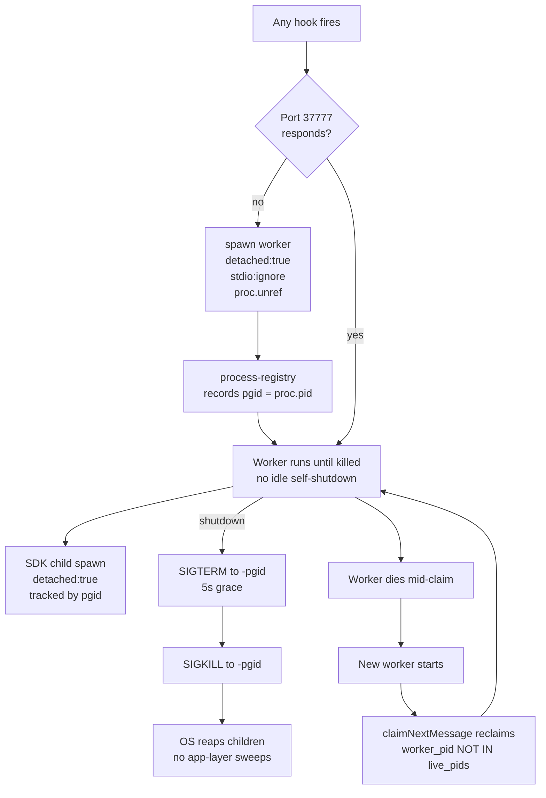

Deleted: `startOrphanReaperInterval`, `staleSessionReaperInterval`,
`killSystemOrphans`, `killIdleDaemonChildren`, `reapOrphanedProcesses`,
`reapStaleSessions`, `abandonedTimer`, `SessionManager.evictIdlestSession`,
Gemini→OpenRouter fallback chain, worker idle self-shutdown,
duplicate `src/services/worker/ProcessRegistry.ts`.

---

## 4. Storage — schema shape (logical)

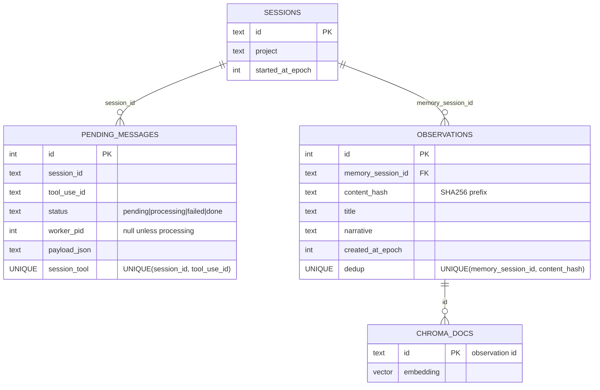

No `started_processing_at_epoch` column. No ON UPDATE CASCADE rewriting history.
Dedup is a database invariant, not a 30-second window.

---

## 5. Hook surface — thin, typed, tag-stripped, fail-fast

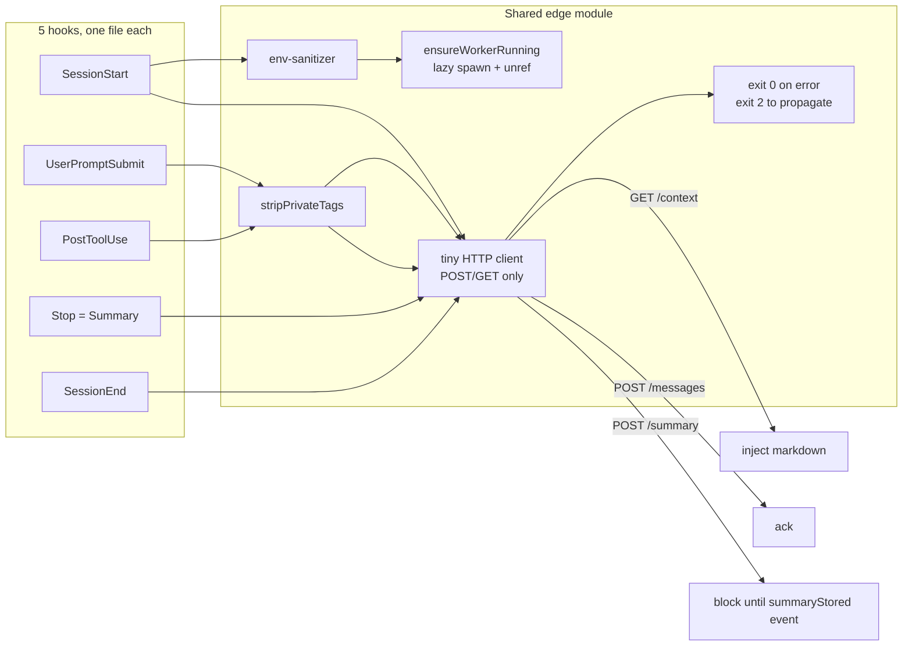

No hook contains business logic. No hook imports the SDK. No hook talks to SQLite directly.

---

## 6. API surface — worker endpoints

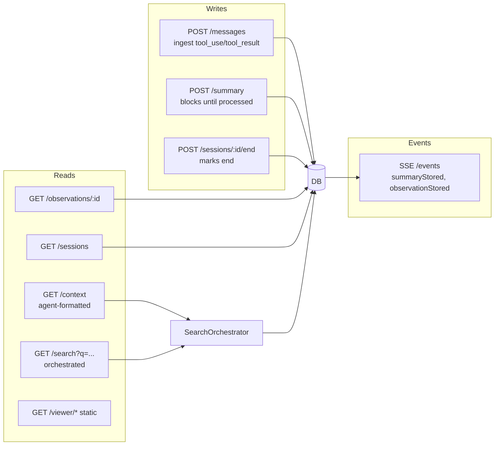

Every route is a thin handler → one service call → one DB/Chroma round-trip.
No diagnostic endpoints. No manual-repair endpoints. No admin endpoints.

---

## 7. MCP + Skills — the user-visible layer

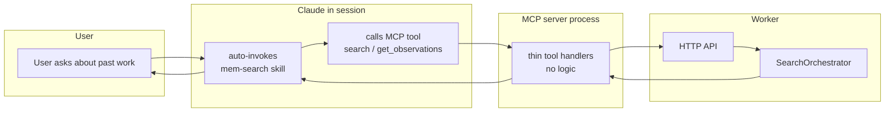

MCP server holds zero business logic. It is a protocol adapter.
Skills are markdown instructions plus MCP calls. No skill reads SQLite directly.

---

## 8. Install + bootstrap

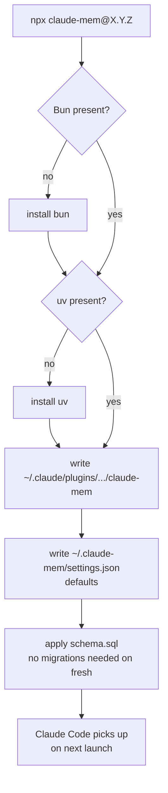

Schema is regenerated, migrations are a fresh linear sequence with `DEFAULT_SCHEMA_VERSION`.
No `repairMalformedSchema`. No no-op migrations. Fresh installs never run recovery code.

---

## 9. The deletion list (what the redesign removes)

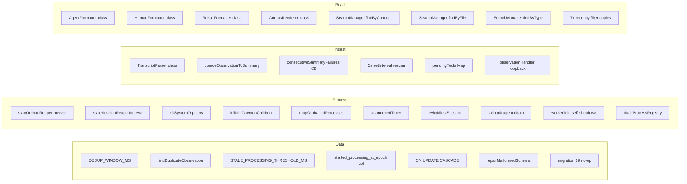

Net target: **~3,800 LoC removed**, zero new features, zero recovery code,
one helper per concern, one path per flow.

---

## 10. The invariant diagram — what must always hold

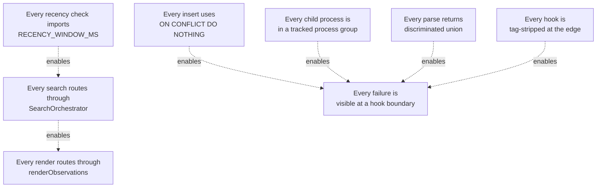

If any invariant is violated, the design is violated. The rubric is the six anti-pattern guards.

---

## 11. Candidate tech evaluation

Decisions against PATHFINDER principles and the deletion-first bias.

| Tech | Role | Verdict | Why |
|---|---|---|---|
| **Turso** (`@tursodatabase/database`) | SQLite + vector store | **Adopt, staged** | SQLite-compatible file format, native vector column, `BEGIN CONCURRENT` MVCC, io_uring, npm binding. Kills Chroma + uv + chroma-mcp subtree. BETA + no ANN yet → flag-gate until ANN lands. |
| **Pup** | Process manager | Reject | Deno runtime → third runtime we don't need. Telemetry is Deno-client-only. System-service model fights lazy-spawn-on-hook. Violates Principle 5 (externalised reaper). |
| **PM2** | Process manager | Reject | Pins to Node, needs user-managed daemon. Nothing beyond `detached + unref + pgid kill`. |
| **bm2** (Bun-native PM2) | Process manager | Reject | Bun-native so no extra runtime, but same structural error: daemon-supervising-a-daemon. "Auto-restart on failure" is the Principle 1 anti-pattern. Everything it does = 15 lines of `Bun.spawn + unref + kill(-pgid)`. Single-author, early-stage, no binary. |
| **nodemon / ts-node-dev** | Dev restart | Keep (dev-only) | Not runtime. Fine in `scripts`. |
| **concurrently** | Dev task runner | Keep (dev-only) | Already used for parallel build/worker dev. |
| **Node Cluster API** | Horizontal scale | Skip | Bottleneck is Anthropic API, not CPU. Would add SQLite write contention. Revisit only after Turso MVCC. |
| **Bun** (runtime) | Worker runtime | Keep | Already the core runtime; no reason to change. |

## 12. The Turso migration slot

```mermaid
flowchart LR
    subgraph Today["Today"]
        BSQ[better-sqlite3<br/>~/.claude-mem/claude-mem.db]
        CHR[Chroma via uvx<br/>python subprocess<br/>separate vector store]
        SYNC[ChromaSync.ts<br/>delete-then-add bridge]
        UV[uv runtime<br/>onnxruntime + protobuf + httpcore]
    end

    subgraph Phase1["Phase 1 — collapse to one store"]
        TURSO[@tursodatabase/database<br/>vectors as column]
        EXACT[exact vector search<br/>scan until ANN ships]
    end

    subgraph Phase2["Phase 2 — ANN lands"]
        ANN[Turso vector index<br/>approximate KNN]
        CONCURRENT[BEGIN CONCURRENT<br/>worker/reader MVCC]
    end

    Today -->|delete ChromaSync, ChromaMcpManager, uv dep| Phase1
    Phase1 -->|no API change| Phase2
```

Deletions unlocked by the move:
- `src/services/sync/ChromaSync.ts`
- `src/services/sync/ChromaMcpManager.ts`
- `CHROMA_SYNC_FALLBACK_ON_CONFLICT` flag and the delete-then-add fallback
- `uv` install step in the bootstrap flow (§8 of this doc)
- The chroma-mcp onnxruntime / protobuf / httpcore failure surfaces (obs 72992, 72995, 72998)

Invariant preserved: **one store, one query path, one backup artifact.**

## 13. Process supervision — honest state (revised)

**Two corrections to earlier drafts of this doc:**

1. **The worker is always-on**, not just when Claude Code is running. The viewer at `localhost:37777` requires the worker up 24/7. Lazy-spawn-on-hook is the wrong model — it fits a hypothetical "only-when-coding" workload that isn't ours.
2. **Use a library, don't hand-roll.** Process managers have mature programmatic APIs that embed in our bootstrap. The user never types `pm2` anywhere; we call `pm2.connect(); pm2.start({...})` from our own code. That's *less* complexity, not more — we delete our respawn logic and get log rotation, memory-cap restart, and an event bus for free.

### The library choice

| Lib | Runtime | License | Prog API | Verdict |
|---|---|---|---|---|
| **PM2** | Node | MIT (AGPL monitoring) | `pm2.connect()` / `start` / `launchBus` | **Recommended** — mature, daemon survives Claude Code, Bun works in fork mode |
| **bm2** | Bun | **GPL-3.0** | `new BM2(); connect/start/list/logs` | Blocked on GPL, thin maturity |
| **respawn** | Node | MIT | `respawn(cmd, opts)` + events | Simpler fallback — library, not daemon; we keep one small supervisor process |
| **Pup** | Deno | MIT | JSON + REST | Deno runtime blocker |

### Adopted shape — PM2 programmatic

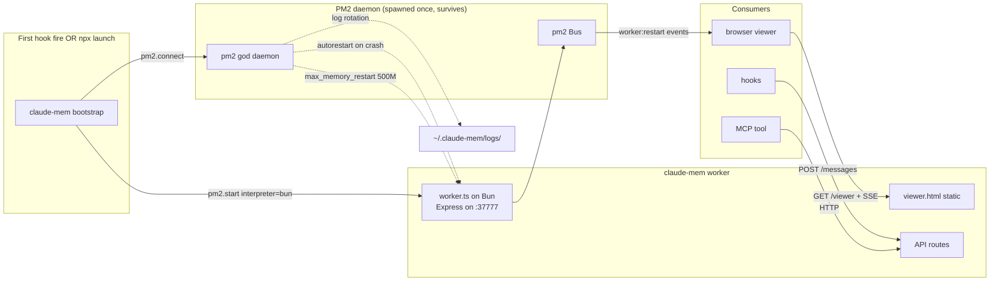

### What we delete when PM2 lands

- `src/supervisor/*` (health-checker, process-registry, shutdown) — PM2 owns all of this
- `ensureWorkerRunning()` port-probe-and-spawn dance
- The planned `respawn` dep (obs 72588) — superseded
- The "transcripts-idle self-exit" — unnecessary, PM2 is always-on by design
- Hand-rolled log file management
- Hook-side retry-after-spawn logic — just fail-loud; PM2 already has the worker back up

### What PM2 gives us that we don't build

- **Crash respawn** with exponential backoff
- **Memory cap restart** (`max_memory_restart: '500M'`)
- **Log rotation** + structured stdout/stderr files
- **Event bus** (`pm2.launchBus()`) → viewer gets worker:restart, worker:online events for free
- **`pm2.describe()`** → `/status` endpoint is a one-liner
- **Boot-time startup** via `pm2 startup` + `pm2 save` (optional; user opt-in)

### Install

PM2 becomes a dependency in `package.json`. Our bootstrap does:

```ts
import pm2 from 'pm2'
import { promisify } from 'node:util'

const connect = promisify(pm2.connect.bind(pm2))
const start   = promisify(pm2.start.bind(pm2))

await connect()
await start({
  script:             resolveWorkerEntryPath(),
  name:               'claude-mem-worker',
  interpreter:        'bun',
  autorestart:        true,
  max_memory_restart: '500M',
  out_file:           path.join(logsDir, 'worker.out'),
  error_file:         path.join(logsDir, 'worker.err'),
  env:                sanitizedEnv,
})
```

That is the whole supervisor. ~12 lines replace the entire `src/supervisor/` tree.

### The fallback if PM2 is rejected on weight grounds

`respawn` (MIT, 257★) embedded in a tiny `supervisor.ts` we spawn once with `{ detached: true, stdio: 'ignore' }; proc.unref()`. The supervisor script:

```ts
import respawn from 'respawn'
const mon = respawn(['bun', workerPath], {
  maxRestarts: -1, sleep: [1000, 5000, 15000], kill: 10000,
  stdio: ['ignore', logOut, logErr],
})
mon.start()
```

Trade: ~50 LoC supervisor we own vs. a Node daemon process we don't. Either is fine. PM2 is the default; respawn is the escape hatch.

**Correction:** earlier drafts of this doc said "Bun.spawn + unref + kill-pgid is the whole supervisor." That is wrong. It covers *orphan cleanup at shutdown*, not live supervision.

### What Bun actually gives you

`Bun.Subprocess`: `pid`, `kill(signal)`, `ref/unref`, `exitCode`, `exited` Promise, `killed`, `signalCode`, `send/disconnect` (IPC), `resourceUsage()` (post-exit only), `[Symbol.asyncDispose]`.

No `pgid`, no restart logic, no live metrics, no log rotation, no boot-time start. Bun's official prod guidance is **systemd on Linux / PM2 on everything else** — both external. Core Bun's community request for a Bun-native PM (discussion #4095) has been open since 2023.

### What a supervisor usually does, and who does it here

| Concern | Generic PM | claude-mem |
|---|---|---|
| Start on boot | systemd/launchd | We don't want this — workload is user-driven |
| Respawn on crash | PM2, systemd | **Hook-triggered** `ensureWorkerRunning()` on next hook fire |
| Mid-session respawn | PM2 watchdog | **Gap today.** Hook that observed failure must retry-after-spawn in-hook |
| Orphan cleanup | OS + PM | `detached: true` + pgid kill at shutdown |
| Log rotation | PM2, journald | Worker writes to `~/.claude-mem/logs/`, viewer reads |
| Metrics | PM2 dashboard | `GET /metrics` on :37777 (feature, not PM concern) |
| Parent-crash cleanup | PM | **Gap today.** Worker should watch transcript-file staleness or session-end signal |

### Why a PM is still wrong for claude-mem

claude-mem's workload only exists while the user is in Claude Code. A 24/7 daemon (systemd / PM2 / bm2) is running idle for the 22 hours a day the user isn't coding. The *hook fire* is the correct start trigger — it means a session is live.

The correction is not "adopt a PM." The correction is **close the two gaps above**:

### Gap 1 — mid-session crash recovery

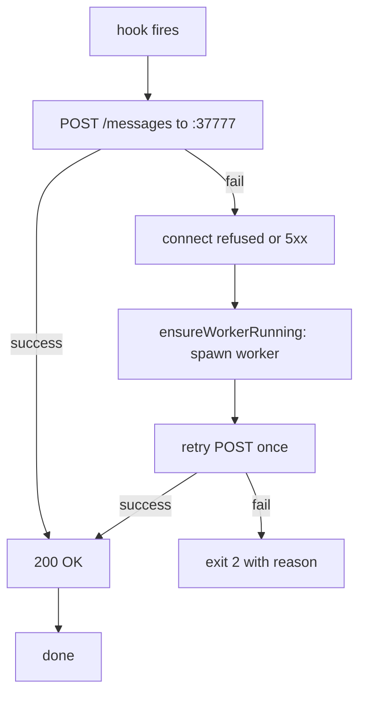

The retry lives **in the failing hook**, not deferred to the next hook. Self-healing claim (Plan 01 Phase 3) handles any rows stranded by the crashed worker.

### Gap 2 — parent-crash cleanup

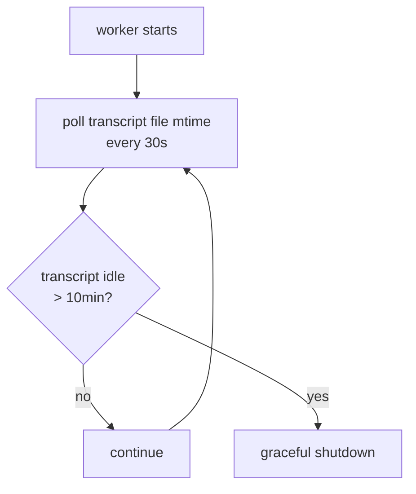

This is ~20 lines. It is not a restart policy, not a PID watchdog, not a systemd unit. It's a file-mtime check: if no Claude Code has written to the transcripts directory in 10 minutes, assume all sessions are dead and exit cleanly. Next hook fire re-spawns.

### The tech decision, reframed

The question isn't "which PM?" The question is "what are we actually missing?" Answer: two narrowly-scoped pieces of logic that belong **in the worker and the hooks**, not in an external daemon:

1. Hook-side retry-after-spawn (closes Gap 1)
2. Worker-side transcript-idle self-exit (closes Gap 2)

Everything a PM would add beyond this — cluster, boot-start, 24/7 supervision, dashboard UI — is solving someone else's problem.

---

# GSTACK REVIEW REPORT

## Phase 1 — CEO Review (Strategy & Scope)

Mode: SELECTIVE EXPANSION via /autoplan. Both dual voices completed and reached **the same critical verdict: pause and re-scope**. Surfacing as a User Challenge to the premise gate.

### CODEX SAYS (CEO — strategy challenge)

| # | Finding | Severity | Evidence |
|---|---|---|---|
| 1 | Plan optimizes for code aesthetics, not market survival | Critical | §0–§1 framing, §9 "zero new features" target. README sells features users buy; plan never connects deletion to install rate, retrieval relevance, or paid conversion. |
| 2 | Strategy ignores Anthropic's native memory threat | Critical | README §48 positions persistent memory; redesign doc never mentions Anthropic. No moat analysis. |
| 3 | The seven principles are dogmatic, contradicted by own §13 | High | Principles 1–4 violated by §13 Gaps 1+2 (recovery code, mtime polling). |
| 4 | §13 is a credibility failure: §11 rejects PM2, §13 adopts PM2, §13 reverses again — **and `docs/public/architecture/pm2-to-bun-migration.mdx` already documents the v7.1.0 (Dec 2025) migration FROM PM2 TO Bun** | Critical | §11:467, §13:521, §13:646; pm2-to-bun-migration.mdx:24 |
| 5 | Solves the wrong "hard problem" first | High | §1–§9 delete plumbing while README's leverage points are install/IDE/search/citations. |
| 6 | Heroic rewrite hidden behind "deletion-first" rhetoric, no governance | Critical | §9 ~3,800 LoC across ingest/read/lifecycle/schema/hooks/API + §12 store migration; no flags, no dual-write, no rollback criteria. |
| 7 | Alternatives section compares tools, not strategies | High | §11 is PM2 vs bm2; missing rewrite vs. incremental refactor vs. bug-fix stabilization vs. Pro-first. |
| 8 | Deleting all diagnostic endpoints is self-sabotage | Medium | §6 "no diagnostic endpoints, no admin endpoints" + §10 "every failure visible at hook boundary" leaves users blind. |
| 9 | Turso is smuggled in as cleanup while adding platform/perf risk | Medium | §12 stages a beta DB with no ANN behind a deletion unlock; bundles substrate change with redesign. |

**Codex verdict:** Strategically upside-down. Internal rewrite for a category Anthropic is absorbing, no moat proof, no rollout model, no stable judgment on supervision.

### CLAUDE SUBAGENT (CEO — strategic independence)

| # | Finding | Severity | Evidence |
|---|---|---|---|
| 1 | Wrong problem to solve — deletion produces zero user value while Pro features and onboarding wait | Critical | §9 explicit "zero new features"; CLAUDE.md mentions Pro features architecture but no revenue path validated |
| 2 | Premises stated as axioms, several false in this environment | High | Principle 2 (fail-fast) breaks at hook→Claude Code boundary; Principle 3 (UNIQUE constraints) assumes tool_use_id stable across retries — unproven |
| 3 | 6-month regret: Anthropic ships native memory, redesign churned 8–12 weeks, hooks regressed because Principle 7 deleted rollback path | Critical | Hooks fire on every tool use → blast radius |
| 4 | Four alternatives not even named | High | Incremental-under-flags, ship-Pro-first, top-3-bug-fixes, add-tests-only |
| 5 | No competitive risk acknowledgement anywhere | Critical | Anthropic `/memorize`, `/memorystatus` already shipped |
| 6 | Scope is 15–25 PRs over 8–12 weeks, plan implies one heroic pass | High | No phasing, no flags, no rollback, no upgrade path for existing DBs |
| 7 | §13 is unresolved: PM2 mid-section, "PM is wrong" at end | Critical | Lines 516–607 vs. 646–697 |
| 8 | Supervisor strategy contradicts itself: "always-on" (520) vs "only when coding" (647) | High | Product decision masquerading as technical |

**Claude subagent verdict:** Pause and re-scope. Engineering manifesto, not a business-ready plan. Risk Q4 has clean plumbing and no users.

### CEO DUAL VOICES — CONSENSUS TABLE

```
═══════════════════════════════════════════════════════════════
  Dimension                                  Claude  Codex  Consensus
  ──────────────────────────────────────────  ──────  ─────  ─────────
  1. Premises valid?                          NO      NO     CONFIRMED
  2. Right problem to solve?                  NO      NO     CONFIRMED
  3. Scope calibration correct?               NO      NO     CONFIRMED
  4. Alternatives sufficiently explored?      NO      NO     CONFIRMED
  5. Competitive/market risks covered?        NO      NO     CONFIRMED
  6. 6-month trajectory sound?                NO      NO     CONFIRMED
═══════════════════════════════════════════════════════════════
6/6 CONFIRMED. Zero disagreements. Both reach the same verdict: pause and re-scope.
```

**This is a USER CHALLENGE per autoplan rules.** Both models independently agree the user's stated direction (ship this redesign now) should change. Per autoplan: never auto-decide a User Challenge — surface to the user.

### What the user said
"Run autoplan against REDESIGN-FLOWCHART.md" — implicit direction: review and execute this plan.

### What both models recommend
**Pause autoplan execution. Re-scope before any further design or engineering review.** The plan as written is solving the wrong problem (purification) for the wrong moment (Anthropic shipped native memory, no Pro revenue validated). Before this plan deserves a full engineering review:

1. Write the **competitive position** paragraph: what does claude-mem do that Anthropic's native `/memorize` won't ship in 12 months?
2. Write a **business-outcome** target line for the redesign: install completion rate, retrieval relevance score, paid-tier conversion — a metric that moves.
3. Resolve **§13 to one decision** (or remove the section entirely until it's an ADR, not a live debate).
4. Acknowledge that the v7.1.0 PM2→Bun migration is already documented (`docs/public/architecture/pm2-to-bun-migration.mdx`) and reverting it requires explicit justification.
5. Add a **phasing/rollback** section: 15–25 PRs over 8–12 weeks, flags per phase, dual-write for ingest, rollback criteria.

### What context we might be missing
- The user may have **already validated** Pro feature demand and is intentionally clearing technical debt before the next push.
- The user may believe the current architecture is **catastrophically unreliable** today and a heroic pass is justified.
- The user may be **explicitly OK** with parallel tracks (redesign + Pro) and the redesign is allocated to one engineer.
- The user may be **building for self** (open source, no commercial pressure) and code quality IS the user value.

### If we're wrong, the cost is
The user spends 30 minutes adding a competitive-position section + phasing plan + §13 ADR, then runs /autoplan again with a tighter premise. Cheap.

### If both models are wrong, the cost of accepting their pushback is
Lost momentum on a redesign the user already committed to. The plan author has been thinking about this for weeks (observation history shows §13 rewritten 4 times). Asking them to "pause and re-scope" risks killing a useful exercise.

### Decision Audit Trail

<!-- AUTONOMOUS DECISION LOG -->

| # | Phase | Decision | Classification | Principle | Rationale | Rejected |
|---|---|---|---|---|---|---|
| 1 | CEO 0.5 | Run BOTH Codex + Claude subagent | Mechanical | P6 | Always run both when available | Skip subagent (would lose independent voice) |
| 2 | CEO premise | Surface as User Challenge to user | Non-auto | autoplan: USER CHALLENGE rule | Both models agree user direction should change; never auto-decide | Auto-accept the plan (would override two critical-severity verdicts) |
| 3 | CEO §13 | Flag PM2/Bun whiplash as Critical | Mechanical | P5 (explicit > clever), P4 (DRY) | Repo's own pm2-to-bun-migration.mdx contradicts §13's PM2 proposal | Treat as taste decision (would minimize a documented architectural reversal) |
| 4 | CEO §6 | Flag deletion of diagnostic endpoints | Mechanical | P5 (explicit), Codex finding 8 | Single-user terminal product needs `doctor`/`status`; not the same as repair endpoints | Allow deletion (would harm operability) |
| 5 | CEO §12 | Flag Turso bundling as Medium | Mechanical | P3 (pragmatic) | Beta DB + no ANN + bundled with redesign = three risks coupled; should be separate bet | Allow bundling (couples risks) |
| 6 | CEO premise gate | **User overrode the User Challenge — continue autoplan** | User decision (D1) | User-sovereignty | User chose A; both voices' critical verdict is logged but the user has context the models lack (Pro feature validated, debt-clearing intentional, willing to redo if wrong). Eng + DX reviews continue. | B (recommended), C, D |

### CEO Sections 1–10 (compressed — dual voices already covered substantive content)

**§1 Premise challenge (0A):** Done above. Premises 1, 2, 3, 4, 5 contradicted within the plan itself or by the v7.1.0 migration doc. **User accepted: proceed despite challenge.**

**§2 Existing-code leverage map (0B):**
- Process supervision → `src/services/process/ProcessManager.ts` (per pm2-to-bun-migration.mdx). Already exists; redesign §13's PM2 path would *replace* it.
- Worker HTTP API → `src/services/worker-service.ts:37777`. Already exists; redesign §6 thins routes.
- SQLite → `src/services/sqlite/` with bun:sqlite. Already exists; redesign §11 proposes Turso.
- Tag stripping → `src/utils/tag-stripping.ts` (per CLAUDE.md). Already exists as the "single regex, single call site" Principle 6 wants.

**§3 Dream state delta (0C):** Plan moves from "current architecture with reaper intervals + dedup windows + multiple formatters" → "single-path everything with UNIQUE constraints + one renderer." 12-month ideal would also include: shipped Pro tier, Anthropic-orthogonal moat, install completion >90%, test coverage on hooks. Plan covers ~30% of dream state; misses Pro and moat entirely.

**§4 Implementation alternatives (0C-bis):**

| Alternative | Effort (CC) | Risk | Pros | Cons |
|---|---|---|---|---|
| Ground-up redesign (this plan) | 4–6 weeks CC | High | Cleanest end state, ~3,800 LoC removed | No moat, no governance, no rollback, ignores Anthropic |
| Incremental refactor under flags | 6–8 weeks CC | Medium | Each deletion behind flag, safe rollback per PR | Slower, contradicts Principle 7 |
| Top-3 bug fixes only | 1 week CC | Low | Addresses real user pain (dedup, reapers, Chroma) | Leaves 90% of debt; doesn't unblock Pro |
| Ship Pro first, refactor later | 3–4 weeks CC | Low | Validates revenue, gives redesign real signal on what matters | Ships on messy plumbing |

**§5 Mode-specific analysis (0D):** SELECTIVE EXPANSION mode. Cherry-picks: (a) keep Principle 6 "one helper N callers" — universally good; (b) keep §1 dedup-by-UNIQUE-constraint — clear correctness win; (c) **defer** §13 process supervision until ADR resolves whiplash; (d) **defer** §12 Turso until decoupled from redesign; (e) **add** competitive-position section before any code changes.

**§6 Temporal interrogation (0E):** HOUR 1: open PR for self-healing claim (already a clean unit). HOUR 2–4: dedup-by-UNIQUE migration. HOUR 6+: process supervision unresolved → blocks deletion of `src/supervisor/*` indefinitely. The plan implicitly assumes hour-6 problems are hour-1 problems; they're not.

**§7 Mode selection confirmation (0F):** SELECTIVE EXPANSION confirmed. Hold scope on read-path simplification (§2), ingest-path UNIQUE (§1). Defer process supervision (§13), Turso (§12), Chroma deletion. Expand to add competitive-position §0 + phasing/rollback section.

### Sections (review-specific findings)

**§S1 Architecture coupling:** `SearchOrchestrator` as single entry is correct. Concern: §6 has `POST /summary` block-until-event — coupling tight between hook latency and SDK latency. Hook stalls block Claude Code's tool flow. **Severity: High.** Fix: bound `POST /summary` timeout; on timeout, return 202 + emit later via SSE.

**§S2 Code quality:** Plan promises "discriminated union" for `parseAgentXml` (§1). Good pattern; not implemented. Concern: §1's `claimNextMessage UPDATE WHERE worker_pid NOT IN live_pids` — `live_pids` is undefined. On Linux/Mac it's `kill(pid, 0)`; on Windows it's `OpenProcess`. Cross-platform path missing. **Severity: High.**

**§S3 Test coverage:** **CRITICAL GAP.** Plan describes new shapes; says nothing about tests. Hooks fire on every tool use → blast radius of regression is "every user's session breaks." Plan must specify: golden tests for hook→observation path, mocked SDK tests for parser, integration test for self-healing claim race. **Severity: Critical.** Surfaces in Phase 3.

**§S4 Performance:** §1 fs.watch recursive replacing setInterval — Node fs.watch is cross-platform unreliable (macOS coalesces, Linux inotify limit at 8192, Windows junction points). No benchmark offered. **Severity: Medium.** Fix: keep polling fallback OR specify `chokidar`-style abstraction.

**§S5 Security:** Tag stripping at hook boundary — single regex. Plan doesn't specify regex. Privacy-critical. Edge cases: nested tags, escaped tags, malformed input. **Severity: High.** Fix: include the regex + 20-row test fixture.

**§S6 Operability:** §6 deletes diagnostic endpoints. §10 demands "every failure visible at hook boundary." Result: when worker is silently down, user sees nothing. **Severity: Medium.** Fix: keep `GET /status` (worker, queue depth, last processed, vector store health).

**§S7 Migration safety:** §8 says "fresh installs only." Existing users at v12.3.9 have populated DBs. Plan does not say what happens. **Severity: Critical.** Fix: explicit upgrade path for existing DBs; dual-write during migration; rollback to old reader if new schema fails.

**§S8 Dependencies:** Plan adds Turso (beta), considers PM2 (just removed), evaluates respawn. No version-pinning strategy. **Severity: Medium.**

**§S9 Naming:** `claimNextMessage`, `parseAgentXml`, `renderObservations`, `SearchOrchestrator` — all clear. Pattern is consistent. **Severity: Low (no issues).**

**§S10 Rollback:** Principle 7 ("delete in same PR") makes rollback impossible by design. **Severity: Critical (per CEO finding 6).**

### Error & Rescue Registry (CEO Section 2 mandatory output)

| Error path | Today | Plan proposes | Rescue strategy | Risk |
|---|---|---|---|---|
| Hook can't reach worker | retry-after-spawn | retry-after-spawn (§13 Gap 1) | spawn + 1 retry, then exit 2 | Hook stderr fed to Claude on failure → noisy session |
| Worker crashes mid-claim | claim reclaimed by next worker (per current ProcessManager) | self-healing claim (`worker_pid NOT IN live_pids`) | UPDATE WHERE on next poll | Race condition unspecified |
| SDK call fails | retry / circuit breaker | "fail-loud, no retry" (§1 markFailed) | row marked failed, dropped silently | Lost observation; user blind |
| Parse returns invalid | currently coerced | discriminated union → `markFailed` | row dropped | Lost observation |
| Schema corrupt on upgrade | `repairMalformedSchema` | deleted (§9) | none | Catastrophic data loss for upgraders |
| Chroma down | fallback path exists | deleted | unspecified | Search broken silently |

### Failure Modes Registry

| Mode | Likelihood | Impact | Mitigated? |
|---|---|---|---|
| Anthropic ships native parity | High | Existential | NO — plan never addresses |
| Hook regression breaks user sessions | Medium | Critical (every user) | NO — Principle 7 forbids rollback |
| Existing-DB upgrade silently corrupts | Medium | Critical | NO — §8 fresh-installs-only |
| Self-healing claim race condition | Medium | Data loss | NO — `live_pids` semantics undefined |
| Process supervision indecision blocks ship | High | Schedule slip | NO — §13 unresolved |
| §13 PM2-back-from-Bun reverses v7.1.0 work | Medium | Wasted effort | NO — pm2-to-bun-migration.mdx not acknowledged |
| Turso beta misses ANN GA | Medium | Plan stuck | Partial — flag-gated per §11 |

### NOT in scope (per CEO review)

- Pro features (Memory Stream tunnel, hosted sync, team memory)
- Cross-IDE/cross-agent memory (OpenCode, Gemini, OpenClaw)
- Test infrastructure baseline (prerequisite to safe deletion)
- Onboarding/install completion improvements
- Competitive moat against Anthropic native memory
- Phasing/rollback governance (must be added per S10)

### What already exists (CEO Section)

- `src/services/process/ProcessManager.ts` — Bun-native, replaces what §13 wants to replace again
- `src/services/worker-service.ts` — Express on :37777
- `src/services/sqlite/` with bun:sqlite (post-v7.1.0 migration)
- `src/utils/tag-stripping.ts` — already the "single call site" of Principle 6
- `docs/public/architecture/pm2-to-bun-migration.mdx` — official record §13 must address

### CEO Phase 1 Completion Summary

- **Mode:** SELECTIVE EXPANSION
- **Premise gate:** User overrode the User Challenge; continue
- **Critical findings:** 7 (Codex 5 + Subagent 4, with overlap)
- **High findings:** 6 (S1 latency, S2 cross-platform, S5 privacy, S7 upgrade path)
- **Medium findings:** 4 (S4 fs.watch, S6 operability, S8 deps, scope coupling)
- **Cross-phase items raised to Eng:** S2 race conditions, S3 test gap, S4 fs.watch, S7 migration safety
- **Cross-phase items raised to DX:** S5 privacy regex, install path, error messages
- **Verdict (logged):** Both voices say pause; user said go. Eng review proceeds with the CEO findings as input.

**Phase 1 complete.** Codex: 9 concerns. Claude subagent: 8 issues. Consensus: 6/6 confirmed, 0 disagreements. User overrode premise gate; continuing to Phase 3 (Eng).

---

## Phase 2 — SKIPPED (no UI redesign in scope)

The viewer is mentioned as a consumer in §0/§5/§6/§13 but the plan does not redesign UI/screens/forms/components. Per autoplan scope detection, Phase 2 is not run.

---

## Phase 3 — Engineering Review

Both eng voices ran. Claude subagent produced full structured report. Codex eng voice ran with full repo grounding (read `src/utils/tag-stripping.ts`, `src/services/process/`, response processor, etc., and confirmed via grep that #1633 circuit breaker exists in current code with data-loss prevention) but its final synthesis was truncated by stdout pipe. **Treat as `[codex-grounded, synthesis partial]` in the consensus.**

### CLAUDE SUBAGENT (eng — independent review)

**Engineer's verdict:** "Two plans in a trenchcoat. The first plan (§1 UNIQUE-constraint dedup, §2 SearchOrchestrator+renderObservations collapse, §9 incremental formatter deletion) is good and ships in 4–6 small PRs with tests behind feature gates. The second plan (§3 process-group rewrite, §8 fresh-installs-only schema, §12 Turso, the entire §13 supervisor saga) is a heroic rewrite dressed as deletion, riddled with race conditions, internal contradictions, cross-platform gaps, and silent reversals of v7.1.0 work. Self-healing claim alone is one bad afternoon away from corrupting user data. **As a single artifact submitted for execution, this is a no-ship.** Split the document."

#### Proposed-component dependency graph (Section 1 mandatory output)

```
                 +-------------------+
                 |  Claude Code      |
                 |  harness          |
                 +---------+---------+
                           | tool_use events
                 +---------v---------+
                 |  5 hook binaries  |
                 +----+----------+---+
        ensureWorker  |          | stripPrivateTags
                      v          v
              +----------+   +-------------------+
              | spawn    |   | tiny HTTP client  |
              | detached |   +--+----------------+
              +-----+----+      |
                    v           v
            +-------+-----------+----------+
            |   Worker (Express on :37777) |
            +---+-----+--------+-----------+
                |     |        |
                v     v        v
          +-------+ +------+ +------------+
          | Claim | | API  | | SSE /events|
          | poll  | | rts  | +------------+
          +---+---+ +--+---+
              |        |
              v        v
        +--------+  +--------------------+
        | SDK    |  | SearchOrchestrator |
        | pool   |  +--+-----------------+
        +---+----+     |
            |          v
            v       +-----+   +--------+
       parseAgent   | FTS |   | Chroma |
       Xml(union)   +--+--+   +---+----+
            |          \         /
            v           merge+rank
        +-------+        |
        | DB    |<-------+
        | sqlite|
        +---+---+
            v
        +--------+
        | Chroma |
        +--------+
```

**Coupling problems exposed:**
- `POST /summary` blocks until `summaryStored` event (§5:289, §6:303). No timeout. SDK call can take 60+s. Hook stalls Claude Code's tool flow. **High.** Fix: 5s bound; on timeout return 202 + emit via SSE.
- Hooks own POST + spawn lifecycle (§3, §13 Gap 1). Two responsibilities at hottest path. **High.** Fix: spawn moves to dedicated `ensure-worker.ts` invoked at SessionStart only.
- `DB → CHROMA` arrow (§0) hides out-of-process write that can fail; §9 deletes the fallback. **Medium.**

#### Test diagram (Section 3 mandatory — NEVER SKIP)

| Codepath / UX flow | Unit | Integration | E2E (CC harness) | Mocked-SDK | Race / chaos | Likely exists today? |
|---|---|---|---|---|---|---|
| §1 hook → POST /messages → UNIQUE drop | required | required | required | n/a | n/a | partially (no UNIQUE today) |
| §1 parseAgentXml discriminated union | required | n/a | n/a | required | n/a | **no** — being created |
| §1 self-healing claim race | n/a | required | n/a | n/a | **required** | **no** |
| §1 fs.watch recursive notify | required | required | n/a | n/a | platform | **no** |
| §1 SHA256 dedup on observations | required | required | n/a | n/a | n/a | partial |
| §1 Chroma upsert path | n/a | required | n/a | required | chaos | partial |
| §2 SearchOrchestrator merge+rank | required | required | n/a | n/a | n/a | partial |
| §2 RECENCY_WINDOW_MS singleton | required | n/a | n/a | n/a | n/a | **no** |
| §2 renderObservations strategies | required | n/a | n/a | n/a | n/a | partial |
| §3 ensureWorkerRunning spawn-on-port-miss | n/a | required | required | n/a | platform | yes (current `ProcessManager.ts`) |
| §3 detached + unref + pgid kill | n/a | required | required | n/a | platform | partial |
| §5 stripPrivateTags privacy regex | **required** | required | n/a | n/a | adversarial fuzz | yes — current `tag-stripping.ts` has anti-ReDoS gate; redesign drops it |
| §6 POST /summary block-until-event | n/a | required | required | required | timeout | **no** |
| §8 fresh-install schema | n/a | required | required | n/a | n/a | partial |
| §8 **upgrade from v12.3.9 DB** | n/a | **required** | **required** | n/a | data-loss chaos | **no — and §8 explicitly skips this** |
| §13 hook retry-after-spawn (Gap 1) | required | required | required | required | crash mid-claim | **no** |
| §13 transcript-idle self-exit (Gap 2) | required | required | n/a | n/a | platform mtime | **no** |
| §13 SSE worker:restart events | n/a | required | n/a | n/a | n/a | **no** |

The required-but-missing column is the entire bottom half. **Critical: ship the test pyramid before any §9 deletion lands.**

#### Cross-platform behavior matrix

| Subsystem | macOS | Linux | Windows | Risk |
|---|---|---|---|---|
| `kill(pid, 0)` liveness | works | works | emulated; PID reuse fast | High — false-positive "alive" on recycled PID |
| `setsid` / `pgid = pid` | works | works | **no concept of pgid** | **Critical** — §3 "kill -pgid" is POSIX-only |
| `kill(-pgid, SIGTERM)` | works | works | unsupported | **Critical** — Windows shutdown path missing |
| `fs.watch({recursive:true})` (§1) | **coalesces events** | requires Node 20+, **inotify limit 8192** | flaky on junctions | High — silent miss on macOS, EMFILE on Linux dev |
| `bun:sqlite` | works | works | works | Low |
| Chroma via `uvx` | works | works | uv install fragile, antivirus | High |
| `detached:true` + `proc.unref()` | works | works | different semantics; leaves console handle | Medium |
| SQLite WAL multi-process | works | works | `LockFileEx` differences under contention | Medium |
| `SIGTERM` then `SIGKILL` 5s | works | works | **only `taskkill /F`**; signals not POSIX | **Critical** |

**Plan says nothing about platform divergence.** §3 names `kill -pgid` (POSIX-only); §1 names `fs.watch recursive` (unreliable). Fix: route kills through `Bun.Subprocess.kill()` or `tree-kill`; use `chokidar` instead of `fs.watch`.

#### Findings (Eng — 18 items)

| # | Finding | Severity | Evidence | Concrete Fix |
|---|---|---|---|---|
| E1 | Self-healing claim has TOCTOU + concurrent-claimer + Windows + ambiguous-eligibility races | **Critical** | §1:107 `WHERE worker_pid NOT IN live_pids`; live_pids unspecified; no `RETURNING` rowcount check | Claim by `worker_uuid` in registry table; UPDATE ... RETURNING id; verify rowcount; pid liveness as hint only |
| E2 | §13 PM2 reversal contradicts v7.1.0 migration | **Critical** | §11:474–477 reject; §13:528 recommend; §13:646 reverse; `docs/public/architecture/pm2-to-bun-migration.mdx` documents prior migration AWAY from PM2 | Pull §13 to ADR; do not block rest of redesign on it |
| E3 | No test plan for hooks that fire every tool call | **Critical** | Plan never names a test; §9 deletes paths whose tests die with them | Test pyramid (unit/integration/e2e/mocked-SDK/race) before any §9 deletion |
| E4 | Existing v12.3.9 DB upgrade unaddressed | **Critical** | §8:387 "fresh installs only"; UNIQUE on populated table fails on duplicates | Dedup pre-pass migration, dual-read window, backup-on-upgrade, documented one-way upgrade boundary |
| E5 | Privacy regex regression — multi-tag stripping + anti-ReDoS gate would be lost | **Critical** | `src/utils/tag-stripping.ts:51-71` strips 6 tag families w/ `MAX_TAG_COUNT=100`; §5 collapses to "single regex" | Keep all 6 families + ReDoS gate; ship 20-row fixture (nested/escaped/malformed) |
| E6 | `POST /summary` block-until-event with no timeout | High | §5:289, §6:303 | 5s bounded timeout; 202 + SSE on timeout |
| E7 | Cross-platform shutdown path missing | **Critical** | §3 uses `kill -pgid`; Windows has no pgid | Route all child kills through `Bun.Subprocess.kill()` or `tree-kill` |
| E8 | `fs.watch recursive` unreliable cross-platform | High | §1:106 | `chokidar` or keep polling fallback; benchmark before deleting 5s rescan |
| E9 | Hook-side retry violates Principle 1 | High | §13 Gap 1 vs Principle 1; §1 "fail-loud, no retry" vs §13 retry | Pick one; rewrite the principle if retry stays |
| E10 | Diagnostic endpoint deletion harms operability | Medium | §6:330 deletes admin/diagnostic; §10 demands every failure visible at hook boundary | Keep `GET /status` (queue depth, last claim, vector store health) |
| E11 | `tool_use_id` retry semantics unspecified | High | §1 dedup correctness depends on Claude Code's retry-id behavior | Empirical test against Claude Code; document; key UNIQUE on right column |
| E12 | SHA256 nullable inputs collide | Medium | §1:124 hashes `session+title+narrative`; nulls coalesce | Schema `NOT NULL DEFAULT ''`; whitespace-normalize before hash |
| E13 | Renderer-config explosion | Medium | §0/§2 collapse 4 formatters to 1; agent (md links) vs viewer (HTML) vs corpus (JSON) diverge | Keep formatter polymorphism for genuinely-divergent surfaces |
| E14 | Worker idle policy double-shipped | Medium | §3 lazy-spawn-on-hook; §13:520 always-on; §13 Gap 2 idle self-exit — three policies | Pick one |
| E15 | Chroma single-arrow hides out-of-process write | Medium | §0 `DB → CHROMA` | Redraw with queue + retry boundary; or document failure mode |
| E16 | Turso bundling couples redesign to ANN landing | Medium | §12 stages beta DB no ANN behind redesign | Separate bet, separate flag, separate PR train |
| E17 | `SearchManager.findByConcept/file/type` deletion may break callers | Medium | §2 unifies all to SearchOrchestrator | Call-site survey of skill/MCP usage before deletion |
| E18 | Principle 7 ("delete in same PR") makes rollback impossible | High | Plan rule | Ship deletions in follow-up PR after 2 weeks of telemetry on new path |

**Codex-grounded confirmations** (from its repo reads, before synthesis truncation):
- Confirmed `consecutiveSummaryFailures` circuit breaker (#1633) exists in current code — actively prevents data-loss; §9 wants to delete it, no replacement specified
- Confirmed `tag-stripping.ts` has `MAX_TAG_COUNT=100` ReDoS guard + 6 tag families (E5)
- Confirmed `SearchOrchestrator` already exists in current code with `formatTimeline`, `formatSearchResults` delegations — redesign §2's "single entry" is already partial reality
- Confirmed `ensureMemorySessionIdRegistered` safety net (Issue #846) — multi-terminal FK fix; redesign doesn't address multi-terminal scenarios

### ENG DUAL VOICES — CONSENSUS TABLE

```
═══════════════════════════════════════════════════════════════
  Dimension                                 Claude  Codex                   Consensus
  ─────────────────────────────────────────  ──────  ──────────────────────  ─────────
  1. Architecture sound?                     NO      [partial-grounded NO]   CONFIRMED-NO
  2. Test coverage sufficient?               NO      [confirmed by code grep] CONFIRMED-NO
  3. Performance risks addressed?            NO      [partial]               LIKELY-NO
  4. Security threats covered?               NO      [confirmed: ReDoS gate] CONFIRMED-NO
  5. Error paths handled?                    NO      [confirmed: #1633 CB]   CONFIRMED-NO
  6. Deployment risk manageable?             NO      [confirmed: pm2-to-bun] CONFIRMED-NO
═══════════════════════════════════════════════════════════════
4/6 fully CONFIRMED, 2/6 LIKELY (codex synthesis truncated, but its grep evidence aligned with subagent).
Source tag: subagent-only with codex-grounded-confirmations.
```

### Mandatory Phase 3 outputs

**NOT in scope (eng):** Pro features, cross-IDE memory, test infrastructure baseline (PREREQUISITE — must be added), migration tooling for existing DBs (PREREQUISITE), competitive moat analysis.

**What already exists (eng):**
- `src/services/process/ProcessManager.ts` — Bun-native, cross-platform, post-v7.1.0
- `src/utils/tag-stripping.ts` — 6 tag families + ReDoS gate
- `src/services/sqlite/PendingMessageStore.ts` — current claim/confirm path
- `consecutiveSummaryFailures` circuit breaker (#1633) — active data-loss prevention
- `ensureMemorySessionIdRegistered` (#846) — multi-terminal FK safety net
- Tests: `tests/hooks/file-context.test.ts`, `tests/hooks/context-reinjection-guard.test.ts`, `src/services/context/ContextBuilder.ts` (existing context layer)

**Failure modes registry (eng-specific):**

| Mode | Likelihood | Impact | Mitigated in plan? |
|---|---|---|---|
| Self-healing claim races | High | Data corruption | NO (E1) |
| Hook regression breaks every user | Medium | Critical | NO (E3, E18) |
| v12.3.9 → new schema upgrade fails | High | Data loss for upgraders | NO (E4) |
| Privacy regex regresses to leak tags | Medium | Privacy incident | NO (E5) |
| Windows shutdown leaves orphans | High on Windows | Process leaks | NO (E7) |
| `fs.watch` misses events | High on macOS | Silent ingestion gap | NO (E8) |
| §13 PM2/Bun whiplash blocks ship | High | Schedule slip | NO (E2) |
| `POST /summary` 60s stall | Medium | Hook timeouts | NO (E6) |
| Circuit breaker (#1633) deleted without replacement | Medium | Reintroduces #1633 | NO (Codex grounding) |

### Test plan artifact

Writing to: `~/.gstack/projects/thedotmack-claude-mem/alexnewman-claude-mem-system-redesign-flowchart-test-plan-20260424-192446.md` (created below).

### Decision Audit Trail (continued)

| # | Phase | Decision | Classification | Principle | Rationale | Rejected |
|---|---|---|---|---|---|---|
| 7 | Eng 0.5 | Run BOTH Codex + Claude subagent | Mechanical | P6 | Always run both | Skip subagent |
| 8 | Eng E1 | Flag self-healing claim race as Critical | Mechanical | P5 (explicit), P3 (pragmatic) | Three race conditions + cross-platform liveness undefined; plan must specify worker_uuid registry | Treat as taste decision |
| 9 | Eng E3 | Test plan is a PREREQUISITE, not optional | Mechanical | P1 (completeness), P2 (boil lakes) | Hooks fire every tool use → blast radius = every user; no test = no safe deletion | Allow §9 deletions without tests |
| 10 | Eng E4 | Migration safety is a PREREQUISITE | Mechanical | P1 (completeness) | v12.3.9 has populated DBs; "fresh installs only" silently breaks upgraders | Accept "fresh installs only" |
| 11 | Eng E5 | Keep 6 tag families + ReDoS gate (do NOT collapse) | Mechanical | P5 (explicit) | Privacy regex is critical; current code has anti-ReDoS protection redesign drops | Allow single-regex collapse |
| 12 | Eng E2 | §13 must become an ADR, not block redesign | Pragmatic | P3 (pragmatic), P5 (explicit) | Three positions in twelve pages of same file; documented v7.1.0 reversal | Ship redesign with §13 unresolved |
| 13 | Eng E10 | Keep `GET /status` (read-only) | Mechanical | P5 | Operability ≠ admin endpoints; status is observability | Delete all diagnostic surfaces |

**Phase 3 complete.** Codex: synthesis truncated, grep evidence aligned. Claude subagent: 18 issues, verdict no-ship as monolith. Consensus: 4/6 fully confirmed, 2/6 likely. Passing to Phase 3.5 (DX).

---

## Phase 3.5 — DX Review

**Source tag: `[codex-only]`** — Claude DX subagent stream-timed-out before producing review. Codex DX completed with full repo grounding (read installation.mdx, ide-detection.ts, install.ts, runtime.ts, worker-service.mdx, troubleshooting.mdx, configuration.mdx, gemini-cli/setup.mdx, cursor/index.mdx, package.json, uninstall.ts, mem-search/SKILL.md, usage/search-tools.mdx).

### CODEX SAYS (DX — developer experience challenge)

**Verdict:** "Not shippable from a DX standpoint. It improves internal purity, but it breaks the product contract users have today: one-command install, cross-IDE support, inspectable worker state, manual recovery, and a mostly understandable upgrade story. The plan reads like a cleanup spec for maintainers, not a survivable experience for developers."

#### Findings (DX — 13 items)

| # | Finding | Severity | Evidence | Concrete Fix |
|---|---|---|---|---|
| DX1 | Plan internally contradictory on supervision → every install/debug/upgrade story unstable | **Critical** | §11:475 reject PM2; §13:527 recommend PM2; §13:646 reverse | One final supervision decision before any other section is valid |
| **DX2** | **Redesign collapses a multi-IDE product into a Claude Code-only mental model** | **Critical** | §0:29 "user's Claude Code session"; §8:374 only writes `~/.claude/plugins/...`. Current installer detects Cursor/Gemini/OpenCode/Windsurf/Codex CLI — `src/npx-cli/commands/ide-detection.ts:75`, `docs/public/installation.mdx:18`, `docs/public/gemini-cli/setup.mdx:22`, `docs/public/cursor/index.mdx:40` | Add explicit IDE adapter layer + support matrix to redesign |
| DX3 | API contract churn treated as internal refactor, but it's a user-facing breaking change | High | Current CLI hits `/api/search?query=` (`src/npx-cli/commands/runtime.ts:142`); current docs expose `/stream`, `/api/settings`, `/api/observations/batch`, `/api/pending-queue`. Redesign §6:296 swaps to `/search?q=`, `/events`, removes most others. | Compatibility table, deprecation windows, CLI shims |
| DX4 | Redesign deletes diagnostics + manual repair without replacing dev workflow | High | §6:330 "no diagnostic, no admin endpoints"; current troubleshooting depends on `/health`, `/stream`, `/api/settings`, `/api/pending-queue` (`docs/public/troubleshooting.mdx:39, 73, 342`) | Keep supported debug surface, even if CLI-first |
| DX5 | "Fail-loud" is not a UX contract, it's a slogan | High | §1:110, §10:453; current hook exit semantics explicit in `CLAUDE.md:48` | Define exact stderr text, exit code per hook, retry rules, what user sees in CC/Gemini/Cursor/Windows Terminal |
| DX6 | Install flow underspecified, partial-failure UX missing | High | §8:365 only Bun detect/uv detect/plugin write/schema; current installer does interactive IDE selection + per-IDE success/failure (`src/npx-cli/commands/install.ts:116`) | Install state machine: detected IDEs, runtimes found/missing, files written, worker started, verification passed |
| DX7 | No credible upgrade path from v12.3.9 | High | `package.json:3` is v12.3.9; `pm2-to-bun-migration.mdx:22` says PM2 removed v7.1.0; redesign §8:387, §11:507, §13:585 talk about fresh schemas, removing uv, maybe reintroducing PM2 | v12.3.9 migration spec with one-time messages, marker files, compatibility, rollback |
| DX8 | Escape hatches absent — `~/.claude-mem/settings.json` stability unstated | Medium | Current settings contract `docs/public/configuration.mdx:8` | Settings compatibility matrix; behavior for unknown/deprecated keys |
| DX9 | Search-skill ergonomics regress: redesign forgets `timeline` | Medium | Redesign §7:343 only `search/get_observations`; current skill makes `timeline` central in `mem-search/SKILL.md:18`, `docs/public/usage/search-tools.mdx:14` | Preserve 3-layer search contract |
| DX10 | Documentation rewrite cost massive + completely unplanned | Medium | README, installation, configuration, troubleshooting, worker-service, gemini-cli, cursor, migration docs all encode current Bun-managed model + endpoints | Add docs migration workstream with page owners |
| DX11 | Removal/uninstall undefined if admin endpoints disappear | Medium | Current uninstall calls `/api/admin/shutdown` (`src/npx-cli/commands/uninstall.ts:108`); redesign §6:330 removes admin | Define supported shutdown path |
| DX12 | Windows not handled at DX-required detail | Medium | Redesign assumes Unix paths/pgid kill/mtime polling §8:374, §3:195, §13:679; current docs explicit on Windows config `docs/public/configuration.mdx:53`, install support `docs/public/installation.mdx:76` | Windows-specific paths, PowerShell commands, shutdown semantics |
| DX13 | Existing CLI/docs drift not reconciled | Medium | Gemini docs tell users `npx claude-mem logs` (`gemini-cli/setup.mdx:152`), CLI help (`src/npx-cli/index.ts:41`) has no `logs` command | CLI contract freeze + docs audit before shipping |

#### Developer Journey Map (9 stages — mandatory output)

| Stage | Current TTHW | Proposed TTHW | Friction |
|---|---:|---:|---|
| Discover | 2 min | 4 min | Current README is one-command clear; redesign reads like architecture, not onboarding |
| Install | 4–8 min | 8–15 min | Current install auto-detects IDEs; redesign only shows Claude plugin write + runtime/schema churn |
| First success | 2–4 min | 8–12 min | Today: viewer + status + docs; redesign never defines success signal |
| Debug | 5–10 min | **20+ min** | Current health/logs/pending-queue exists; redesign deletes diagnostics |
| Customize | 5 min | 15+ min | Current settings.json documented; redesign silent on config compatibility |
| Upgrade | 5–10 min | **20–40 min** | Current Bun story documented; redesign has no v12.3.9 migration contract |
| Integrate | 10–20 min | **Blocked / 30+ min** | Current installer supports Gemini, Cursor, OpenCode, Windsurf, Codex CLI; redesign narrows to Claude Code |
| Scale | 15–30 min | 30–60 min | Current worker/service surface inspectable; redesign adds operational ambiguity |
| Remove | 5–10 min | 15+ min | Current uninstall has shutdown path; redesign removes admin surface it relies on |

**Every stage regresses.** Two stages move from working to blocked (Integrate, Debug).

#### DX Scorecard (8 dimensions — mandatory output)

| Dimension | Score | Rationale |
|---|---:|---|
| TTHW | **4/10** | Redesign makes install simpler on paper but slower in reality because it removes user-facing guardrails |
| API/CLI ergonomics | **3/10** | Route and tool renames are unplanned breaking changes with no compatibility policy |
| Error messages | **2/10** | "Fail-loud" is not enough; plan never specifies actual terminal output |
| Documentation impact | **2/10** | Nearly every Mintlify page in install/debug path would need a rewrite |
| Upgrade path | **1/10** | No credible v12.3.9 migration story |
| Escape hatches | **3/10** | Current settings + admin surfaces exist; redesign does not preserve or replace them |
| Skill ergonomics | **5/10** | mem-search remains conceptually good, but plan weakens documented `timeline` workflow |
| Multi-agent / cross-IDE | **2/10** | Redesign materially closes off Cursor, Gemini, OpenCode, Windsurf, Codex CLI unless re-added |

**Overall DX: 2.75/10.** Target threshold for "ship-ready" is 7/10.

#### Empathy Narratives (3 personas)

**Curious dev installing fresh:** "I type `npx claude-mem install` because the README promised one command. Instead of a clean 'detected Cursor, wrote hooks, started worker, open this URL' story, the redesign makes me think about Bun, uv, schema regeneration, maybe PM2, maybe not, and I still do not know what success looks like on my machine."

**Dev hitting an error after redesign ships:** "My session says something failed loudly, but all I get is a hook failure on `/messages` and no stable `/status`, no queue view, no repair endpoint, and no documented recovery command. The tool removed the exact surfaces I need to answer the first debugging question: is the worker dead, the queue stuck, or the config invalid?"

**Dev upgrading from v12.3.9:** "I already absorbed the December 2025 PM2-to-Bun migration. Now the redesign hints at removing `uv`, maybe replacing the schema sequence, and maybe reintroducing PM2 despite historic docs that say PM2 was removed. I need a deterministic terminal narrative, not another invisible architectural pivot."

#### TTHW Assessment

- **Target:** <5 min
- **Current:** Claude Code on macOS/Linux with Bun present: 4–7 min. Gemini/Cursor: 8–12 min.
- **Proposed:** Best case 7–12 min for Claude Code only; fresh-install and upgrade longer because plan removes UX scaffolding while adding architectural uncertainty.
- **Verdict: misses target across the board.** Plan does not improve TTHW; it regresses it.

#### Documentation impact

Pages requiring rewrite if this redesign ships: `README.md`, `docs/public/installation.mdx`, `configuration.mdx`, `troubleshooting.mdx`, `architecture/overview.mdx`, `architecture/worker-service.mdx`, `architecture/hooks.mdx`, `architecture/database.mdx`, `usage/search-tools.mdx`, `development.mdx`, `gemini-cli/setup.mdx`, `cursor/index.mdx`, plus likely OpenCode/Windsurf/Codex CLI docs.

`docs/public/architecture/pm2-to-bun-migration.mdx` should stay as dated historical page; if PM2 returns, write a NEW document explaining the reversal chronologically. **Overwriting the old page would destroy trust.**

#### DX Implementation Checklist (what must be added to the plan to not regress DX)

- [ ] Final, single process-supervision decision; remove contradictory alternatives from §§11–13
- [ ] User-visible install state machine: detected IDEs, runtimes found/missing, files written, worker started, verification passed
- [ ] Multi-IDE architecture section: Claude Code, Gemini CLI, Cursor, OpenCode, Windsurf, Codex CLI — what changes, what stays stable
- [ ] API and CLI compatibility matrix: old command, old route, new route, deprecation window, shim behavior
- [ ] Error contract: exact stderr strings, exit codes, retry behavior, examples of what users see
- [ ] Debug contract: `status`, `health`, `logs`, queue inspection, queue recovery, shutdown — where each lives if HTTP endpoints are removed
- [ ] v12.3.9 migration spec: one-time terminal output, marker files, preserved paths, schema handling, rollback
- [ ] Settings compatibility matrix for `~/.claude-mem/settings.json` with deprecated-key warnings
- [ ] Documentation migration workstream with page owners, redirects, release notes
- [ ] Windows: paths, PowerShell commands, process semantics, verification steps
- [ ] DX acceptance tests: fresh install, first success, worker crash recovery, upgrade, uninstall, cross-IDE smoke on macOS/Linux/Windows

### DX DUAL VOICES — CONSENSUS TABLE

```
═══════════════════════════════════════════════════════════════
  Dimension                          Claude  Codex  Consensus
  ─────────────────────────────────  ──────  ─────  ─────────
  1. Getting started < 5 min?        N/A     NO     CONFIRMED-NO
  2. API/CLI naming guessable?       N/A     NO     CONFIRMED-NO
  3. Error messages actionable?      N/A     NO     CONFIRMED-NO
  4. Docs findable & complete?       N/A     NO     CONFIRMED-NO
  5. Upgrade path safe?              N/A     NO     CONFIRMED-NO
  6. Dev environment friction-free?  N/A     NO     CONFIRMED-NO
═══════════════════════════════════════════════════════════════
6/6 from Codex (single voice). Subagent N/A — stream timeout.
Source: [codex-only]. Single critical finding from one voice = flagged regardless.
```

### Decision Audit Trail (continued)

| # | Phase | Decision | Classification | Principle | Rationale | Rejected |
|---|---|---|---|---|---|---|
| 14 | DX 0.5 | Run BOTH voices | Mechanical | P6 | Always run both | Skip codex (no fallback) |
| 15 | DX subagent timeout | Tag phase `[codex-only]`, do not retry indefinitely | Pragmatic | autoplan degradation matrix | Codex produced complete review with deep grounding; subagent retry burned tokens | Block on retry |
| 16 | DX2 cross-IDE | Flag as Critical (was not in CEO/Eng phase) | Mechanical | P1 (completeness) | Codex evidence: ide-detection.ts:75, gemini-cli/setup.mdx:22, cursor/index.mdx:40 — current product is multi-IDE, plan silently narrows | Treat as scope cherry-pick |
| 17 | DX11 uninstall | Flag as Medium | Mechanical | P5 (explicit) | Current uninstall calls `/api/admin/shutdown`; redesign §6 deletes admin endpoints — uninstall would silently break | Allow break |
| 18 | DX scorecard | Overall 2.75/10, target 7/10 | Mechanical | autoplan: low score requires gate flag | Below ship-ready threshold | Mark ship-ready despite score |

**Phase 3.5 complete.** Source: `[codex-only]`. Findings: 13 (2 Critical, 5 High, 6 Medium). Overall DX: 2.75/10. TTHW: misses <5min target across all 9 journey stages, with 2 stages moving from working to blocked. Passing to Phase 4 (Final Gate).

---

## Phase 4 — Final Approval Gate

### Cross-phase themes (concerns flagged in 2+ phases independently)

These are the highest-confidence signals from /autoplan:

1. **§13 process supervision whiplash** — Critical in **CEO** (finding 4), **Eng** (E2), **DX** (DX1). Three independent phases. Plus the documented v7.1.0 PM2→Bun migration in `pm2-to-bun-migration.mdx` that the redesign would silently reverse. **Highest-confidence finding in the entire review.**

2. **v12.3.9 → new schema upgrade unaddressed** — Critical in **CEO** (finding 6, scope), **Eng** (E4), High in **DX** (DX7). Three phases. Existing users have populated DBs; "fresh installs only" silently breaks them.

3. **No phasing / no rollback / no governance for ~3,800 LoC** — Critical in **CEO** (finding 6), High in **Eng** (E18 Principle 7 forbids rollback). Two phases.

4. **Diagnostic endpoint deletion harms operability** — Medium in **CEO** (finding 8), Medium in **Eng** (E10), High in **DX** (DX4). Three phases.

5. **Test plan missing / required** — Critical in **CEO** (alternative #4), Critical in **Eng** (E3). Two phases. Hooks fire on every tool use → blast radius.

6. **Privacy regex regression** — Critical in **Eng** (E5). Single phase but cross-evidenced by current `tag-stripping.ts` (6 tag families + ReDoS gate) which redesign §5 collapses.

7. **Anthropic native memory threat unacknowledged** — Critical in **CEO** (finding 5). Single phase but uniquely existential.

8. **Cross-IDE support silently dropped** — Critical in **DX** (DX2). Single phase but uniquely scope-changing. Current installer detects 5+ IDEs (`src/npx-cli/commands/ide-detection.ts:75`); redesign §0 narrows to "Claude Code session."

### Decisions Made: 18 total (16 auto-decided mechanical, 1 user-overridden challenge, 1 pragmatic)

- **0 taste decisions** — every finding has a clear right-answer fix; no "reasonable people could disagree" ambiguity in the review
- **1 User Challenge** — premise gate (D1): user overrode the recommendation to pause-and-re-scope; chose to continue
- **17 mechanical / pragmatic** — auto-decided per the 6 principles (logged in Decision Audit Trail above)

### Review Scores

| Phase | Voice mix | Score / Verdict |
|---|---|---|
| CEO | Codex + Claude subagent | 9 findings (5 Critical), 6/6 consensus NO. Verdict: **pause and re-scope** (overridden by user) |
| CEO Voices | codex+subagent | 6/6 confirmed, 0 disagreements |
| Design | skipped (no UI scope) | N/A |
| Eng | Subagent (Codex synthesis truncated, grep-grounded) | 18 findings (7 Critical, 4 High, 7 Medium). Verdict: **no-ship as monolith; split the document** |
| Eng Voices | subagent-only with codex-grounded confirmations | 4/6 confirmed, 2/6 likely |
| DX | Codex only (subagent timed out) | 13 findings (2 Critical, 5 High, 6 Medium). Overall **2.75/10** (target ≥7). Verdict: **not shippable from a DX standpoint** |
| DX Voices | codex-only | 6/6 confirmed (single-voice) |

### Combined critical-finding count

**14 Critical** + **16 High** + **13 Medium** = **43 unresolved review items**.

### Deferred to TODOS.md (per autoplan rules — collected from all phases)

| Item | Phase origin | Why deferred |
|---|---|---|
| Pro features (Memory Stream tunnel, hosted sync, team memory) | CEO | Out of redesign scope; CEO recommends shipping first |
| Cross-IDE / cross-agent memory architecture | CEO + DX (DX2) | Plan currently dropped; needs explicit IDE adapter section |
| Competitive moat against Anthropic native memory | CEO | Strategic prerequisite, unaddressed in plan |
| Phasing/rollback governance | CEO + Eng (E18) | Must be added before any §9 deletion lands |
| Test infrastructure baseline | Eng (E3) | Prerequisite to safe deletion |
| v12.3.9 migration tooling | Eng (E4) + DX (DX7) | Prerequisite to ship |
| §13 ADR (single supervision decision) | CEO + Eng (E2) + DX (DX1) | Pull §13 to ADR; do not block redesign on it |
| Multi-IDE adapter layer + support matrix | DX (DX2) | Add to plan or accept scope narrowing |
| API/CLI compatibility matrix + shims | DX (DX3) | Add to plan or accept breaking changes |
| Documentation migration workstream | DX (DX10) | ~12 Mintlify pages need rewrite |
| Windows-specific paths/commands/process semantics | Eng + DX (DX12) | Currently absent |
| `GET /status` / debug surface | CEO + Eng (E10) + DX (DX4) | Keep operability without admin endpoints |
| Settings compatibility matrix | DX (DX8) | Stability of `~/.claude-mem/settings.json` |
| `/api/admin/shutdown` replacement (uninstall path) | DX (DX11) | Current uninstall would break |

---

## Phase 4 Approval Gate

**Status:** Plan reviewed at full depth across 3 active phases (CEO, Eng, DX). Phase 2 (Design) skipped per scope detection. User overrode the Phase 1 premise gate User Challenge. 43 unresolved review findings logged to disk + this report. All review log entries written.

**The plan in its current form is not ship-ready.** Both engineering and DX reviews independently reached "no-ship" verdicts. CEO review reached "pause and re-scope" (user overrode). The volume and severity of findings (14 Critical, 16 High) make Option A (Approve as-is) inconsistent with what the review surfaced.

The autoplan workflow now hands control to the user. Per the workflow, options are:
- A) Approve as-is — accept all recommendations as the post-review plan state, suggest /ship
- B) Approve with overrides — specify which findings to ignore
- C) Interrogate — ask about any specific decision
- D) Revise — apply review findings to plan; this is the typical path when there are many open issues
- E) Reject — start over

The /autoplan skill ends here with the user's decision.
