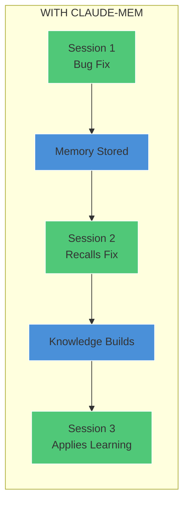
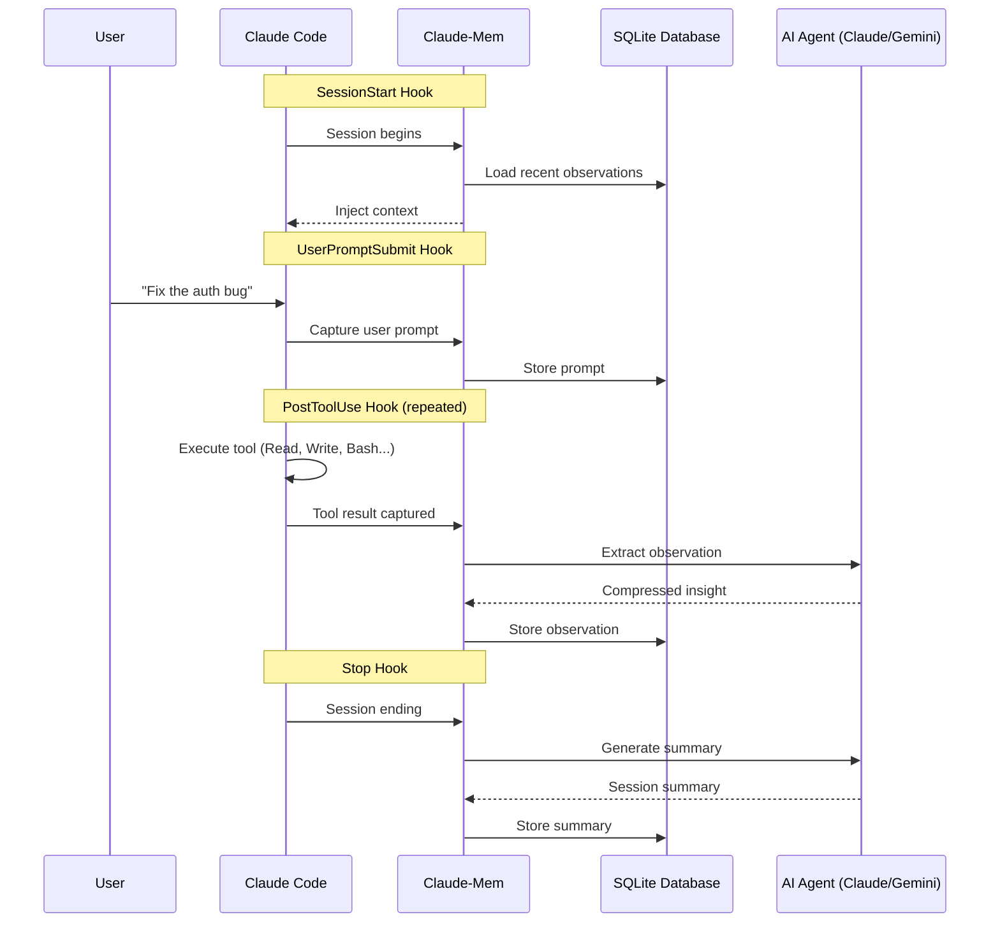
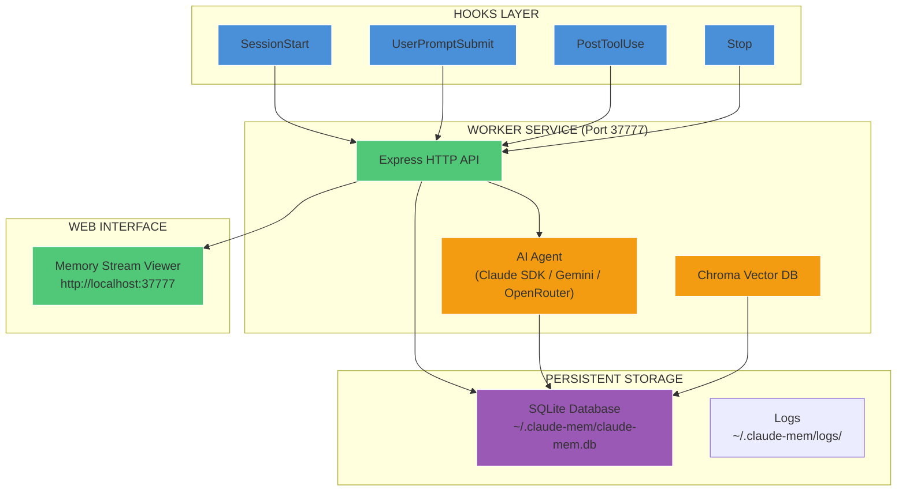
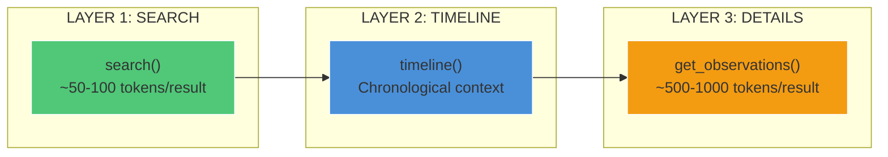
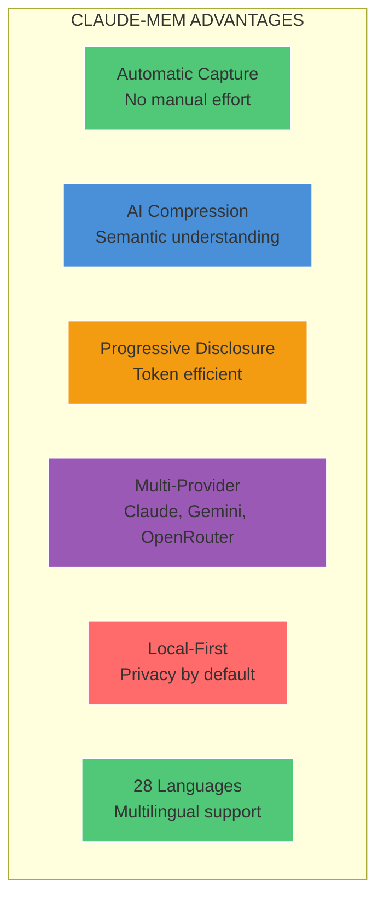
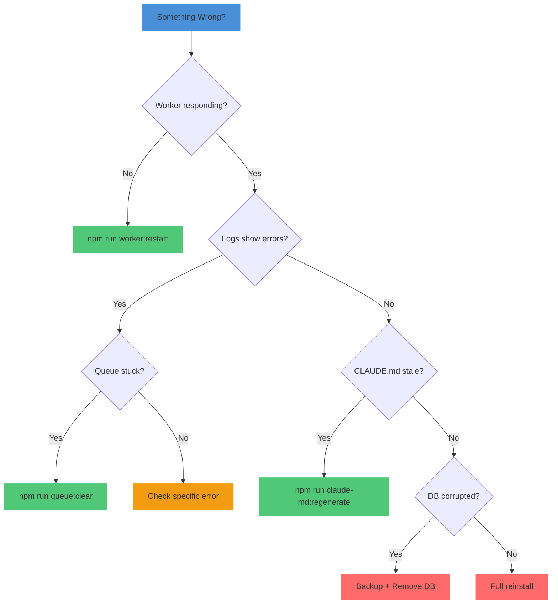

# Claude-Mem MASTERCLASS

**The Complete Guide to Persistent Memory for Claude Code**

> "The best code is code that remembers what it learned yesterday."

---

## Table of Contents

1. [What Are We Doing Here?](#1-what-are-we-doing-here)
2. [How It Works](#2-how-it-works)
3. [Why It Works](#3-why-it-works)
4. [Why We Choose to Run This Way](#4-why-we-choose-to-run-this-way)
5. [What Are the Other Options?](#5-what-are-the-other-options)
6. [Why This Option is Better](#6-why-this-option-is-better)
7. [Rollback Plan](#7-rollback-plan)
8. [Quick Reference](#8-quick-reference)

---

## 1. What Are We Doing Here?

### The Big Picture

**Claude-mem is a persistent memory compression system that gives Claude Code the ability to remember what it learned across sessions.**

Every time you start a new Claude Code session, the AI starts fresh - it has no memory of yesterday's debugging session, the architectural decisions you made last week, or the bug you fixed three months ago. Claude-mem changes that by automatically capturing, compressing, and recalling relevant context from your project history.

### The Problem We Are Solving

```mermaid
graph LR
    subgraph Without["WITHOUT CLAUDE-MEM"]
        S1["Session 1<br/>Bug Fix"] --> FORGET1["Memory Lost"]
        S2["Session 2<br/>Same Bug"] --> FORGET2["Memory Lost"]
        S3["Session 3<br/>Same Bug Again"] --> PAIN["Frustration"]
    end

    style S1 fill:#ff6b6b,stroke:#fff
    style S2 fill:#ff6b6b,stroke:#fff
    style S3 fill:#ff6b6b,stroke:#fff
    style FORGET1 fill:#2d3436,stroke:#fff
    style FORGET2 fill:#2d3436,stroke:#fff
    style PAIN fill:#ff6b6b,stroke:#fff
```





### The Analogy: Your AI's Journal

Think of claude-mem as a **smart journal** for your AI assistant:

| Human Memory | Claude-Mem Equivalent |
|--------------|----------------------|
| Writing in a diary | Observations captured after each tool use |
| Summarizing your week | Session summaries generated at session end |
| Looking up old notes | MCP search tools query past work |
| Muscle memory | Context injection at session start |

**Without the journal**, every morning you wake up with amnesia. **With the journal**, you build on yesterday's progress.

---

## 2. How It Works

### The Foundation: 5 Lifecycle Hooks

Claude-mem integrates with Claude Code through **lifecycle hooks** - specific moments in the Claude Code session where claude-mem can observe, capture, or inject information.



### The 5 Hooks Explained

| Hook | When | What Happens |
|------|------|--------------|
| **SessionStart** | Claude Code launches | Injects recent context, starts worker service |
| **UserPromptSubmit** | User sends message | Captures the user's request, creates session |
| **PostToolUse** | After every tool call | Extracts observations from tool results |
| **Stop** | Session ending | Generates comprehensive session summary |
| **SessionEnd** | Session complete | Cleanup and finalization |

### The Core Components



### Data Flow: From Tool Use to Memory

1. **Tool Execution**: Claude Code executes a tool (Read, Write, Bash, etc.)
2. **Hook Capture**: PostToolUse hook captures the tool name and result
3. **HTTP Request**: Hook sends data to Worker Service on port 37777
4. **AI Processing**: AI agent extracts meaningful observation from raw data
5. **Storage**: Compressed observation stored in SQLite with FTS5 indexing
6. **Vector Sync**: Observation embedded into Chroma for semantic search

### The Observation Types

Claude-mem categorizes observations by type for better searchability:

| Type | Icon | Description |
|------|------|-------------|
| **bugfix** | Red | Bug fixes, error resolutions |
| **feature** | Blue | New functionality implemented |
| **refactor** | Green | Code improvements, cleanup |
| **investigation** | Yellow | Research, exploration |
| **architecture** | Purple | Design decisions |
| **documentation** | Gray | Docs, comments |
| **configuration** | Orange | Config changes |
| **testing** | Cyan | Test-related work |

### The 3-Layer Search Workflow

Claude-mem uses a token-efficient progressive disclosure pattern:



**Why 3 layers?** Fetching full observation details is expensive (~500-1000 tokens each). By first getting a compact index, filtering to relevant IDs, then fetching only what you need, you save approximately **10x tokens**.

---

## 3. Why It Works

### The Science: Compression + Retrieval

Claude-mem works because it applies two key principles:

**1. Lossy Compression**: Raw tool outputs can be thousands of tokens. An AI agent compresses this to a meaningful observation of ~50-200 tokens, retaining the essential insight while discarding noise.

**2. Contextual Retrieval**: At session start, relevant past observations are injected into Claude's context window. This "primes" the model with project-specific knowledge it would otherwise lack.

### The Analogy: A Senior Developer's Memory

Imagine a senior developer who has worked on your codebase for years:

| What They Remember | What They Forget |
|-------------------|------------------|
| "We tried that approach in 2023, it caused race conditions" | The exact commit hash |
| "The auth module was rewritten because of security audit" | Every line of the old code |
| "Don't touch the legacy parser, it's fragile" | The 500 lines of that parser |

Claude-mem gives Claude this kind of **wisdom without the weight**.

### The Math: Token Economics

| Without Claude-Mem | With Claude-Mem |
|--------------------|-----------------|
| 0 tokens of history | ~500-2000 tokens of curated context |
| No past knowledge | Relevant architectural decisions |
| Rediscovers problems | Recalls previous solutions |
| Cost: Time wasted | Cost: ~500 tokens at session start |

**The tradeoff is overwhelmingly positive**: A small token investment yields massive productivity gains.

### The Trust: Fail-Fast Philosophy

Claude-mem follows a strict **fail-fast** philosophy:

- Missing session? **Fail loudly** (don't silently create one)
- Database error? **Propagate up** (don't swallow with try-catch)
- Hook failure? **Log with context** (don't continue silently)

This philosophy was hard-won after a "3-month battle against complexity" (see v8.1.0 changelog) where silent failures caused 10+ hour debugging sessions.

---

## 4. Why We Choose to Run This Way

### Design Decision 1: SQLite over PostgreSQL

**Choice**: Local SQLite database at `~/.claude-mem/claude-mem.db`

**Why**:
- Zero configuration (no server to run)
- Portable (database is a single file)
- Fast (memory-mapped, WAL mode)
- Sufficient for single-user workloads

**Tradeoff**: Can't share memory across machines (by design - your memory stays local)

### Design Decision 2: Bun Runtime

**Choice**: Bun (not Node.js) for worker service and hooks

**Why**:
- Native SQLite support via `bun:sqlite`
- Faster startup time (critical for hooks)
- Single binary distribution
- TypeScript execution without transpilation

**Tradeoff**: Requires Bun installation (auto-installed if missing)

### Design Decision 3: Hook-Based Architecture

**Choice**: Lifecycle hooks (not continuous monitoring)

**Why**:
- Event-driven (only runs when needed)
- No background process watching files
- Integrates with Claude Code's official plugin system
- Minimal resource usage between events

**Tradeoff**: Only captures tool usage within Claude Code sessions

### Design Decision 4: AI-Powered Compression

**Choice**: Use an AI model (Claude SDK, Gemini, or OpenRouter) to extract observations

**Why**:
- Semantic understanding (not just text summarization)
- Context-aware extraction
- Consistent observation format
- Natural language output

**Tradeoff**: Requires AI API access (Claude SDK uses CLI auth, Gemini has free tier)

### Design Decision 5: Local-First Privacy

**Choice**: All data stays on your machine by default

**Why**:
- No data sent to external servers (except AI API for compression)
- Privacy tags (`<private>`) strip sensitive content before storage
- Database is local SQLite
- Chroma vectors are local

**Tradeoff**: No cloud sync between machines (use git to share important knowledge)

---

## 5. What Are the Other Options?

### Alternative 1: Manual Note-Taking

**How it works**: You manually maintain a `NOTES.md` or `DECISIONS.md` file

| Pros | Cons |
|------|------|
| Full control over what's captured | Requires discipline |
| No dependencies | Often forgotten during flow |
| Human-curated quality | Doesn't scale to large projects |

### Alternative 2: Git Commit History

**How it works**: Rely on commit messages and PR descriptions for history

| Pros | Cons |
|------|------|
| Already exists | Commit messages are often terse |
| Tied to code changes | Doesn't capture investigation work |
| Searchable with git log | No semantic search |

### Alternative 3: External Knowledge Bases (Notion, Obsidian)

**How it works**: Maintain a separate knowledge base tool

| Pros | Cons |
|------|------|
| Rich formatting | Context switching required |
| Team sharing | Manual entry |
| Powerful organization | Disconnected from code |

### Alternative 4: CLAUDE.md Files (Manual)

**How it works**: Maintain per-project CLAUDE.md files with context

| Pros | Cons |
|------|------|
| Claude reads them automatically | Manual maintenance |
| Per-project customization | Can become stale |
| No external dependencies | Doesn't capture session-by-session insights |

### Alternative 5: Other Memory Plugins

**How they work**: Third-party plugins for Claude Code memory

| Pros | Cons |
|------|------|
| Alternative approaches | Varies by plugin |
| Community-driven | May lack maintenance |
| Different feature sets | Integration quality varies |

---

## 6. Why This Option is Better

### Claude-Mem Advantages



### Comparison Matrix

| Feature | Claude-Mem | Manual Notes | Git History | External KB |
|---------|------------|--------------|-------------|-------------|
| Automatic capture | Yes | No | Partial | No |
| Semantic search | Yes | No | No | Depends |
| Token efficient | Yes | Yes | N/A | N/A |
| Zero config | Yes | Yes | Yes | No |
| Cross-session recall | Yes | Manual | Indirect | Manual |
| Privacy control | Yes | Yes | Yes | Varies |
| Claude integration | Native | Manual | Indirect | Manual |

### The Killer Features

1. **Zero-Effort Capture**: Every tool use is automatically observed and compressed. You don't have to remember to take notes.

2. **Intelligent Context Injection**: At session start, relevant past observations are automatically loaded. Claude starts with knowledge.

3. **Progressive Token Efficiency**: The 3-layer search workflow (search, timeline, get_observations) saves ~10x tokens compared to loading full details immediately.

4. **Multi-Provider Flexibility**: Choose between Claude SDK (uses CLI auth), Gemini (free tier available), or OpenRouter (100+ models).

5. **Folder-Level CLAUDE.md**: Auto-generated context files in each directory (v9.0.0+) provide hyper-local awareness.

---

## 7. Rollback Plan

### If Something Goes Wrong

Claude-mem is designed with recovery in mind. Here are your options:

### Level 1: Restart Worker

**Symptom**: Worker unresponsive, hooks failing

```bash
cd ~/.claude/plugins/marketplaces/thedotmack
npm run worker:restart
```

### Level 2: Check Logs

**Symptom**: Unexpected behavior

```bash
# View today's logs
npm run worker:logs

# Tail logs in real-time
npm run worker:tail

# Or check directly
tail -f ~/.claude-mem/logs/worker-$(date +%Y-%m-%d).log
```

### Level 3: Clear Failed Queue

**Symptom**: Messages stuck in processing

```bash
# Interactive removal of failed messages
npm run queue:clear

# Clear all messages (nuclear option)
npm run queue:clear -- --all --force
```

### Level 4: Regenerate CLAUDE.md Files

**Symptom**: Auto-generated CLAUDE.md files are stale or corrupted

```bash
npm run claude-md:regenerate

# Dry run first to see what would change
npm run claude-md:dry-run
```

### Level 5: Database Recovery

**Symptom**: Database corruption or migration issues

```bash
# Backup current database
cp ~/.claude-mem/claude-mem.db ~/.claude-mem/claude-mem.db.backup

# Remove database (will be recreated with migrations)
rm ~/.claude-mem/claude-mem.db

# Restart worker (recreates fresh database)
npm run worker:restart
```

**Note**: Removing the database loses all stored observations and summaries. Only do this as a last resort.

### Level 6: Full Uninstall and Reinstall

**Symptom**: Plugin completely broken

```bash
# In Claude Code
> /plugin uninstall claude-mem
> /plugin marketplace add thedotmack/claude-mem
> /plugin install claude-mem
```

### Level 7: Manual Plugin Removal

**Symptom**: Plugin system itself is broken

```bash
# Remove plugin directory
rm -rf ~/.claude/plugins/marketplaces/thedotmack

# Remove data directory (optional - preserves memory if skipped)
rm -rf ~/.claude-mem

# Reinstall via Claude Code
> /plugin marketplace add thedotmack/claude-mem
> /plugin install claude-mem
```

### Recovery Decision Tree



---

## 8. Quick Reference

### Installation

```bash
# In Claude Code terminal
> /plugin marketplace add thedotmack/claude-mem
> /plugin install claude-mem
# Restart Claude Code
```

### File Locations

| Path | Purpose |
|------|---------|
| `~/.claude/plugins/marketplaces/thedotmack/` | Installed plugin |
| `~/.claude-mem/` | Data directory |
| `~/.claude-mem/claude-mem.db` | SQLite database |
| `~/.claude-mem/settings.json` | Configuration |
| `~/.claude-mem/logs/` | Log files |
| `~/.claude-mem/chroma/` | Vector database |

### Configuration (settings.json)

```json
{
  "CLAUDE_MEM_PROVIDER": "claude",
  "CLAUDE_MEM_MODE": "code",
  "CLAUDE_MEM_LOG_LEVEL": "info",
  "CLAUDE_MEM_WORKER_PORT": 37777,
  "CLAUDE_MEM_CONTEXT_OBSERVATIONS": 20
}
```

### Provider Options

| Provider | Auth Method | Cost | Notes |
|----------|-------------|------|-------|
| `claude` | CLI auth (automatic) | Included with Claude Code | Default, recommended |
| `gemini` | API key | Free tier: 1500 req/day | Good free alternative |
| `openrouter` | API key | Varies by model | 100+ model choices |

### Common Commands

```bash
# Worker management
npm run worker:start
npm run worker:stop
npm run worker:restart
npm run worker:status

# Queue management
npm run queue              # View pending messages
npm run queue:process      # Process pending manually
npm run queue:clear        # Clear failed messages

# CLAUDE.md management
npm run claude-md:regenerate
npm run claude-md:dry-run

# Logs
npm run worker:logs
npm run worker:tail
```

### Web Interface

Open **http://localhost:37777** in your browser to:
- View the memory stream in real-time
- Search past observations
- Configure settings
- Monitor worker health

### MCP Search Tools

| Tool | Purpose | Token Cost |
|------|---------|------------|
| `search` | Find observations by query | ~50-100/result |
| `timeline` | Get chronological context | Variable |
| `get_observations` | Fetch full details by ID | ~500-1000/result |

### Privacy Tags

Prevent sensitive content from being stored:

```markdown
<private>
API_KEY=sk-secret-value
PASSWORD=hunter2
</private>
```

Content inside `<private>` tags is stripped before storage.

---

## Summary

Claude-mem transforms Claude Code from a stateless assistant into a knowledgeable collaborator that remembers your project's history. By automatically capturing tool usage, compressing it with AI, and injecting relevant context into new sessions, it provides the continuity that makes long-term development work more efficient.

**Key Takeaways**:

1. **Automatic**: No manual note-taking required
2. **Intelligent**: AI compression extracts meaningful insights
3. **Efficient**: Progressive disclosure saves tokens
4. **Flexible**: Multiple AI providers supported
5. **Private**: Local-first design, privacy tags for sensitive data
6. **Recoverable**: Clear rollback procedures at every level

---

*Created by The Professor (Agent #27) for the claude-mem community.*

*Version: 9.0.5 | Last Updated: 2026-01-23*
