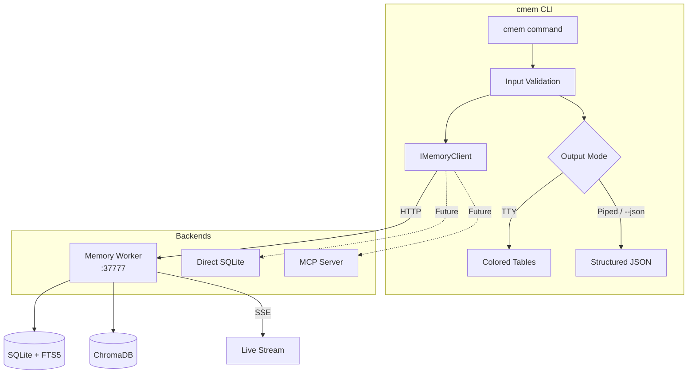
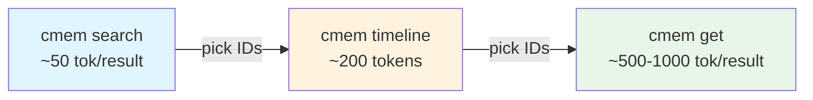

# cmem

**Context Memory CLI** — Search, stream, and manage persistent AI agent memory from the terminal. Agent and model agnostic.

[](https://www.npmjs.com/package/cmem)
[](LICENSE)
[](https://nodejs.org)

---

## Quick Install

```bash
# Zero-install (no global required)
npx cmem --help

# Global install via npm
npm i -g cmem

# Or via bun
bun add -g cmem
```

---

## What is cmem?

Context memory is the persistent record of everything an AI agent learns during a coding session: decisions made, bugs fixed, patterns discovered, architectural choices taken. Without it, every session starts cold and agents repeat the same mistakes.

cmem is a terminal CLI that gives you and your agents structured access to that memory. It connects to a running memory worker and exposes search, timeline browsing, live streaming, and memory management — all from a single, lightweight command.

It is designed to work with any AI agent that can run a shell command. The `--json` flag and semantic exit codes make it scriptable by Claude Code, Cursor, Droid, Codex, or any agent that reads stdout.

---

## Architecture



Commands never call a backend directly. They call `IMemoryClient`, and the factory resolves the right backend from your configuration. This is how future backends (direct SQLite, Mem0 MCP) will slot in without changing any command code.

---

## Progressive Disclosure

Token-efficient memory retrieval in three layers:



Start broad with `search` to identify relevant observation IDs. Use `timeline` to get chronological context around an anchor. Fetch full details only for the specific observations you need with `get`. A typical agent workflow consumes 10x fewer tokens than fetching everything upfront.

---

## For Humans

When stdout is a terminal (TTY), cmem renders colored tables, icons, and human-readable output automatically:

```bash
cmem search "authentication bug"
cmem timeline 2543 --before 5 --after 5
cmem stream
cmem stats
```

No flags required. Output adapts to your terminal width.

---

## For AI Agents

Every command supports `--json` for structured, stable output. When stdout is piped (not a TTY), JSON mode activates automatically.

```bash
# From Claude Code
cmem search "auth bug" --json | jq '.data.results[].id'

# From any agent — fetch full observation details
cmem get 2543 --json

# Progressive disclosure saves 10x tokens
cmem search "JWT" --json --limit 10       # ~50 tokens/result
cmem timeline 2543 --json                 # ~200 tokens total
cmem get 2543 2102 --json                 # full details, only what you need
```

Exit codes are semantic and stable — agents can rely on them for branching logic without parsing error text.

---

## Command Reference

### Search — Progressive Disclosure

```bash
cmem search <query>                        # Layer 1: full-text + semantic search
cmem timeline [anchor]                     # Layer 2: chronological context window
cmem get <ids...>                          # Layer 3: full observation details
```

Options for `search`:
```
--limit <n>           Results per page (default: 20)
--offset <n>          Pagination offset
--project <name>      Filter by project
--type <type>         Filter by observation type
--json                Structured JSON output
```

Options for `timeline`:
```
--before <n>          Observations before anchor (default: 5)
--after <n>           Observations after anchor (default: 5)
--project <name>      Filter by project
--json                Structured JSON output
```

### Semantic Shortcuts

```bash
cmem decisions                             # Key architectural and design decisions
cmem changes                               # File and code change observations
cmem how <query>                           # How-it-works explanations
```

### Data Browsing

```bash
cmem observations                          # Paginated observation browser
cmem sessions                              # Session summary browser
cmem projects                              # List all projects
cmem stats                                 # Worker + database statistics
cmem context --project <name>              # Context injection preview
```

### Memory Management

```bash
cmem remember "insight text"               # Save a manual memory
cmem export-data --project <name>          # Export memories to JSON
cmem import-data backup.json              # Import memories from JSON
```

### Worker Management

```bash
cmem worker status                         # Check worker health
cmem queue status                          # Processing queue state
cmem queue process                         # Process pending queue items
cmem settings list                         # View all settings
cmem settings set KEY value                # Update a setting
cmem logs                                  # View worker logs
```

### Live Streaming

```bash
cmem stream                                # Watch observations in real-time
cmem stream --tmux                         # Open as tmux sidebar pane
cmem endless on                            # Enable endless mode
cmem endless off                           # Disable endless mode
cmem endless status                        # Check endless mode state
```

---

## Backend Support

| Backend | Status | How |
|---------|--------|-----|
| Memory worker | Supported | Default. HTTP API on `:37777`. Start with your memory worker binary. |
| Direct SQLite | Planned | Read directly from `.agentfs/*.db` or equivalent. No worker required. |
| Mem0 MCP | Planned | Via MCP protocol. Plugs in behind the same `IMemoryClient` interface. |
| Custom | Extensible | Implement `IMemoryClient` and register in `client-factory.ts`. |

The backend abstraction (`IMemoryClient`) is a stable interface. Commands never call a backend directly, so adding a new backend does not require touching any command code.

---

## Security Model

### Input Validation

Every piece of user-supplied input is validated before it reaches the backend:

- Path traversal patterns (`..`, null bytes) are rejected at the CLI boundary
- Control characters are stripped from text inputs
- Settings keys are validated against a 35-key allowlist — arbitrary setting names are rejected
- Observation IDs must be positive integers

### Privacy Tags

`<private>` tags are stripped from all output as a defense-in-depth measure. The worker also strips them at the hook layer, so stripping happens twice.

### Localhost Only

cmem only connects to `127.0.0.1` by default. There is no mechanism for remote connections in the current implementation. The configuration allows overriding the host, but this is intended for development use only.

### Dry Run

Write operations (`remember`, `settings set`, `queue process`) can be previewed without committing changes:

```bash
cmem remember "insight" --dry-run
cmem settings set KEY value --dry-run
```

### Semantic Exit Codes

Exit codes are stable and documented. Agents can branch on them without parsing error text.

---

## JSON Response Schema

All `--json` output follows a stable envelope:

```json
{
  "ok": true,
  "data": {
    "results": [...],
    "query": "authentication bug"
  },
  "meta": {
    "count": 10,
    "hasMore": true,
    "offset": 0,
    "limit": 20
  }
}
```

Error responses:

```json
{
  "ok": false,
  "data": null,
  "error": "Worker not running at http://127.0.0.1:37777",
  "code": 2
}
```

Fields are never removed from the schema. New fields may be added in minor releases.

---

## Exit Codes

| Code | Meaning | When |
|------|---------|------|
| `0` | Success | Command completed normally |
| `1` | Worker API error | Backend returned 4xx or 5xx |
| `2` | Connection error | Worker not running or unreachable |
| `3` | Invalid arguments | Validation failed before any API call |
| `4` | Not found | Observation ID or project does not exist |
| `5` | Internal error | Unexpected CLI-level failure |

---

## Configuration

Configuration resolution order (first match wins):

1. `CMEM_*` environment variables
2. `CLAUDE_MEM_*` environment variables (backwards compatibility)
3. `~/.claude-mem/settings.json`
4. Built-in defaults

```bash
# Override worker connection
CMEM_WORKER_PORT=37778 cmem stats
CMEM_WORKER_HOST=127.0.0.1 cmem stats

# Backwards-compatible (still supported)
CLAUDE_MEM_WORKER_PORT=37778 cmem stats
CLAUDE_MEM_WORKER_HOST=127.0.0.1 cmem stats
```

Settings file (`~/.claude-mem/settings.json`):

```json
{
  "CLAUDE_MEM_WORKER_HOST": "127.0.0.1",
  "CLAUDE_MEM_WORKER_PORT": "37777"
}
```

---

## Performance

- **53ms** cold start
- **210KB** single-file bundle (compiled with Bun)
- **3 runtime dependencies** — `commander`, `chalk`, `cli-table3`
- Zero heavy dependencies

---

## Agent Integration Examples

```bash
# Search and pipe IDs to a follow-up command
cmem search "auth bug" --json | jq -r '.data.results[].id' | xargs cmem get --json

# Check worker before starting a session
cmem worker status --json | jq -e '.data.healthy' || echo "Start the worker first"

# Save a memory from a script
cmem remember "Deploy requires NODE_ENV=production explicitly set" --json

# Export and back up a project
cmem export-data --project lesearch --output backup-$(date +%F).json

# Progressive disclosure in a shell script
RESULTS=$(cmem search "JWT expiry" --json --limit 5)
IDS=$(echo "$RESULTS" | jq -r '.data.results[].id' | tr '\n' ' ')
cmem get $IDS --json
```

---

## Requirements

- Node.js 18+ (or Bun for development)
- A running memory worker on `localhost:37777`

---

## License

[AGPL-3.0](LICENSE)
