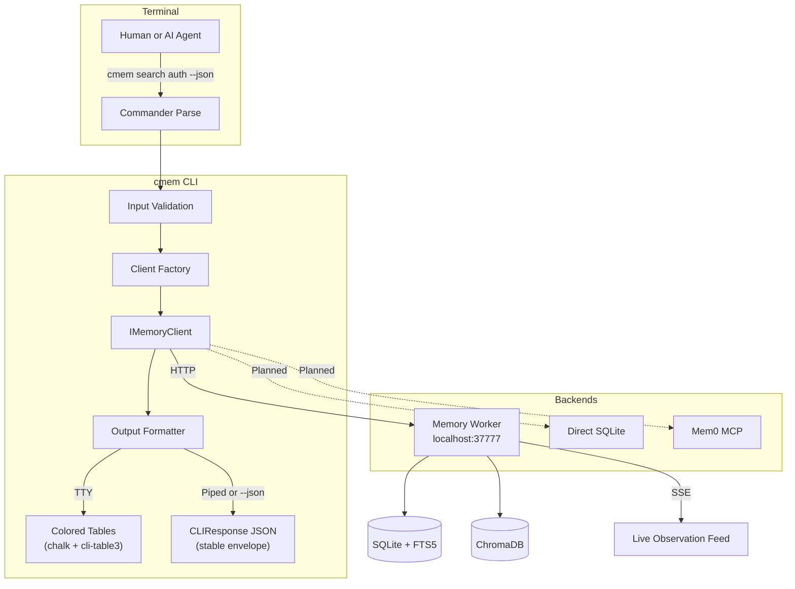

# cmem Architecture

Technical reference for the cmem CLI codebase. Intended for contributors and anyone implementing a new backend or integrating cmem into a toolchain.

---

## System Overview

cmem is a single-binary CLI that translates terminal commands into structured queries against a persistent memory backend. It has three concerns: validating input, routing to the right backend, and formatting output for the right audience (human or agent).



---

## Data Flow

A full request-response cycle for `cmem search "auth bug" --json`:

```
1. src/index.ts
   Commander parses argv, dispatches to registerSearchCommand handler.

2. src/commands/search.ts
   Handler extracts opts (query, limit, offset, project, json flag).
   Calls detectOutputMode(opts) → 'agent' (because --json is set).
   Calls validateQuery(query) → validated string or throws CLIError(ExitCode.INVALID_ARGS).

3. src/config.ts
   loadConfig() resolves config from env vars > settings.json > defaults.
   Returns CMEMConfig { workerHost, workerPort, baseUrl, dataDir }.

4. src/client-factory.ts
   createMemoryClient(config) → returns WorkerClient(config).

5. src/client.ts (WorkerClient)
   search(params) builds URL, calls rawFetch with AbortController timeout.
   On success: returns SearchResponse (typed).
   On fetch failure: throws CLIError(ExitCode.CONNECTION_ERROR).
   On 4xx/5xx: throws CLIError(ExitCode.WORKER_ERROR).
   On 404: throws CLIError(ExitCode.NOT_FOUND).

6. src/formatters/json.ts
   formatJSON(result, meta) wraps in CLIResponse envelope.
   { ok: true, data: result, meta: { count, hasMore, offset, limit } }

7. src/output.ts
   In 'agent' mode: JSON.stringify(envelope) to stdout, then process.exit(0).
   In 'human' mode: renders colored table via formatters/table.ts.

8. On any unhandled CLIError:
   outputError(err, mode) writes { ok: false, error, code } to stderr.
   process.exit(err.exitCode).
```

---

## Progressive Disclosure

Progressive disclosure is the core token-efficiency strategy for agent use.

The three layers exist because of different cost profiles:

| Layer | Command | Tokens/result | Use for |
|-------|---------|---------------|---------|
| 1 | `search` | ~50 | Broad recall — find candidate IDs |
| 2 | `timeline` | ~200 total | Chronological context around a pivot point |
| 3 | `get` | ~500-1000 | Full content, only for selected IDs |

Without progressive disclosure, an agent fetching 20 results at Layer 3 costs 10,000-20,000 tokens. Using all three layers to fetch 3 relevant results costs roughly 1,200 tokens — a 10x reduction.

The layers are designed so each narrows the ID set: search returns IDs, timeline provides chronological context that eliminates noise, get fetches only the final candidates.

---

## Dual Output Mode

Every command supports two output modes. The mode is selected once at the top of each command handler and flows through all formatters.

```typescript
// src/utils/detect.ts
export function detectOutputMode(opts: { json?: boolean }): OutputMode {
  if (opts.json) return 'agent';
  if (!process.stdout.isTTY) return 'agent';
  return 'human';
}
```

Rules:
- `--json` flag → always agent mode, regardless of TTY state
- Piped stdout (not a TTY) → agent mode automatically (enables `cmem search ... | jq ...`)
- Interactive terminal → human mode with colors and tables

The `OutputMode` type is `'human' | 'agent'`. It is passed to every formatter call, never re-detected mid-command.

Human mode uses `chalk` for color and `cli-table3` for tabular layout. Both are no-ops in agent mode — the JSON formatter writes a plain string.

---

## Security Boundary

The security boundary is at the CLI input layer, before any backend call.

```
User input → validate.ts → CLIError or clean value → client → backend
```

Four validation categories in `src/utils/validate.ts`:

1. **Path traversal** — `..` sequences and null bytes are rejected immediately. Throws `CLIError(ExitCode.INVALID_ARGS)`.

2. **Control characters** — Non-printable characters (except tab and newline) are stripped from text inputs. This prevents terminal injection via crafted memory content.

3. **Settings allowlist** — The 35 valid settings keys are enumerated. Any key not in the allowlist is rejected. This prevents agents from setting arbitrary worker configuration.

4. **Observation ID validation** — IDs must parse as positive integers. Non-numeric or negative values are rejected before any API call.

Privacy protection (`src/utils/privacy.ts`) runs on output, not input. It strips `<private>...</private>` blocks from any text returned by the backend. This is defense-in-depth — the worker also strips at the hook layer.

---

## Backend Abstraction

`IMemoryClient` is the stable interface all commands program against. It lives in `src/memory-client.ts`.

```typescript
export interface IMemoryClient {
  isHealthy(): Promise<boolean>;

  // Progressive disclosure
  search(params: SearchParams): Promise<SearchResponse>;
  timeline(params: TimelineParams): Promise<TimelineResponse>;
  getObservations(params: BatchParams): Promise<Observation[]>;

  // Data browsing
  getObservationById(id: number): Promise<Observation>;
  listObservations(params: ListParams): Promise<PaginatedResponse<Observation>>;
  listSummaries(params: ListParams): Promise<PaginatedResponse<SessionSummary>>;
  getStats(): Promise<WorkerStats>;
  getProjects(): Promise<ProjectsResponse>;

  // Semantic shortcuts
  decisions(params: ListParams): Promise<SearchResponse>;
  changes(params: ListParams): Promise<SearchResponse>;
  howItWorks(params: ListParams): Promise<SearchResponse>;

  // Context, memory, settings, logs, processing, streaming ...
}
```

The factory pattern in `src/client-factory.ts` resolves the concrete implementation:

```typescript
export function createMemoryClient(config: CMEMConfig): IMemoryClient {
  // Today: always WorkerClient
  // Future: inspect config.backend to select SQLiteClient, Mem0Client, etc.
  return new WorkerClient(config);
}
```

Commands import `createMemoryClient`, never `WorkerClient` directly. This is enforced by convention and will be enforced by lint rule if violations appear.

The current implementation is `WorkerClient` — a thin HTTP client over the memory worker's REST API. It uses `fetch` with `AbortController` for timeouts and maps HTTP status codes to `CLIError` exit codes.

---

## SSE Streaming Architecture

The `stream` command and `tmux` sidebar use Server-Sent Events (SSE) for live observation delivery.

```
cmem stream
  → WorkerClient.connectStream()
    → fetch('/stream', { Accept: 'text/event-stream' })
    → Response with ReadableStream body

  → src/tmux/sse-consumer.ts
    → reads chunks from ReadableStream
    → parses SSE event format (data: {...}\n\n)
    → emits parsed Observation objects

  → src/tmux/renderer.ts
    → formats each observation for the terminal
    → respects terminal width from detect.ts

tmux sidebar variant:
  → src/tmux/sidebar.ts
    → tmux split-window -h (horizontal pane)
    → runs cmem stream in the new pane
    → AbortController terminates on main session exit
```

The stream connection uses `timeout: 0` — SSE is a long-lived connection and must not time out. All other connections use a 5-second read timeout and 30-second write timeout.

Backpressure is handled by the Node.js ReadableStream. If the terminal can't keep up with the event rate, the consumer slows the read loop, which applies backpressure to the network stream.

---

## Exit Code Contract

Exit codes are a stable API. Agents branch on them without parsing error text. Never change an assigned code.

| Code | Constant | Meaning |
|------|----------|---------|
| `0` | `ExitCode.SUCCESS` | Normal completion |
| `1` | `ExitCode.WORKER_ERROR` | Backend returned 4xx or 5xx |
| `2` | `ExitCode.CONNECTION_ERROR` | Worker not running or unreachable |
| `3` | `ExitCode.INVALID_ARGS` | Validation failure before any API call |
| `4` | `ExitCode.NOT_FOUND` | Observation ID or project does not exist |
| `5` | `ExitCode.INTERNAL_ERROR` | Unexpected CLI-level failure |

Defined in `src/errors.ts`. `CLIError` carries an `ExitCode`. The top-level error handler in `src/output.ts` reads it and calls `process.exit(err.exitCode)`.

---

## Configuration Resolution Chain

Config is resolved in this order (first match wins):

1. `CMEM_WORKER_HOST` / `CMEM_WORKER_PORT` environment variables
2. `CLAUDE_MEM_WORKER_HOST` / `CLAUDE_MEM_WORKER_PORT` environment variables (backwards compatibility)
3. Fields in `~/.claude-mem/settings.json`
4. Built-in defaults: `127.0.0.1:37777`

The data directory defaults to `~/.claude-mem` and can be overridden with `CMEM_DATA_DIR` or `CLAUDE_MEM_DATA_DIR`.

Config is loaded once per command invocation in `loadConfig()` (`src/config.ts`) and passed to the factory. There is no global config singleton — each command invocation is independent.

---

## Bundle and Distribution

The build step compiles all TypeScript to a single ESM file using Bun's bundler:

```bash
bun build src/index.ts --outdir dist --target node
```

Output: `dist/index.js` — a self-contained 210KB ESM file. The three runtime dependencies (`commander`, `chalk`, `cli-table3`) are bundled in. Node.js 18+ provides `fetch` natively, so no polyfill is needed.

An optional native binary can be built with:

```bash
bun build src/index.ts --compile --outfile dist/cmem
```

The binary includes the Bun runtime and requires no Node.js installation. Cold start is ~53ms from the compiled bundle.
