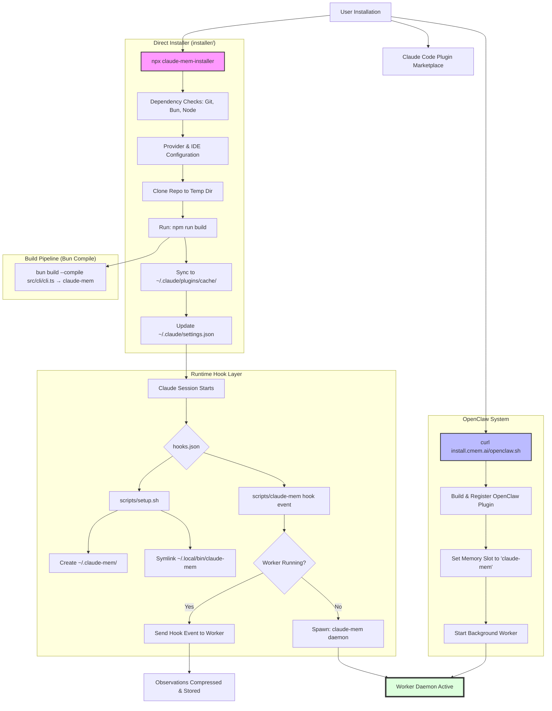

# Installation & Hook Architecture

This document outlines the complete installation lifecycle and hook execution model for `claude-mem`.

## Architecture Overview

`claude-mem` uses a **singular built artifact** architecture. All system components (CLI, Worker Daemon, MCP Server, and Lifecycle Hooks) are bundled into a single platform-specific binary named `claude-mem`.

## Installation Flow Diagram

## System Components (Unified Binary)

The `claude-mem` binary is a multi-call executable that behaves differently based on its arguments:

- **`claude-mem hook <event>`**: Executes a lifecycle hook (invoked by Claude Code).
- **`claude-mem daemon`**: Runs as the background worker service (orchestrator).
- **`claude-mem mcp`**: Runs as the Model Context Protocol search server.
- **`claude-mem statusline`**: Returns project metrics for shell status lines.
- **`claude-mem start/stop/status`**: Management commands for the daemon.

### Benefits of the Singular Artifact:
1.  **Fast Startup:** No Node.js/Bun cold start for hooks (native binary execution).
2.  **No Fallbacks:** Eliminated "intermediate" JS bundles and shell wrappers.
3.  **Atomic Updates:** Replacing a single binary updates the entire system.
4.  **Consistency:** The same code path is used for CLI and Daemon, reducing "works only in CLI" bugs.

## Setup Hook (`scripts/setup.sh`)
Executes on `SessionStart` to ensure the local environment is ready:
- Initializes `~/.claude-mem/` data directory.
- Manages `PATH` entries and symlinks in `~/.local/bin/`.
- Cleans up legacy configurations from shell profiles.
