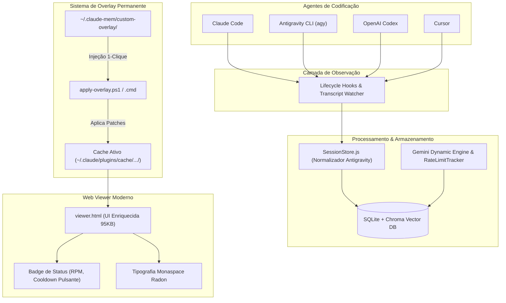

🌐 Esta é uma tradução automatizada. Correções da comunidade são bem-vindas!

<h1 align="center">
  <br>
  <a href="https://github.com/thedotmack/claude-mem">
    <picture>
      <source media="(prefers-color-scheme: dark)" srcset="https://raw.githubusercontent.com/thedotmack/claude-mem/main/docs/public/claude-mem-logo-for-dark-mode.webp">
      <source media="(prefers-color-scheme: light)" srcset="https://raw.githubusercontent.com/thedotmack/claude-mem/main/docs/public/claude-mem-logo-for-light-mode.webp">
      
    </picture>
  </a>
  <br>
  <a href="https://vercel.com/open-source-program">
    
  </a>
</h1>

<p align="center">
  <a href="docs/i18n/README.zh.md">🇨🇳 中文</a> •
  <a href="docs/i18n/README.zh-tw.md">🇹🇼 繁體中文</a> •
  <a href="docs/i18n/README.ja.md">🇯🇵 日本語</a> •
  <a href="docs/i18n/README.pt.md">🇵🇹 Português</a> •
  <a href="docs/i18n/README.pt-br.md">🇧🇷 Português</a> •
  <a href="docs/i18n/README.ko.md">🇰🇷 한국어</a> •
  <a href="docs/i18n/README.es.md">🇪🇸 Español</a> •
  <a href="docs/i18n/README.de.md">🇩🇪 Deutsch</a> •
  <a href="docs/i18n/README.fr.md">🇫🇷 Français</a> •
  <a href="docs/i18n/README.he.md">🇮🇱 עברית</a> •
  <a href="docs/i18n/README.ar.md">🇸🇦 العربية</a> •
  <a href="docs/i18n/README.ru.md">🇷🇺 Русский</a> •
  <a href="docs/i18n/README.pl.md">🇵🇱 Polski</a> •
  <a href="docs/i18n/README.cs.md">🇨🇿 Čeština</a> •
  <a href="docs/i18n/README.nl.md">🇳🇱 Nederlands</a> •
  <a href="docs/i18n/README.tr.md">🇹🇷 Türkçe</a> •
  <a href="docs/i18n/README.uk.md">🇺🇦 Українська</a> •
  <a href="docs/i18n/README.vi.md">🇻🇳 Tiếng Việt</a> •
  <a href="docs/i18n/README.tl.md">🇵🇭 Tagalog</a> •
  <a href="docs/i18n/README.id.md">🇮🇩 Indonesia</a> •
  <a href="docs/i18n/README.th.md">🇹🇭 ไทย</a> •
  <a href="docs/i18n/README.hi.md">🇮🇳 हिन्दी</a> •
  <a href="docs/i18n/README.bn.md">🇧🇩 বাংলা</a> •
  <a href="docs/i18n/README.ur.md">🇵🇰 اردو</a> •
  <a href="docs/i18n/README.ro.md">🇷🇴 Română</a> •
  <a href="docs/i18n/README.sv.md">🇸🇪 Svenska</a> •
  <a href="docs/i18n/README.it.md">🇮🇹 Italiano</a> •
  <a href="docs/i18n/README.el.md">🇬🇷 Ελληνικά</a> •
  <a href="docs/i18n/README.hu.md">🇭🇺 Magyar</a> •
  <a href="docs/i18n/README.fi.md">🇫🇮 Suomi</a> •
  <a href="docs/i18n/README.da.md">🇩🇰 Dansk</a> •
  <a href="docs/i18n/README.no.md">🇳🇴 Norsk</a>
</p>

<h4 align="center">Sistema de compressão de memória persistente construído para <a href="https://claude.com/claude-code" target="_blank">Claude Code</a>.</h4>

<p align="center">
  <a href="LICENSE">
    
  </a>
  <a href="package.json">
    
  </a>
  <a href="package.json">
    
  </a>
  <a href="https://github.com/thedotmack/awesome-claude-code">
    
  </a>
</p>

<p align="center">
  <a href="https://trendshift.io/repositories/15496" target="_blank">
    <picture>
      <source media="(prefers-color-scheme: dark)" srcset="https://raw.githubusercontent.com/thedotmack/claude-mem/main/docs/public/trendshift-badge-dark.svg">
      <source media="(prefers-color-scheme: light)" srcset="https://raw.githubusercontent.com/thedotmack/claude-mem/main/docs/public/trendshift-badge.svg">
      
    </picture>
  </a>
</p>

<br>

<table align="center">
  <tr>
    <td align="center">
      <a href="https://github.com/thedotmack/claude-mem">
        <picture>
          
        </picture>
      </a>
    </td>
    <td align="center">
      <a href="https://www.star-history.com/#thedotmack/claude-mem&Date">
        <picture>
          <source
            media="(prefers-color-scheme: dark)"
            srcset="https://api.star-history.com/image?repos=thedotmack/claude-mem&type=date&theme=dark&legend=top-left"
          />
          <source
            media="(prefers-color-scheme: light)"
            srcset="https://api.star-history.com/image?repos=thedotmack/claude-mem&type=date&legend=top-left"
          />
          
        </picture>
      </a>
    </td>
  </tr>
</table>

<p align="center">
  <a href="#-visão-geral-do-fork-aprimorado">Visão Geral do Fork</a> •
  <a href="#-recursos--ajustes-do-fork">Recursos do Fork</a> •
  <a href="#-guia-de-instalação">Guia de Instalação</a> •
  <a href="#-arquitetura-do-sistema">Arquitetura</a> •
  <a href="#-automação-de-overlay--imunidade-a-updates">Automação de Overlay</a> •
  <a href="#início-rápido">Início Rápido Upstream</a> •
  <a href="#como-funciona">Como Funciona</a> •
  <a href="#ferramentas-de-busca-mcp">Ferramentas MCP</a> •
  <a href="#configuração">Configuração</a> •
  <a href="#solução-de-problemas">Solução de Problemas</a>
</p>

<p align="center">
  Claude-Mem preserva o contexto perfeitamente entre sessões, capturando automaticamente observações de uso de ferramentas, gerando resumos semânticos e disponibilizando-os para sessões futuras.
</p>

---

## ⚡ Fork Aprimorado: Edição Gemini Dynamic Engine & Antigravity CLI

> **Fork customizado desenvolvido para suporte nativo ao Antigravity CLI (`agy`), motor dinâmico Gemini com Rate-Limiter adaptativo e arquitetura de overlay imune a sobrescritas de auto-update.**

<p align="center">
  
  
  
</p>

---

### 🌟 Principais Ajustes & Recursos Deste Fork

#### 1. 🧠 Gemini Dynamic Engine & Rate Limiter Inteligente
- **Badge Interativo no Cabeçalho:** O Web Viewer exibe em tempo real o modelo ativo, limites de RPM, consumo de tokens e status de cooldown.
- **Indicador Visual de Pausa (`is-paused`):** Animação pulsante elegante quando o provedor atinge limite de cota (`quota_exhausted`), com temporizador regressivo.
- **Fila Segura de Observações:** Durante cooldowns de cota, as observações permanecem em buffer seguro no SQLite, evitando travamentos ou perda de contexto.
- **Mitigação de Falhas em Cascata:** Backoff exponencial automático que previne disparos repetitivos e bloqueios de IP/API.

#### 2. 🪐 Suporte Nativo ao Antigravity CLI (`agy`)
- **Detecção e Normalização no `SessionStore.js`:** Identificação nativa da origem `antigravity-cli` e comandos `agy`, operando lado a lado com Claude, Codex e Cursor.
- **Estilização e Badges Dedicados:** Tags com destaque visual exclusivo (`.source-antigravity-cli`) em azul celeste para os temas claro e escuro no Viewer.
- **Continuidade Cross-Agent:** Compartilhamento transparente de contexto e memórias entre Claude Code, Antigravity CLI e Codex no mesmo projeto.

#### 3. 🛡️ Arquitetura de Custom Overlay (Imunidade a Auto-Updates)
O gerenciador de plugins do Claude Code baixa novas pastas de cache a cada atualização upstream. Este fork resolve isso com um sistema de **overlay permanente**:
- **Pasta Permanente Protegida:** Arquivos customizados, fontes e patches ficam salvos em `~/.claude-mem/custom-overlay/`.
- **Scripts de Restauração em 1 Clique:**
  - `apply-overlay.cmd` (Executável por duplo clique no Windows)
  - `apply-overlay.ps1` (Script PowerShell inteligente que detecta a pasta ativa no `installed_plugins.json`)
- **Backup de Segurança Prévio:** Cria automaticamente um `.backup-before-overlay` dos arquivos originais antes de aplicar as melhorias.

#### 4. 🎨 Web Viewer Modernizado
- **Tipografia `Monaspace Radon`:** Fontes dedicadas para leitura confortável de código e resumos de contexto.
- **Layout Responsivo:** Grade adaptada para telas grandes, terminais embutidos e dispositivos móveis.
- **Tema Escuro de Alto Contraste:** Cores calibradas para acompanhar a estética dos IDEs modernos.

---

### 📦 Guia de Instalação

#### Opção A: Restauração / Aplicação com 1 Clique (Recomendado)
Se você já possui o Claude-Mem instalado e deseja aplicar este pacote com todas as melhorias:
1. Os arquivos estão salvos em `~/.claude-mem/custom-overlay/`.
2. Dê um duplo clique em:
   ```cmd
   C:\Users\<SeuUsuario>\.claude-mem\custom-overlay\apply-overlay.cmd
   ```
   Ou pelo PowerShell:
   ```powershell
   powershell.exe -ExecutionPolicy Bypass -File "C:\Users\<SeuUsuario>\.claude-mem\custom-overlay\apply-overlay.ps1"
   ```
3. O script localizará a versão ativa, criará o backup e reaplicará a interface e os drivers do Antigravity automaticamente.

#### Opção B: Adicionar este Fork no Marketplace do Claude Code
No arquivo `known_marketplaces.json`:
```json
{
  "thedotmack": {
    "source": {
      "source": "github",
      "repo": "<seu-usuario-github>/claude-mem"
    },
    "installLocation": "C:\\Users\\<SeuUsuario>\\.claude\\plugins\\marketplaces\\thedotmack",
    "autoUpdate": true
  }
}
```
Em seguida, no Claude Code:
```bash
/plugin marketplace update
/plugin install claude-mem
```

#### Opção C: Integração com o Antigravity CLI (`agy`)
Adicione o MCP server no Antigravity CLI (`~/.gemini/antigravity-cli/mcp/claude-mem/` ou `settings.json`):
```json
{
  "mcpServers": {
    "claude-mem": {
      "command": "node",
      "args": [
        "C:/Users/<SeuUsuario>/.claude/plugins/cache/thedotmack/claude-mem/<versao-ativa>/scripts/mcp-server.cjs"
      ]
    }
  }
}
```

---

### 🏗️ Arquitetura do Sistema



---

### ❓ FAQ & Solução de Problemas

- **Por que o selo do Web Viewer está pulsando em "Paused"?**  
  Indica um cooldown de cota temporário (`quota_exhausted`) no provedor de IA (ex: Gemini API gratuita).  
  > **Importante:** **NÃO** reinicie o worker. Reiniciar zera a contagem de recuo e sobrecarrega a API. As novas observações continuam seguras na fila e serão processadas assim que o cooldown expirar.

- **O Claude Code atualizou e minha interface customizada sumiu:**  
  Basta executar o `apply-overlay.cmd` em `~/.claude-mem/custom-overlay/`.

- **Como checar a saúde do serviço?**  
  Acesse `http://127.0.0.1:37777/api/gemini/status` no seu navegador.

---

## Início Rápido

Instale com um único comando:

```bash
npx claude-mem install
```

Ou instale para o OpenCode:

```bash
npx claude-mem install --ide opencode
```

Ou instale para o Antigravity CLI ([guia de configuração](https://docs.claude-mem.ai/antigravity-cli/setup)):

```bash
npx claude-mem install --ide antigravity
```

Ou instale a partir do marketplace de plugins dentro do Claude Code:

```bash
/plugin marketplace add thedotmack/claude-mem

/plugin install claude-mem
```

Reinicie o Claude Code. O contexto de sessões anteriores aparecerá automaticamente em novas sessões.

> **Observação:** o Claude-Mem também é publicado no npm, mas `npm install -g claude-mem` instala **apenas o SDK/biblioteca** — ele não registra os hooks do plugin nem configura o serviço worker. Sempre instale via `npx claude-mem install` ou pelos comandos `/plugin` acima.

### 🦞 OpenClaw Gateway

Instale o claude-mem como um plugin de memória persistente em gateways [OpenClaw](https://openclaw.ai) com um único comando:

```bash
curl -fsSL https://install.cmem.ai/openclaw.sh | bash
```

O instalador cuida das dependências, da configuração do plugin, da configuração do provedor de IA, da inicialização do worker e de feeds opcionais de observação em tempo real para Telegram, Discord, Slack e outros. Consulte o [Guia de Integração com o OpenClaw](https://docs.claude-mem.ai/openclaw-integration) para mais detalhes.

**Principais Recursos:**

- 🧠 **Memória Persistente** - O contexto sobrevive entre sessões
- 📊 **Divulgação Progressiva** - Recuperação de memória em camadas com visibilidade de custo de tokens
- 🔍 **Busca Baseada em Skill** - Consulte o histórico do seu projeto com a skill mem-search
- 🖥️ **Interface Web de Visualização** - Fluxo de memória em tempo real na URL do worker exibida na inicialização
- 💻 **Skill para Claude Desktop** - Busque memória em conversas do Claude Desktop
- 🔒 **Controle de Privacidade** - Use tags `<private>` para excluir conteúdo sensível do armazenamento
- ⚙️ **Configuração de Contexto** - Controle refinado sobre qual contexto é injetado
- 🤖 **Operação Automática** - Nenhuma intervenção manual necessária
- 🔗 **Citações** - Referencie observações passadas com IDs através da API do worker ou visualize todas no visualizador web

---

## Documentação

📚 **[Ver Documentação Completa](https://docs.claude-mem.ai/)** - Navegue no site oficial

### Começando

- **[Guia de Instalação](https://docs.claude-mem.ai/installation)** - Início rápido e instalação avançada
- **[Guia de Uso](https://docs.claude-mem.ai/usage/getting-started)** - Como o Claude-Mem funciona automaticamente
- **[Ferramentas de Busca](https://docs.claude-mem.ai/usage/search-tools)** - Consulte o histórico do seu projeto com linguagem natural

### Melhores Práticas

- **[Engenharia de Contexto](https://docs.claude-mem.ai/context-engineering)** - Princípios de otimização de contexto para agentes de IA
- **[Divulgação Progressiva](https://docs.claude-mem.ai/progressive-disclosure)** - Filosofia por trás da estratégia de preparação de contexto do Claude-Mem

### Arquitetura

- **[Visão Geral](https://docs.claude-mem.ai/architecture/overview)** - Componentes do sistema e fluxo de dados
- **[Evolução da Arquitetura](https://docs.claude-mem.ai/architecture-evolution)** - A jornada da v3 à v5
- **[Arquitetura de Hooks](https://docs.claude-mem.ai/hooks-architecture)** - Como o Claude-Mem usa hooks de ciclo de vida
- **[Referência de Hooks](https://docs.claude-mem.ai/architecture/hooks)** - 7 scripts de hook explicados
- **[Serviço Worker](https://docs.claude-mem.ai/architecture/worker-service)** - API HTTP e gerenciamento do Bun
- **[Banco de Dados](https://docs.claude-mem.ai/architecture/database)** - Schema SQLite e busca FTS5
- **[Arquitetura de Busca](https://docs.claude-mem.ai/architecture/search-architecture)** - Busca híbrida com banco de dados vetorial Chroma

### Configuração e Desenvolvimento

- **[Configuração](https://docs.claude-mem.ai/configuration)** - Variáveis de ambiente e configurações
- **[Desenvolvimento](https://docs.claude-mem.ai/development)** - Build, testes e contribuição
- **[Branches de Release](https://docs.claude-mem.ai/branches)** - Fluxo das branches stable, core-dev e community-edge
- **[Solução de Problemas](https://docs.claude-mem.ai/troubleshooting)** - Problemas comuns e soluções

---

## Como Funciona

**Componentes Principais:**

1. **5 Hooks de Ciclo de Vida** - SessionStart, UserPromptSubmit, PostToolUse, Stop, SessionEnd (6 scripts de hook)
2. **Instalação Inteligente** - Verificador de dependências em cache (script pré-hook, não um hook de ciclo de vida)
3. **Serviço Worker** - API HTTP local com interface de visualização web e endpoints de busca, gerenciado pelo Bun
4. **Banco de Dados SQLite** - Armazena sessões, observações, resumos
5. **Skill mem-search** - Consultas em linguagem natural com divulgação progressiva
6. **Banco de Dados Vetorial Chroma** - Busca híbrida semântica + palavra-chave para recuperação inteligente de contexto

Veja [Visão Geral da Arquitetura](https://docs.claude-mem.ai/architecture/overview) para detalhes.

---

## Ferramentas de Busca MCP

O Claude-Mem fornece busca inteligente de memória através de **4 ferramentas MCP** seguindo um padrão de fluxo de trabalho em **3 camadas**, eficiente em termos de tokens:

**O Fluxo de Trabalho em 3 Camadas:**

1. **`search`** - Obtenha um índice compacto com IDs (~50-100 tokens/resultado)
2. **`timeline`** - Obtenha o contexto cronológico em torno de resultados interessantes
3. **`get_observations`** - Busque detalhes completos APENAS para os IDs filtrados (~500-1.000 tokens/resultado)

**Como Funciona:**
- O Claude usa ferramentas MCP para buscar na sua memória
- Comece com `search` para obter um índice de resultados
- Use `timeline` para ver o que estava acontecendo em torno de observações específicas
- Use `get_observations` para buscar detalhes completos dos IDs relevantes
- **Economia de tokens de ~10x** ao filtrar antes de buscar os detalhes

**Ferramentas MCP Disponíveis:**

1. **`search`** - Busca no índice de memória com consultas de texto completo, filtros por tipo/data/projeto
2. **`timeline`** - Obtenha o contexto cronológico em torno de uma observação ou consulta específica
3. **`get_observations`** - Busque detalhes completos de observações por IDs (sempre agrupe múltiplos IDs)

**Exemplo de Uso:**

```typescript
// Etapa 1: Buscar o índice
search(query="authentication bug", type="bugfix", limit=10)

// Etapa 2: Revisar o índice, identificar IDs relevantes (ex.: #123, #456)

// Etapa 3: Buscar os detalhes completos
get_observations(ids=[123, 456])
```

Veja o [Guia de Ferramentas de Busca](https://docs.claude-mem.ai/usage/search-tools) para exemplos detalhados.

---

## Branches de Release

Os releases estáveis são publicados a partir da branch `main` e disponibilizados no npm. As branches `core-dev` e
`community-edge` são branches executadas a partir do código-fonte para correções de confiabilidade antecipadas e
integrações da comunidade. Veja **[Branches de Release](https://docs.claude-mem.ai/branches)**
para o fluxo das branches e instruções de execução não estável.

---

## Requisitos do Sistema

- **Node.js**: 20.0.0 ou superior
- **Claude Code**: Versão mais recente com suporte a plugins
- **Bun**: Runtime JavaScript e gerenciador de processos (instalado automaticamente se ausente)
- **uv**: Gerenciador de pacotes Python para busca vetorial (instalado automaticamente se ausente)
- **SQLite 3**: Para armazenamento persistente (incluído)

---
### Notas de Configuração para Windows

Se você vir um erro como:

```powershell
npm : The term 'npm' is not recognized as the name of a cmdlet
```

Certifique-se de que o Node.js e o npm estejam instalados e adicionados ao seu PATH. Baixe o instalador mais recente do Node.js em https://nodejs.org e reinicie seu terminal após a instalação.

---

## Configuração

As configurações são gerenciadas em `~/.claude-mem/settings.json` (criado automaticamente com valores padrão na primeira execução). Configure o modelo de IA, a porta do worker, o diretório de dados, o nível de log e as configurações de injeção de contexto.

Veja o **[Guia de Configuração](https://docs.claude-mem.ai/configuration)** para todas as configurações disponíveis e exemplos.

### Configuração de Modo e Idioma

O Claude-Mem oferece suporte a múltiplos modos de fluxo de trabalho e idiomas através da configuração `CLAUDE_MEM_MODE`.

Essa opção controla:
- O comportamento do fluxo de trabalho (ex.: code, chill, investigation)
- O idioma usado nas observações geradas

#### Como Configurar

Edite seu arquivo de configurações em `~/.claude-mem/settings.json`:

```json
{
  "CLAUDE_MEM_MODE": "code--zh"
}
```

Os modos são definidos em `plugin/modes/`. Para ver todos os modos disponíveis localmente:

```bash
ls ~/.claude/plugins/marketplaces/thedotmack/plugin/modes/
```

#### Modos Disponíveis

| Modo | Descrição |
|------------|-------------------------|
| `code` | Modo padrão em inglês |
| `code--zh` | Modo em chinês simplificado |
| `code--ja` | Modo em japonês |

Os modos específicos de idioma seguem o padrão `code--[lang]`, onde `[lang]` é o código de idioma ISO 639-1 (ex.: `zh` para chinês, `ja` para japonês, `es` para espanhol).

> Observação: o `code--zh` (chinês simplificado) já vem integrado — nenhuma instalação adicional ou atualização de plugin é necessária.

#### Após Alterar o Modo

Reinicie o Claude Code para aplicar a nova configuração de modo.
---

## Desenvolvimento

Veja o **[Guia de Desenvolvimento](https://docs.claude-mem.ai/development)** para instruções de build, testes e fluxo de contribuição.

---

## Solução de Problemas

Se estiver enfrentando problemas, descreva o problema para o Claude e a skill troubleshoot diagnosticará automaticamente e fornecerá correções.

Veja o **[Guia de Solução de Problemas](https://docs.claude-mem.ai/troubleshooting)** para problemas comuns e soluções.

---

## Relatos de Bug

Crie relatos de bug abrangentes com o gerador automatizado:

```bash
cd ~/.claude/plugins/marketplaces/thedotmack
npm run bug-report
```

## Contribuindo

Contribuições são bem-vindas! Por favor:

1. Faça um fork do repositório
2. Crie uma branch de feature
3. Faça suas alterações com testes
4. Atualize a documentação
5. Envie um Pull Request

O Claude-Mem é distribuído a partir de três branches: `main` (estável), `core-dev` e
`community-edge`. Apenas a `main` é publicada no npm; as demais são executadas a partir do
código-fonte. Veja [Branches de Release](https://docs.claude-mem.ai/branches) para a
estratégia e instruções de execução local.

Veja o [Guia de Desenvolvimento](https://docs.claude-mem.ai/development) para o fluxo de contribuição.

---

## Licença

O Claude-Mem é licenciado sob a Apache License 2.0.

Escolhemos a Apache-2.0 porque a memória agêntica duradoura deve ser fácil de incorporar em
ferramentas de desenvolvimento, agentes locais, servidores MCP, sistemas empresariais, stacks de robótica
e harnesses de agentes em produção.

Veja o arquivo [LICENSE](LICENSE) para todos os detalhes. Veja [docs/license.md](docs/license.md)
e [docs/ip-boundary.md](docs/ip-boundary.md) para o escopo de licenciamento e a
fronteira entre o aberto e o comercial.

**Nota sobre o Ragtime**: o diretório `ragtime/` é licenciado sob a **Apache License 2.0**. Veja [ragtime/LICENSE](ragtime/LICENSE) para detalhes.

---

## Suporte

- **Documentação**: [docs/](docs/)
- **Issues**: [GitHub Issues](https://github.com/thedotmack/claude-mem/issues)
- **Repositório**: [github.com/thedotmack/claude-mem](https://github.com/thedotmack/claude-mem)
- **Conta X Oficial**: [@Claude_Memory](https://x.com/Claude_Memory)
- **Discord Oficial**: [Entrar no Discord](https://discord.com/invite/J4wttp9vDu)
- **Autor**: Alex Newman ([@thedotmack](https://github.com/thedotmack))

---

**Construído com Claude Agent SDK** | **Funciona com Claude Code** | **Feito com TypeScript**

---

### E o CMEM?

CMEM é um token criado por terceiros, mas oficialmente adotado pelo criador do Claude-Mem (Alex Newman, @thedotmack). O token funciona como um catalisador comunitário de crescimento e um veículo para levar o CMEM aos desenvolvedores e profissionais do conhecimento que mais precisam dele.

CA Oficial na BASE: 0x76b1967eec0ccaeb001bbbb2b40dc4badba31ba3