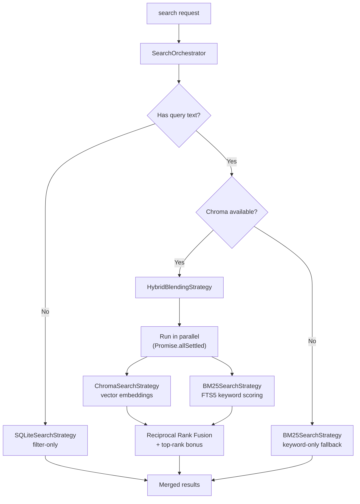

# Search Architecture

Claude-mem uses a **hybrid search architecture** that combines FTS5 keyword scoring (BM25) with Chroma vector embeddings, merged via **Reciprocal Rank Fusion (RRF)**. Results are exposed through 4 streamlined MCP tools following a 3-layer workflow pattern.

## Overview

**Architecture**: MCP Tools → MCP Protocol → HTTP API → SearchOrchestrator → Strategy Pipeline

**Key Components**:
1. **MCP Tools** (4 tools) - `search`, `timeline`, `get_observations`, `__IMPORTANT`
2. **MCP Server** (`plugin/scripts/mcp-server.cjs`) - Thin wrapper over HTTP API
3. **HTTP API Endpoints** - Fast search operations on Worker Service (port 37777)
4. **SearchOrchestrator** - Entry point that selects and executes the right search strategy
5. **Search Strategies** - `BM25SearchStrategy`, `ChromaSearchStrategy`, `HybridBlendingStrategy`, `SQLiteSearchStrategy`
6. **Scoring utilities** - `rrfScore()` and `topRankBonus()` for rank fusion
7. **SQLite Database** - Persistent storage with FTS5 virtual tables
8. **Chroma Vector DB** - Semantic search with embedding similarity

**Token Efficiency**: ~10x savings through 3-layer workflow pattern

## Hybrid Search Pipeline

<Note>
  Since v9.7.0 (BM25 keyword search) and v9.8.0 (RRF score fusion), every text query runs through the hybrid pipeline by default. No configuration is required.
</Note>

### SearchOrchestrator

`SearchOrchestrator` is the single entry point for all search operations. It normalizes parameters, selects a strategy, and handles fallbacks.



The orchestrator follows a three-path decision tree:

| Path | Condition | Strategy | Latency |
|------|-----------|----------|---------|
| **Filter-only** | No query text | `SQLiteSearchStrategy` | &lt;5 ms |
| **Hybrid blend** | Query + Chroma available | `HybridBlendingStrategy` (Chroma + BM25 in parallel) | ~55-210 ms |
| **Keyword fallback** | Query + Chroma unavailable | `BM25SearchStrategy` | 1-5 ms |

### BM25 Keyword Path

`BM25SearchStrategy` queries the existing FTS5 virtual tables in SQLite. It searches observations and session summaries using the `unicode61` tokenizer with per-column BM25 weighting (title: 10.0, subtitle: 5.0, narrative: 3.0, text: 2.0, facts: 1.0, concepts: 1.0).

```sql
SELECT o.*, bm25(observations_fts, 10.0, 5.0, 3.0, 2.0, 1.0, 1.0) AS bm25_score
FROM observations_fts
JOIN observations o ON o.id = observations_fts.rowid
WHERE observations_fts MATCH ?
ORDER BY bm25_score ASC
LIMIT ?
```

BM25 is always available as a fallback -- it requires only SQLite, no external services.

### Chroma Vector Path

`ChromaSearchStrategy` converts the query into a vector embedding via Chroma and performs approximate nearest-neighbor search. This captures semantic similarity that keyword matching misses (e.g., "auth token expiry" matching an observation titled "JWT refresh logic").

### Reciprocal Rank Fusion (RRF)

When both paths succeed, `HybridBlendingStrategy` merges results using **Reciprocal Rank Fusion**, a parameter-free rank fusion algorithm:

```
score(d) = Σ  1 / (k + rank_i(d))    for each ranker i
```

Where `k = 60` (the standard RRF smoothing constant) and `rank_i(d)` is the 1-indexed position of document `d` in ranker `i`.

Documents appearing in both result sets accumulate contributions from both rankers, naturally surfacing items that are relevant by keyword **and** semantics. A **top-rank bonus** (default +0.003) is added when an item appears in the top 5 of every ranker, rewarding strong cross-ranker agreement.

The scoring utilities live in `scoring.ts`:

| Function | Purpose |
|----------|---------|
| `rrfScore(rankers, k)` | Computes RRF scores across an array of rank maps |
| `topRankBonus(rankers, topK, bonus)` | Flat bonus for items in top-K of all rankers |

### Graceful Degradation

`HybridBlendingStrategy` uses `Promise.allSettled` so a failure in one path does not block the other:

| Chroma | BM25 | Outcome |
|--------|------|---------|
| OK | OK | Full RRF blend (`strategy: 'hybrid-blend'`) |
| Fail | OK | BM25-only results (`strategy: 'bm25'`, `fellBack: true`) |
| OK | Fail | Chroma-only results (`strategy: 'chroma'`, `fellBack: true`) |
| Fail | Fail | Empty results (`fellBack: true`) |

The `StrategySearchResult` type carries `strategy` and `fellBack` fields so callers always know which path produced the results.

---

## How It Works

### 1. User Query

Claude has access to 4 MCP tools. When searching memory, Claude follows the 3-layer workflow:

```
Step 1: search(query="authentication bug", type="bugfix", limit=10)
Step 2: timeline(anchor=<observation_id>, depth_before=3, depth_after=3)
Step 3: get_observations(ids=[123, 456, 789])
```

### 2. MCP Protocol

MCP server receives tool call via JSON-RPC over stdio:

```json
{
  "method": "tools/call",
  "params": {
    "name": "search",
    "arguments": {
      "query": "authentication bug",
      "type": "bugfix",
      "limit": 10
    }
  }
}
```

### 3. HTTP API Call

MCP server translates to HTTP request:

```typescript
const url = `http://localhost:37777/api/search?query=authentication%20bug&type=bugfix&limit=10`;
const response = await fetch(url);
```

### 4. SearchOrchestrator Processing

The Worker Service delegates to `SearchOrchestrator`, which selects a strategy based on the query:

```typescript
// SearchOrchestrator.executeWithFallback()
if (!options.query)            → SQLiteSearchStrategy   // filter-only
if (hybridBlendingStrategy)    → HybridBlendingStrategy // Chroma + BM25
else                           → BM25SearchStrategy     // keyword fallback
```

For text queries with Chroma available, the hybrid blend runs both paths in parallel and merges with RRF (see [Hybrid Search Pipeline](#hybrid-search-pipeline) above).

### 5. Results Returned

Worker returns structured data → MCP server → Claude:

```json
{
  "content": [{
    "type": "text",
    "text": "| ID | Time | Title | Type |\n|---|---|---|---|\n| #123 | 2:15 PM | Fixed auth token expiry | bugfix |"
  }]
}
```

### 6. Claude Processes Results

Claude reviews the index, decides which observations are relevant, and can:
- Use `timeline` to get context
- Use `get_observations` to fetch full details for selected IDs

## The 4 MCP Tools

### `__IMPORTANT` - Workflow Documentation

Always visible to Claude. Explains the 3-layer workflow pattern.

**Description:**
```
3-LAYER WORKFLOW (ALWAYS FOLLOW):
1. search(query) → Get index with IDs (~50-100 tokens/result)
2. timeline(anchor=ID) → Get context around interesting results
3. get_observations([IDs]) → Fetch full details ONLY for filtered IDs
NEVER fetch full details without filtering first. 10x token savings.
```

**Purpose:** Ensures Claude follows token-efficient pattern

### `search` - Search Memory Index

**Tool Definition:**
```typescript
{
  name: 'search',
  description: 'Step 1: Search memory. Returns index with IDs. Params: query, limit, project, type, obs_type, dateStart, dateEnd, offset, orderBy',
  inputSchema: {
    type: 'object',
    properties: {},
    additionalProperties: true  // Accepts any parameters
  }
}
```

**HTTP Endpoint:** `GET /api/search`

**Parameters:**
- `query` - Full-text search query
- `limit` - Maximum results (default: 20)
- `type` - Filter by observation type
- `project` - Filter by project name
- `dateStart`, `dateEnd` - Date range filters
- `offset` - Pagination offset
- `orderBy` - Sort order

**Returns:** Compact index with IDs, titles, dates, types (~50-100 tokens per result)

### `timeline` - Get Chronological Context

**Tool Definition:**
```typescript
{
  name: 'timeline',
  description: 'Step 2: Get context around results. Params: anchor (observation ID) OR query (finds anchor automatically), depth_before, depth_after, project',
  inputSchema: {
    type: 'object',
    properties: {},
    additionalProperties: true
  }
}
```

**HTTP Endpoint:** `GET /api/timeline`

**Parameters:**
- `anchor` - Observation ID to center timeline around (optional if query provided)
- `query` - Search query to find anchor automatically (optional if anchor provided)
- `depth_before` - Number of observations before anchor (default: 3)
- `depth_after` - Number of observations after anchor (default: 3)
- `project` - Filter by project name

**Returns:** Chronological view showing what happened before/during/after

### `get_observations` - Fetch Full Details

**Tool Definition:**
```typescript
{
  name: 'get_observations',
  description: 'Step 3: Fetch full details for filtered IDs. Params: ids (array of observation IDs, required), orderBy, limit, project',
  inputSchema: {
    type: 'object',
    properties: {
      ids: {
        type: 'array',
        items: { type: 'number' },
        description: 'Array of observation IDs to fetch (required)'
      }
    },
    required: ['ids'],
    additionalProperties: true
  }
}
```

**HTTP Endpoint:** `POST /api/observations/batch`

**Body:**
```json
{
  "ids": [123, 456, 789],
  "orderBy": "date_desc",
  "project": "my-app"
}
```

**Returns:** Complete observation details (~500-1,000 tokens per observation)

## MCP Server Implementation

**Location:** `/Users/YOUR_USERNAME/.claude/plugins/marketplaces/doublefx/plugin/scripts/mcp-server.cjs`

**Role:** Thin wrapper that translates MCP protocol to HTTP API calls

**Key Characteristics:**
- ~312 lines of code (reduced from ~2,718 lines in old implementation)
- No business logic - just protocol translation
- Single source of truth: Worker HTTP API
- Simple schemas with `additionalProperties: true`

**Handler Example:**
```typescript
{
  name: 'search',
  handler: async (args: any) => {
    const endpoint = '/api/search';
    const searchParams = new URLSearchParams();

    for (const [key, value] of Object.entries(args)) {
      searchParams.append(key, String(value));
    }

    const url = `http://localhost:37777${endpoint}?${searchParams}`;
    const response = await fetch(url);
    return await response.json();
  }
}
```

## Worker HTTP API

**Location:** `src/services/worker-service.ts`

**Port:** 37777

**Search Endpoints:**
```typescript
GET  /api/search           # Main search (used by MCP search tool)
GET  /api/timeline         # Timeline context (used by MCP timeline tool)
POST /api/observations/batch  # Fetch by IDs (used by MCP get_observations tool)
GET  /api/health           # Health check
```

**Database Access:**
- Uses `SearchOrchestrator` for all search operations (strategy selection, RRF merging)
- `SessionSearch` and `SessionStore` are injected into strategies for FTS5 and structured queries
- `ChromaSync` provides vector embeddings when available

## Viewer UI Search Integration

The web viewer at http://localhost:37777 is a consumer of the same search API used by MCP tools:

- **Text search**: Debounced queries sent to `GET /api/search` with `format=json`
- **Filters**: Observation type (`obs_type`), concepts, item kind (`type`), date range (`dateStart`/`dateEnd`)
- **Hybrid search**: When a text query is provided, the `SearchOrchestrator` runs BM25 keyword scoring and Chroma vector search in parallel, merging results with RRF. Date range filters are passed to both strategies.
- **Pagination**: `offset`/`limit` parameters for infinite scroll
- **Activity density**: Client-side bucketing of observation timestamps for the 90-day activity bar

This means the viewer and MCP tools share the same search logic — improvements to one benefit both.

**Search Pipeline:**
```
search tool → HTTP GET → SearchOrchestrator → HybridBlendingStrategy
  ├─ BM25SearchStrategy  → FTS5 query (SQLite)
  └─ ChromaSearchStrategy → vector similarity (Chroma)
  → RRF merge → sorted results
```

### Concept Vocabulary

Observations use a closed concept vocabulary with canonical terms:
- `how-it-works`, `why-it-exists`, `what-changed`, `problem-solution`, `gotcha`, `pattern`, `trade-off`

Concepts are normalized during observation processing to ensure consistent filtering across MCP tools and the viewer UI.

## The 3-Layer Workflow Pattern

### Design Philosophy

The 3-layer workflow embodies **progressive disclosure** - a core principle of magic-claude-mem's architecture.

**Layer 1: Index (Search)**
- **What:** Compact table with IDs, titles, dates, types
- **Cost:** ~50-100 tokens per result
- **Purpose:** Survey what exists before committing tokens
- **Decision Point:** "Which observations are relevant?"

**Layer 2: Context (Timeline)**
- **What:** Chronological view of observations around a point
- **Cost:** Variable based on depth
- **Purpose:** Understand narrative arc, see what led to/from a point
- **Decision Point:** "Do I need full details?"

**Layer 3: Details (Get Observations)**
- **What:** Complete observation data (narrative, facts, files, concepts)
- **Cost:** ~500-1,000 tokens per observation
- **Purpose:** Deep dive on validated, relevant observations
- **Decision Point:** "Apply knowledge to current task"

### Token Efficiency

**Traditional RAG Approach:**
```
Fetch 20 observations upfront: 10,000-20,000 tokens
Relevance: ~10% (only 2 observations actually useful)
Waste: 18,000 tokens on irrelevant context
```

**3-Layer Workflow:**
```
Step 1: search (20 results)        ~1,000-2,000 tokens
Step 2: Review index, filter to 3 relevant IDs
Step 3: get_observations (3 IDs)   ~1,500-3,000 tokens
Total: 2,500-5,000 tokens (50-75% savings)
```

**10x Savings:** By filtering at index level before fetching full details

## Architecture Evolution

### Before: Complex MCP Implementation

**Approach:** 9 MCP tools with detailed parameter schemas

**Token Cost:** ~2,500 tokens in tool definitions per session
- `search_observations` - Full-text search
- `find_by_type` - Filter by type
- `find_by_file` - Filter by file
- `find_by_concept` - Filter by concept
- `get_recent_context` - Recent sessions
- `get_observation` - Fetch single observation
- `get_session` - Fetch session
- `get_prompt` - Fetch prompt
- `help` - API documentation

**Problems:**
- Overlapping operations (search_observations vs find_by_type)
- Complex parameter schemas
- No built-in workflow guidance
- High token cost at session start

**Code Size:** ~2,718 lines in mcp-server.ts

### After: Streamlined MCP Implementation

**Approach:** 4 MCP tools following 3-layer workflow

**Token Cost:** ~312 lines of code, simplified tool definitions

**Tools:**
1. `__IMPORTANT` - Workflow guidance (always visible)
2. `search` - Step 1 (index)
3. `timeline` - Step 2 (context)
4. `get_observations` - Step 3 (details)

**Benefits:**
- Progressive disclosure built into tool design
- No overlapping operations
- Simple schemas (`additionalProperties: true`)
- Clear workflow pattern
- ~10x token savings

**Code Size:** ~312 lines in mcp-server.ts (88% reduction)

### Key Insight

**Before:** Progressive disclosure was something Claude had to remember

**After:** Progressive disclosure is enforced by tool design itself

The 3-layer workflow pattern makes it structurally difficult to waste tokens:
- Can't fetch details without first getting IDs from search
- Can't search without seeing workflow reminder (`__IMPORTANT`)
- Timeline provides middle ground between index and full details

## Configuration

### Claude Desktop

Add to `claude_desktop_config.json`:

```json
{
  "mcpServers": {
    "mcp-search": {
      "command": "node",
      "args": [
        "/Users/YOUR_USERNAME/.claude/plugins/marketplaces/doublefx/plugin/scripts/mcp-server.cjs"
      ]
    }
  }
}
```

### Claude Code

MCP server is automatically configured via plugin installation. No manual setup required.

**Both clients use the same MCP tools** - the architecture works identically for Claude Desktop and Claude Code.

## Security

### FTS5 Injection Prevention

All search queries are escaped before FTS5 processing:

```typescript
function escapeFTS5Query(query: string): string {
  return query.replace(/"/g, '""');
}
```

**Testing:** 332 injection attack tests covering special characters, SQL keywords, quote escaping, and boolean operators.

### MCP Protocol Security

- Stdio transport (no network exposure)
- Local-only HTTP API (localhost:37777)
- No authentication needed (local development only)

## Performance

**Hybrid Blend (BM25 + Chroma):** ~55-210 ms — both paths run in parallel, so total latency equals the slower path

**BM25 Keyword-Only:** 1-5 ms — pure SQLite FTS5, no network calls

**Filter-Only (SQLite):** Sub-5 ms — direct structured queries

**MCP Overhead:** Minimal - simple protocol translation

**Caching:** HTTP layer allows response caching (future enhancement)

**Pagination:** Efficient with offset/limit

**Batching:** `get_observations` accepts multiple IDs in single call

## Benefits Over Alternative Approaches

### vs. Traditional RAG

**Traditional RAG:**
- Fetches everything upfront
- High token cost
- Low relevance ratio

**3-Layer MCP:**
- Fetches only what's needed
- ~10x token savings
- 100% relevance (Claude chooses what to fetch)

### vs. Previous MCP Implementation (v5.x)

**Previous (9 tools):**
- Complex schemas
- Overlapping operations
- No workflow guidance
- ~2,500 tokens in definitions

**Current (4 tools):**
- Simple schemas
- Clear workflow
- Built-in guidance
- ~312 lines of code

### vs. Skill-Based Approach (Previously)

**Skill approach:**
- Required separate skill files
- HTTP API called directly via curl
- Progressive disclosure through skill loading

**MCP approach:**
- Native MCP protocol (better Claude integration)
- Cleaner architecture (protocol translation layer)
- Works with both Claude Desktop and Claude Code
- Simpler to maintain (no skill files)

**Migration:** Skill-based search was removed in favor of streamlined MCP architecture.

## Troubleshooting

### MCP Server Not Connected

**Symptoms:** Tools not appearing in Claude

**Solution:**
1. Check MCP server path in configuration
2. Verify worker service is running: `curl http://localhost:37777/api/health`
3. Restart Claude Desktop/Code

### Worker Service Not Running

**Symptoms:** MCP tools fail with connection errors

**Solution:**
```bash
npm run worker:status       # Check status
npm run worker:restart      # Restart worker
npm run worker:logs         # View logs
```

### Empty Search Results

**Symptoms:** search() returns no results

**Troubleshooting:**
1. Test API directly: `curl "http://localhost:37777/api/search?query=test"`
2. Check database: `ls ~/.magic-claude-mem/magic-claude-mem.db`
3. Verify observations exist: `curl "http://localhost:37777/api/health"`

## Next Steps

- [Memory Search Usage](/usage/search-tools) - User guide with examples
- [Progressive Disclosure](/progressive-disclosure) - Philosophy behind 3-layer workflow
- [Worker Service Architecture](/architecture/worker-service) - HTTP API details
- [Database Schema](/architecture/database) - FTS5 tables and indexes
