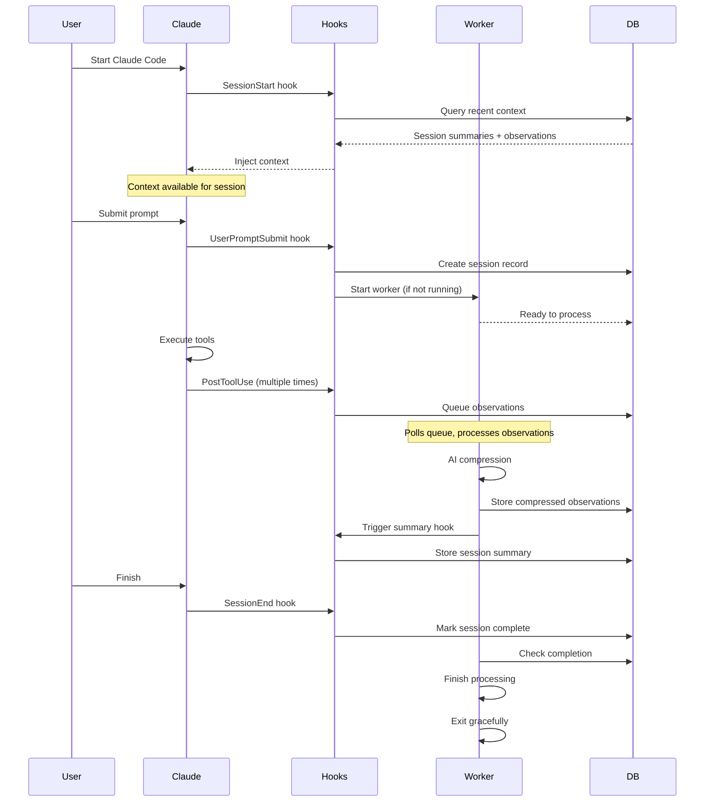

# How Claude-Mem Uses Hooks: A Lifecycle-Driven Architecture

## Core Principle
**Observe the main Claude Code session from the outside, process observations in the background, inject context at the right time.**

---

## The Big Picture

Claude-Mem is fundamentally a **hook-driven system**. Every piece of functionality happens in response to lifecycle events:

```
┌─────────────────────────────────────────────────────────┐
│              CLAUDE CODE SESSION                         │
│  (Main session - user interacting with Claude)          │
│                                                          │
│  SessionStart → UserPromptSubmit → Tool Use → Stop      │
│     ↓ ↓ ↓            ↓               ↓          ↓        │
│  [3 Hooks]        [Hook]          [Hook]     [Hook]     │
└─────────────────────────────────────────────────────────┘
    ↓ ↓ ↓             ↓               ↓          ↓
┌─────────────────────────────────────────────────────────┐
│                  CLAUDE-MEM SYSTEM                       │
│                                                          │
│  Smart      Worker      Context    New        Obs       │
│  Install    Start       Inject     Session    Capture   │
└─────────────────────────────────────────────────────────┘
```

<Note>
As of Claude Code 2.1.0 (ultrathink update), SessionStart hooks no longer display user-visible messages. Context is silently injected via `hookSpecificOutput.additionalContext`.
</Note>

**Key insight:** Claude-Mem doesn't interrupt or modify Claude Code's behavior. It observes from the outside and provides value through lifecycle hooks.

---

## Why Hooks?

### The Non-Invasive Requirement

Claude-Mem had several architectural constraints:

1. **Can't modify Claude Code**: It's a closed-source binary
2. **Must be fast**: Can't slow down the main session
3. **Must be reliable**: Can't break Claude Code if it fails
4. **Must be portable**: Works on any project without configuration

**Solution:** External command hooks configured via settings.json

### The Hook System Advantage

Claude Code's hook system provides exactly what we need:

<CardGroup cols={2}>
  <Card title="Lifecycle Events" icon="clock">
    SessionStart, UserPromptSubmit, PreToolUse (Read), PostToolUse, Stop, SessionEnd
  </Card>

  <Card title="Non-Blocking" icon="forward">
    Hooks run in parallel, don't wait for completion
  </Card>

  <Card title="Context Injection" icon="upload">
    SessionStart and UserPromptSubmit can add context
  </Card>

  <Card title="Tool Observation" icon="eye">
    PostToolUse sees all tool inputs and outputs
  </Card>
</CardGroup>

---

## The Hook Scripts

Claude-Mem uses lifecycle hook scripts across 5 lifecycle events. Runtime setup is handled out-of-band by `npx claude-mem install` (and `npx claude-mem repair`); the Setup hook only runs a sub-100ms `version-check.js` to flag stale installs. SessionStart runs 2 hooks in sequence: worker-service start, then context-hook.

### Setup Hook: Version Check

**Purpose:** Detect stale installs caused by external plugin upgrades and prompt the user to repair.

**Note:** Runtime installation (Bun, uv, `bun install` in the plugin cache) is performed by `npx claude-mem install` and `npx claude-mem repair` — the Setup hook itself never installs anything.

**When:** Claude Code Setup phase, before every session.

**What it does:**
1. Reads the `.install-version` marker written by the npx installer.
2. Compares it against the currently loaded plugin version.
3. On mismatch, writes `run: npx claude-mem repair` to stderr.
4. Always exits 0 (non-blocking, sub-100ms).

**Configuration:**
```json
{
  "hooks": {
    "Setup": [{
      "hooks": [{
        "type": "command",
        "command": "node ${CLAUDE_PLUGIN_ROOT}/scripts/version-check.js",
        "timeout": 60
      }]
    }]
  }
}
```

**Key Features:**
- ✅ Sub-100ms version-marker check (no I/O beyond reading the marker)
- ✅ Always exit 0 — never blocks a session
- ✅ Clear repair instructions on stderr when the plugin was upgraded externally (e.g. `claude plugin update`)

**Source:** `scripts/version-check.js`. The matching installer logic lives in `npx claude-mem install` / `npx claude-mem repair`, which install Bun + uv globally, run `bun install` in the plugin cache, and write the `.install-version` marker — all behind a visible clack spinner.

---

### Hook 1: SessionStart - Context Injection

**Purpose:** Inject relevant context from previous sessions

**When:** Claude Code starts (runs after the worker-start SessionStart entry)

**What it does:**
1. Extracts project name from current working directory
2. Queries SQLite for recent session summaries (last 10)
3. Queries SQLite for recent observations (configurable, default 50)
4. Formats as progressive disclosure index
5. Outputs to stdout (automatically injected into context)

**Key decisions:**
- ✅ Runs on startup, clear, and compact
- ✅ 300-second timeout (allows for npm install if needed)
- ✅ Progressive disclosure format (index, not full details)
- ✅ Configurable observation count via `CLAUDE_MEM_CONTEXT_OBSERVATIONS`

**Output format:**
```markdown
# [claude-mem] recent context

**Legend:** 🎯 session-request | 🔴 gotcha | 🟡 problem-solution ...

### Oct 26, 2025

**General**
| ID | Time | T | Title | Tokens |
|----|------|---|-------|--------|
| #2586 | 12:58 AM | 🔵 | Context hook file empty | ~51 |

*Use MCP search tools to access full details*
```

**Source:** `src/hooks/context-hook.ts` → `plugin/scripts/context-hook.js`

---

### Hook 2: UserPromptSubmit (New Session Hook)

**Purpose:** Initialize session tracking when user submits a prompt

**When:** Before Claude processes the user's message

**What it does:**
1. Reads user prompt and session ID from stdin
2. Creates new session record in SQLite
3. Saves raw user prompt for full-text search (v4.2.0+)
4. Starts Bun worker service if not running
5. Returns immediately (non-blocking)

**Configuration:**
```json
{
  "hooks": {
    "UserPromptSubmit": [{
      "hooks": [{
        "type": "command",
        "command": "${CLAUDE_PLUGIN_ROOT}/scripts/new-hook.js"
      }]
    }]
  }
}
```

**Key decisions:**
- ✅ No matcher (runs for all prompts)
- ✅ Creates session record immediately
- ✅ Stores raw prompts for search (privacy note: local SQLite only)
- ✅ Auto-starts worker service
- ✅ Suppresses output (`suppressOutput: true`)

**Database operations:**
```sql
INSERT INTO sdk_sessions (claude_session_id, project, user_prompt, ...)
VALUES (?, ?, ?, ...)

INSERT INTO user_prompts (session_id, prompt, prompt_number, ...)
VALUES (?, ?, ?, ...)
```

**Source:** `src/hooks/new-hook.ts` → `plugin/scripts/new-hook.js`

---

### Hook 3: PostToolUse (Save Observation Hook)

**Purpose:** Capture tool execution observations for later processing

**When:** Immediately after any tool completes successfully

**What it does:**
1. Receives tool name, input, output from stdin
2. Finds active session for current project
3. Enqueues observation in observation_queue table
4. Returns immediately (processing happens in worker)

**Configuration:**
```json
{
  "hooks": {
    "PostToolUse": [{
      "matcher": "*",
      "hooks": [{
        "type": "command",
        "command": "${CLAUDE_PLUGIN_ROOT}/scripts/save-hook.js"
      }]
    }]
  }
}
```

**Key decisions:**
- ✅ Matcher: `*` (captures all tools)
- ✅ Non-blocking (just enqueues, doesn't process)
- ✅ Worker processes observations asynchronously
- ✅ Parallel execution safe (each hook gets own stdin)

**Database operations:**
```sql
INSERT INTO observation_queue (session_id, tool_name, tool_input, tool_output, ...)
VALUES (?, ?, ?, ?, ...)
```

**What gets queued:**
```json
{
  "session_id": "abc123",
  "tool_name": "Edit",
  "tool_input": {
    "file_path": "/path/to/file.ts",
    "old_string": "...",
    "new_string": "..."
  },
  "tool_output": {
    "success": true,
    "linesChanged": 5
  },
  "created_at_epoch": 1698765432
}
```

**Source:** `src/hooks/save-hook.ts` → `plugin/scripts/save-hook.js`

---

### Hook 4: Stop Hook (Summary Generation)

**Purpose:** Generate AI-powered session summaries during the session

**When:** When Claude stops (triggered by Stop lifecycle event)

**What it does:**
1. Gathers session observations from database
2. Sends to Claude Agent SDK for summarization
3. Processes response and extracts structured summary
4. Stores in session_summaries table

**Configuration:**
```json
{
  "hooks": {
    "Stop": [{
      "hooks": [{
        "type": "command",
        "command": "${CLAUDE_PLUGIN_ROOT}/scripts/summary-hook.js"
      }]
    }]
  }
}
```

**Key decisions:**
- ✅ Triggered by Stop lifecycle event
- ✅ Multiple summaries per session (v4.2.0+)
- ✅ Summaries are checkpoints, not endings
- ✅ Uses Claude Agent SDK for AI compression

**Summary structure:**
```xml
<summary>
  <request>User's original request</request>
  <investigated>What was examined</investigated>
  <learned>Key discoveries</learned>
  <completed>Work finished</completed>
  <next_steps>Remaining tasks</next_steps>
  <files_read>
    <file>path/to/file1.ts</file>
    <file>path/to/file2.ts</file>
  </files_read>
  <files_modified>
    <file>path/to/file3.ts</file>
  </files_modified>
  <notes>Additional context</notes>
</summary>
```

**Source:** `src/hooks/summary-hook.ts` → `plugin/scripts/summary-hook.js`

---

### Hook 5: SessionEnd (Cleanup Hook)

**Purpose:** Mark sessions as completed when they end

**When:** Claude Code session ends (not on `/clear`)

**What it does:**
1. Marks session as completed in database
2. Allows worker to finish processing
3. Performs graceful cleanup

**Configuration:**
```json
{
  "hooks": {
    "SessionEnd": [{
      "hooks": [{
        "type": "command",
        "command": "${CLAUDE_PLUGIN_ROOT}/scripts/cleanup-hook.js"
      }]
    }]
  }
}
```

**Key decisions:**
- ✅ Graceful completion (v4.1.0+)
- ✅ No longer sends DELETE to workers
- ✅ Skips cleanup on `/clear` commands
- ✅ Preserves ongoing sessions

**Why graceful cleanup?**

**Old approach (v3):**
```typescript
// ❌ Aggressive cleanup
SessionEnd → DELETE /worker/session → Worker stops immediately
```

**Problems:**
- Interrupted summary generation
- Lost pending observations
- Race conditions

**New approach (v4.1.0+):**
```typescript
// ✅ Graceful completion
SessionEnd → UPDATE sessions SET completed_at = NOW()
Worker sees completion → Finishes processing → Exits naturally
```

**Benefits:**
- Worker finishes important operations
- Summaries complete successfully
- Clean state transitions

**Source:** `src/hooks/cleanup-hook.ts` → `plugin/scripts/cleanup-hook.js`

---

## Hook Execution Flow

### Session Lifecycle



### Hook Timing

| Event | Timing | Blocking | Timeout | Output Handling |
|-------|--------|----------|---------|-----------------|
| **Setup (version-check)** | Before session | No | 60s | stderr hint on stale install (always exit 0) |
| **SessionStart (worker-start)** | Before session | No | 60s | stderr (log only) |
| **SessionStart (context)** | Before session | No | 60s | JSON → additionalContext (silent) |
| **UserPromptSubmit** | Before processing | No | 60s | stdout → context |
| **PostToolUse** | After tool | No | 120s | Transcript only |
| **Summary** | Worker triggered | No | 120s | Database |
| **SessionEnd** | On exit | No | 120s | Log only |

<Note>
As of Claude Code 2.1.0 (ultrathink update), SessionStart hooks no longer display user-visible messages. Context is silently injected via `hookSpecificOutput.additionalContext`.
</Note>

---

## The Worker Service Architecture

### Why a Background Worker?

**Problem:** Hooks must be fast (< 1 second)

**Reality:** AI compression takes 5-30 seconds per observation

**Solution:** Hooks enqueue observations, worker processes async

```
┌─────────────────────────────────────────────────────────┐
│                   HOOK (Fast)                            │
│  1. Read stdin (< 1ms)                                  │
│  2. Insert into queue (< 10ms)                          │
│  3. Return success (< 20ms total)                       │
└─────────────────────────────────────────────────────────┘
                        ↓ (queue)
┌─────────────────────────────────────────────────────────┐
│                 WORKER (Slow)                            │
│  1. Poll queue every 1s                                 │
│  2. Process observation via Claude SDK (5-30s)          │
│  3. Parse and store results                             │
│  4. Mark observation processed                          │
└─────────────────────────────────────────────────────────┘
```

### Bun Process Management

**Technology:** Bun (JavaScript runtime and process manager)

**Why Bun:**
- Auto-restart on failure
- Fast startup and low memory footprint
- Built-in TypeScript support
- Cross-platform (works on macOS, Linux, Windows)
- No separate process manager needed

**Worker lifecycle:**
```bash
# Started by hooks automatically (if not running)
npm run worker:start

# Status check
npm run worker:status

# View logs
npm run worker:logs

# Restart
npm run worker:restart

# Stop
npm run worker:stop
```

### Worker HTTP API

**Technology:** Express.js REST API on the worker's per-user port (default `37700 + (uid % 100)`, override via `CLAUDE_MEM_WORKER_PORT`)

**Endpoints:**

| Endpoint | Method | Purpose |
|----------|--------|---------|
| `/health` | GET | Health check |
| `/sessions` | POST | Create session |
| `/sessions/:id` | GET | Get session status |
| `/sessions/:id` | PATCH | Update session |
| `/observations` | POST | Enqueue observation |
| `/observations/:id` | GET | Get observation |

**Why HTTP API?**
- Language-agnostic (hooks can be any language)
- Easy debugging (curl commands)
- Standard error handling
- Proper async handling

---

## Design Patterns

### Pattern 1: Fire-and-Forget Hooks

**Principle:** Hooks should return immediately, not wait for completion

```typescript
// ❌ Bad: Hook waits for processing
export async function saveHook(stdin: HookInput) {
  const observation = parseInput(stdin);
  await processObservation(observation);  // BLOCKS!
  return success();
}

// ✅ Good: Hook enqueues and returns
export async function saveHook(stdin: HookInput) {
  const observation = parseInput(stdin);
  await enqueueObservation(observation);  // Fast
  return success();  // Immediate
}
```

### Pattern 2: Queue-Based Processing

**Principle:** Decouple capture from processing

```
Hook (capture) → Queue (buffer) → Worker (process)
```

**Benefits:**
- Parallel hook execution safe
- Worker failure doesn't affect hooks
- Retry logic centralized
- Backpressure handling

### Pattern 3: Graceful Degradation

**Principle:** Memory system failure shouldn't break Claude Code

```typescript
try {
  await captureObservation();
} catch (error) {
  // Log error, but don't throw
  console.error('Memory capture failed:', error);
  return { continue: true, suppressOutput: true };
}
```

**Failure modes:**
- Database locked → Skip observation, log error
- Worker crashed → Auto-restart via Bun
- Network issue → Retry with exponential backoff
- Disk full → Warn user, disable memory

### Pattern 4: Progressive Enhancement

**Principle:** Core functionality works without memory, memory enhances it

```
Without memory: Claude Code works normally
With memory:    Claude Code + context from past sessions
Memory broken:  Falls back to working normally
```

---

## Hook Debugging

### Debug Mode

Enable detailed hook execution logs:

```bash
claude --debug
```

**Output:**
```
[DEBUG] Executing hooks for PostToolUse:Write
[DEBUG] Getting matching hook commands for PostToolUse with query: Write
[DEBUG] Found 1 hook matchers in settings
[DEBUG] Matched 1 hooks for query "Write"
[DEBUG] Found 1 hook commands to execute
[DEBUG] Executing hook command: ${CLAUDE_PLUGIN_ROOT}/scripts/save-hook.js with timeout 60000ms
[DEBUG] Hook command completed with status 0: {"continue":true,"suppressOutput":true}
```

### Common Issues

<AccordionGroup>
  <Accordion title="Hook not executing">
    **Symptoms:** Hook command never runs

    **Debugging:**
    1. Check `/hooks` menu - is hook registered?
    2. Verify matcher pattern (case-sensitive!)
    3. Test command manually: `echo '{}' | node save-hook.js`
    4. Check file permissions (executable?)
  </Accordion>

  <Accordion title="Hook times out">
    **Symptoms:** Hook execution exceeds timeout

    **Debugging:**
    1. Check timeout setting (default 60s)
    2. Identify slow operation (database? network?)
    3. Move slow operation to worker
    4. Increase timeout if necessary
  </Accordion>

  <Accordion title="Context not injecting">
    **Symptoms:** SessionStart hook runs but context missing

    **Debugging:**
    1. Check stdout (must be valid JSON or plain text)
    2. Verify no stderr output (pollutes JSON)
    3. Check exit code (must be 0)
    4. Look for npm install output (v4.3.1 fix)
  </Accordion>

  <Accordion title="Observations not captured">
    **Symptoms:** PostToolUse hook runs but observations missing

    **Debugging:**
    1. Check database: `sqlite3 ~/.claude-mem/claude-mem.db "SELECT * FROM observation_queue"`
    2. Verify session exists: `SELECT * FROM sdk_sessions`
    3. Check worker status: `npm run worker:status`
    4. View worker logs: `npm run worker:logs`
  </Accordion>
</AccordionGroup>

### Testing Hooks Manually

```bash
# Test context hook
echo '{
  "session_id": "test123",
  "cwd": "/Users/alex/projects/my-app",
  "hook_event_name": "SessionStart",
  "source": "startup"
}' | node plugin/scripts/context-hook.js

# Test save hook
echo '{
  "session_id": "test123",
  "tool_name": "Edit",
  "tool_input": {"file_path": "test.ts"},
  "tool_output": {"success": true}
}' | node plugin/scripts/save-hook.js

# Test with actual Claude Code
claude --debug
/hooks  # View registered hooks
# Submit prompt and watch debug output
```

---

## Performance Considerations

### Hook Execution Time

**Target:** < 100ms per hook

**Actual measurements:**

| Hook | Average | p95 | p99 |
|------|---------|-----|-----|
| Setup (version-check, marker matches) | 8ms | 20ms | 40ms |
| Setup (version-check, marker mismatch — stderr hint, still non-blocking) | 10ms | 25ms | 50ms |
| SessionStart (context) | 45ms | 120ms | 250ms |
| SessionStart (user-message) | 5ms | 10ms | 15ms |
| UserPromptSubmit | 12ms | 25ms | 50ms |
| PostToolUse | 8ms | 15ms | 30ms |
| SessionEnd | 5ms | 10ms | 20ms |

**Why the Setup hook stays fast:**
- The Setup hook only reads the `.install-version` marker — no `npm install`, no spawned subprocesses.
- All heavy lifting (Bun + uv install, `bun install` inside the plugin cache) happens in `npx claude-mem install` / `npx claude-mem repair`, which run with a visible clack spinner outside the session lifecycle.
- On marker mismatch the hook prints a one-line `run: npx claude-mem repair` hint to stderr and exits 0; the user opts into the slow path explicitly.

### Database Performance

**Schema optimizations:**
- Indexes on `project`, `created_at_epoch`, `claude_session_id`
- FTS5 virtual tables for full-text search
- WAL mode for concurrent reads/writes

**Query patterns:**
```sql
-- Fast: Uses index on (project, created_at_epoch)
SELECT * FROM session_summaries
WHERE project = ?
ORDER BY created_at_epoch DESC
LIMIT 10

-- Fast: Uses index on claude_session_id
SELECT * FROM sdk_sessions
WHERE claude_session_id = ?
LIMIT 1

-- Fast: FTS5 full-text search
SELECT * FROM observations_fts
WHERE observations_fts MATCH ?
ORDER BY rank
LIMIT 20
```

### Worker Throughput

**Bottleneck:** Claude API latency (5-30s per observation)

**Mitigation:**
- Process observations sequentially (simpler, more predictable)
- Skip low-value observations (TodoWrite, ListMcpResourcesTool)
- Batch summaries (generate every N observations, not every observation)

**Future optimization:**
- Parallel processing (multiple workers)
- Smart batching (combine related observations)
- Lazy summarization (summarize only when needed)

---

## Security Considerations

### Hook Command Safety

**Risk:** Hooks execute arbitrary commands with user permissions

**Mitigations:**
1. **Frozen at startup:** Hook configuration captured at start, changes require review
2. **User review required:** `/hooks` menu shows changes, requires approval
3. **Plugin isolation:** `${CLAUDE_PLUGIN_ROOT}` prevents path traversal
4. **Input validation:** Hooks validate stdin schema before processing

### Data Privacy

**What gets stored:**
- User prompts (raw text) - v4.2.0+
- Tool inputs and outputs
- File paths read/modified
- Session summaries

**Privacy guarantees:**
- All data stored locally in `~/.claude-mem/claude-mem.db`
- No cloud uploads (API calls only for AI compression)
- SQLite file permissions: user-only read/write
- No analytics or telemetry

### API Key Protection

**Configuration:**
- Anthropic API key in `~/.anthropic/api_key` or `ANTHROPIC_API_KEY` env var
- Worker inherits environment from Claude Code
- Never logged or stored in database

---

## Key Takeaways

1. **Hooks are interfaces**: They define clean boundaries between systems
2. **Non-blocking is critical**: Hooks must return fast, workers do the heavy lifting
3. **Graceful degradation**: Memory system can fail without breaking Claude Code
4. **Queue-based decoupling**: Capture and processing happen independently
5. **Progressive disclosure**: Context injection uses index-first approach
6. **Lifecycle alignment**: Each hook has a clear, single purpose

---

## Further Reading

- [Claude Code Hooks Reference](https://docs.claude.com/claude-code/hooks) - Official documentation
- [Progressive Disclosure](progressive-disclosure) - Context priming philosophy
- [Architecture Evolution](architecture-evolution) - v3 to v4 journey
- [Worker Service Design](architecture/worker-service) - Background processing details

---

*The hook-driven architecture enables Claude-Mem to be both powerful and invisible. Users never notice the memory system working - it just makes Claude smarter over time.*
