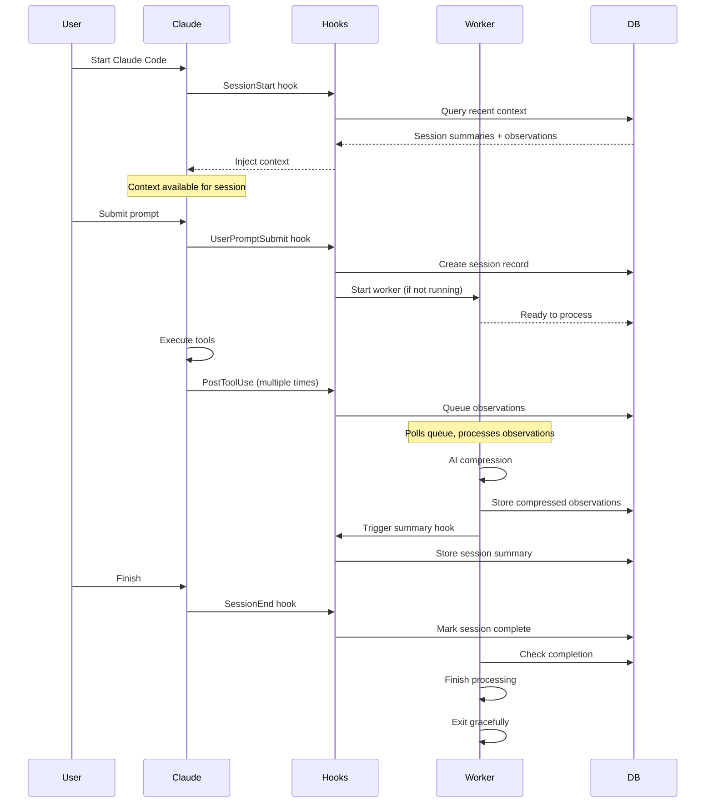

# How Claude-Mem Uses Hooks: A Lifecycle-Driven Architecture

## Core Principle
**Observe the main Claude Code session from the outside, process observations in the background, inject context at the right time.**

---

## The Big Picture

Claude-Mem is fundamentally a **hook-driven system**. Every piece of functionality happens in response to lifecycle events:

```
┌─────────────────────────────────────────────────────────┐
│              CLAUDE CODE SESSION                         │
│  (Main session - user interacting with Claude)          │
│                                                          │
│  SessionStart → UserPromptSubmit → Tool Use → Stop      │
│     ↓ ↓ ↓            ↓               ↓          ↓        │
│  [3 Hooks]        [Hook]          [Hook]     [Hook]     │
└─────────────────────────────────────────────────────────┘
    ↓ ↓ ↓             ↓               ↓          ↓
┌─────────────────────────────────────────────────────────┐
│                  CLAUDE-MEM SYSTEM                       │
│                                                          │
│  Smart      Worker      Context    New        Obs       │
│  Install    Start       Inject     Session    Capture   │
└─────────────────────────────────────────────────────────┘
```

<Note>
As of Claude Code 2.1.0 (ultrathink update), SessionStart hooks no longer display user-visible messages. Context is silently injected via `hookSpecificOutput.additionalContext`.
</Note>

**Key insight:** Claude-Mem doesn't interrupt or modify Claude Code's behavior. It observes from the outside and provides value through lifecycle hooks.

---

## Why Hooks?

### The Non-Invasive Requirement

Claude-Mem had several architectural constraints:

1. **Can't modify Claude Code**: It's a closed-source binary
2. **Must be fast**: Can't slow down the main session
3. **Must be reliable**: Can't break Claude Code if it fails
4. **Must be portable**: Works on any project without configuration

**Solution:** External command hooks configured via settings.json

### The Hook System Advantage

Claude Code's hook system provides exactly what we need:

<CardGroup cols={2}>
  <Card title="Lifecycle Events" icon="clock">
    SessionStart, UserPromptSubmit, PreToolUse (Read), PostToolUse, Stop, SessionEnd
  </Card>

  <Card title="Non-Blocking" icon="forward">
    Hooks run in parallel, don't wait for completion
  </Card>

  <Card title="Context Injection" icon="upload">
    SessionStart and UserPromptSubmit can add context
  </Card>

  <Card title="Tool Observation" icon="eye">
    PostToolUse sees all tool inputs and outputs
  </Card>
</CardGroup>

---

## The Hook Scripts

Claude-Mem registers hooks for 6 lifecycle events (SessionStart, UserPromptSubmit, PreToolUse for `Read`, PostToolUse, Stop, SessionEnd) plus a Setup hook. `npx claude-mem install` (and `npx claude-mem repair`) set up the runtime. SessionStart runs 2 hooks: worker-service start, which is async so session start never waits on it, and the synchronous context hook, which starts the worker itself when needed. A third, startup-only SessionStart entry keeps the hook launcher on PATH.

### How Every Hook Is Launched

Each runtime hook is one short **exec-form** command: `command` + `args`, with no `shell` key. Claude Code resolves `claude-mem` on PATH and spawns it directly, with no bash, no shell string and no per-call shell startup. On Windows that also means no Git Bash requirement and no console window from a bash → node chain.

```json
{
  "hooks": {
    "SessionStart": [
      {
        "matcher": "startup|resume|clear|compact",
        "hooks": [
          { "type": "command", "command": "claude-mem", "args": ["start"], "timeout": 60, "async": true },
          { "type": "command", "command": "claude-mem", "args": ["hook", "claude-code", "context"], "timeout": 60 }
        ]
      },
      {
        "matcher": "startup",
        "hooks": [
          { "type": "command", "command": "node", "args": ["${CLAUDE_PLUGIN_ROOT}/scripts/ensure-launcher.cjs"], "timeout": 180 }
        ]
      }
    ],
    "PostToolUse": [
      {
        "matcher": "*",
        "hooks": [
          { "type": "command", "command": "claude-mem", "args": ["hook", "claude-code", "observation"], "timeout": 120, "async": true }
        ]
      }
    ]
  }
}
```

The other events follow the same shape (`session-init`, `file-context`, `summarize`, `session-end`). See `plugin/hooks/hooks.json` for the full file; it is generated by `scripts/build-hooks.js`, and the build rejects any runtime entry that has a `shell` key or a `command` other than `claude-mem`.

**The `claude-mem` launcher:**
- A small compiled binary (`bun build --compile` of `plugin/scripts/claude-mem-launcher.cjs`), placed by `npx claude-mem install` / `update` at `~/.local/bin/claude-mem` on macOS and Linux, or `%LOCALAPPDATA%\claude-mem\bin\claude-mem.exe` on Windows, and added to PATH (shell rc file on POSIX, user Path on Windows).
- Its only job: find the installed plugin root (`CLAUDE_PLUGIN_ROOT`, then the newest plugin cache version, then the marketplace copy), run `worker-service.cjs` with the same arguments under Bun, pass the hook's stdin through, and exit 0 on any failure with one `claude-mem: <reason>, continuing without memory` line on stderr. It never exits 2, so it never blocks a prompt or a tool.
- It is **version-stable**: it carries no claude-mem logic, so marketplace auto-updates keep working with the binary already on PATH. `claude-mem --version` prints its protocol number.
- It is not the npm package's `claude-mem` CLI. A global npm `claude-mem` earlier on PATH shadows it; `npx claude-mem doctor` reports that.

**Self-heal for marketplace-only installs.** A marketplace install or update runs no installer code, and Claude Code puts a plugin's `bin/` only on the Bash tool's PATH, not on the hook PATH. The startup-only SessionStart entry, `node ${CLAUDE_PLUGIN_ROOT}/scripts/ensure-launcher.cjs`, compiles and places the launcher when it is missing or older than the plugin needs. It is synchronous and always exits 0. When the launcher is current it prints nothing; when the memory hooks cannot work it prints one `{"systemMessage": "..."}` line to stdout, which Claude Code shows to the user (see below). It runs alongside the other SessionStart hooks, so if the launcher was missing, the other hooks in that first session fail with `Executable not found in $PATH: "claude-mem"`, and that session can miss memory context.

**When the launcher is missing.** Claude Code reports a missing hook executable as a non-blocking error on every hook call (`Executable not found in $PATH: "claude-mem"`) and the session carries on without memory. When the launcher cannot be made active, session start shows:

```
claude-mem: memory hooks are not active: <reason>. Fix: run `npx claude-mem install`, then restart Claude Code.
```

See [claude-mem: command not found in hooks](/troubleshooting#claude-mem-command-not-found-in-hooks).

### Setup Hook: Version Check

**Purpose:** Make sure the loaded plugin can start its worker: install the runtime dependencies the plugin marketplace left out, and record the `.install-version` marker.

**Note:** `npx claude-mem install` and `npx claude-mem repair` install Bun, uv and the plugin dependencies up front. The plugin marketplace (including `claude plugin update`) only extracts files.

**When:** Only when Claude Code is started with `claude --init`, `claude --init-only` or `claude -p --maintenance`. Claude Code does **not** fire Setup on plugin install, plugin update or a normal session start, so for marketplace installs it is a manual repair path, not an automatic one.

**What it does:**
1. Checks that every dependency declared in the plugin's `package.json` (plus the `zod` subpaths the worker loads) is present in its `node_modules`, not just that the folder exists.
2. If any are missing, runs `bun install --production` in the plugin root (up to 120s), then checks again. A partial tree is kept, never deleted.
3. If dependencies are still missing, prints `claude-mem: plugin dependencies missing (…) - run: npx claude-mem@latest install`, naming the modules (stderr; Codex receives it as SessionStart context).
4. If the closure is complete and `.install-version` is missing, unreadable or from another version, writes the marker itself (`{version, installedAt, bun}`) instead of sending a working install to the installer.
5. Always exits 0 — never blocks a session.

**Configuration** (simplified; the shipped entry is the one hook that still uses `"shell": "bash"`, which first resolves the plugin root and Node):
```json
{
  "hooks": {
    "Setup": [{
      "matcher": "*",
      "hooks": [{
        "type": "command",
        "shell": "bash",
        "command": "node \"$_P/scripts/version-check.js\"",
        "timeout": 300
      }]
    }]
  }
}
```

**Key Features:**
- ✅ Fast when the install is complete: a declared-dependency check, no install
- ✅ Repairs marketplace installs on `--init` / `--maintenance`: installs missing dependencies and writes the marker
- ✅ Names the missing modules when an install cannot be completed
- ✅ Always exit 0 — never blocks a session

**Source:** `plugin/scripts/version-check.js`. `npx claude-mem install` / `npx claude-mem repair` do the same work ahead of time — they install Bun + uv globally, run `bun install` in the plugin cache, and write the `.install-version` marker — behind a visible clack spinner.

---

### Hook 1: SessionStart - Context Injection

**Purpose:** Inject relevant context from previous sessions

**When:** Claude Code starts (runs alongside the async worker-start SessionStart entry)

**What it does:**
1. Extracts project name from current working directory
2. Queries SQLite for recent session summaries (last 10)
3. Queries SQLite for recent observations (configurable, default 50)
4. Formats as progressive disclosure index
5. Outputs to stdout (automatically injected into context)

**Key decisions:**
- ✅ Runs on startup, clear, and compact
- ✅ 300-second timeout (allows for npm install if needed)
- ✅ Progressive disclosure format (index, not full details)
- ✅ Configurable observation count via `CLAUDE_MEM_CONTEXT_OBSERVATIONS`

**Output format:**
```markdown
# [claude-mem] recent context

**Legend:** 🎯 session-request | 🔴 gotcha | 🟡 problem-solution ...

### Oct 26, 2025

**General**
| ID | Time | T | Title | Tokens |
|----|------|---|-------|--------|
| #2586 | 12:58 AM | 🔵 | Context hook file empty | ~51 |

*Use MCP search tools to access full details*
```

**Source:** `src/cli/handlers/context.ts`, run as `claude-mem hook claude-code context`

---

### Hook 2: UserPromptSubmit (New Session Hook)

**Purpose:** Initialize session tracking when user submits a prompt

**When:** Before Claude processes the user's message

**What it does:**
1. Reads user prompt and session ID from stdin
2. Creates new session record in SQLite
3. Saves raw user prompt for full-text search (v4.2.0+)
4. Starts Bun worker service if not running
5. Returns immediately (non-blocking)

**Configuration:**
```json
{
  "hooks": {
    "UserPromptSubmit": [{
      "hooks": [{
        "type": "command",
        "command": "claude-mem",
        "args": ["hook", "claude-code", "session-init"],
        "timeout": 15
      }]
    }]
  }
}
```

**Key decisions:**
- ✅ No matcher (runs for all prompts)
- ✅ Creates session record immediately
- ✅ Stores raw prompts for search (privacy note: local SQLite only)
- ✅ Auto-starts worker service
- ✅ Suppresses output (`suppressOutput: true`)

**Database operations:**
```sql
INSERT INTO sdk_sessions (claude_session_id, project, user_prompt, ...)
VALUES (?, ?, ?, ...)

INSERT INTO user_prompts (session_id, prompt, prompt_number, ...)
VALUES (?, ?, ?, ...)
```

**Source:** `src/cli/handlers/session-init.ts`, run as `claude-mem hook claude-code session-init`

---

### Hook 3: PostToolUse (Save Observation Hook)

**Purpose:** Capture tool execution observations for later processing

**When:** Immediately after any tool completes successfully

**What it does:**
1. Receives tool name, input, output from stdin
2. Finds active session for current project
3. Enqueues observation in observation_queue table
4. Returns immediately (processing happens in worker)

**Configuration:**
```json
{
  "hooks": {
    "PostToolUse": [{
      "matcher": "*",
      "hooks": [{
        "type": "command",
        "command": "claude-mem",
        "args": ["hook", "claude-code", "observation"],
        "timeout": 120,
        "async": true
      }]
    }]
  }
}
```

**Key decisions:**
- ✅ Matcher: `*` (captures all tools)
- ✅ Non-blocking (just enqueues, doesn't process)
- ✅ Worker processes observations asynchronously
- ✅ Parallel execution safe (each hook gets own stdin)

**Database operations:**
```sql
INSERT INTO observation_queue (session_id, tool_name, tool_input, tool_output, ...)
VALUES (?, ?, ?, ?, ...)
```

**What gets queued:**
```json
{
  "session_id": "abc123",
  "tool_name": "Edit",
  "tool_input": {
    "file_path": "/path/to/file.ts",
    "old_string": "...",
    "new_string": "..."
  },
  "tool_output": {
    "success": true,
    "linesChanged": 5
  },
  "created_at_epoch": 1698765432
}
```

**Source:** `src/cli/handlers/observation.ts`, run as `claude-mem hook claude-code observation`

---

### Hook 4: Stop Hook (Summary Generation)

**Purpose:** Generate AI-powered session summaries during the session

**When:** When Claude stops (triggered by Stop lifecycle event)

**What it does:**
1. Gathers session observations from database
2. Sends to Claude Agent SDK for summarization
3. Processes response and extracts structured summary
4. Stores in session_summaries table

**Configuration:**
```json
{
  "hooks": {
    "Stop": [{
      "hooks": [{
        "type": "command",
        "command": "claude-mem",
        "args": ["hook", "claude-code", "summarize"],
        "timeout": 120,
        "async": true
      }]
    }]
  }
}
```

**Key decisions:**
- ✅ Triggered by Stop lifecycle event
- ✅ Multiple summaries per session (v4.2.0+)
- ✅ Summaries are checkpoints, not endings
- ✅ Uses Claude Agent SDK for AI compression

**Summary structure:**
```xml
<summary>
  <request>User's original request</request>
  <investigated>What was examined</investigated>
  <learned>Key discoveries</learned>
  <completed>Work finished</completed>
  <next_steps>Remaining tasks</next_steps>
  <files_read>
    <file>path/to/file1.ts</file>
    <file>path/to/file2.ts</file>
  </files_read>
  <files_modified>
    <file>path/to/file3.ts</file>
  </files_modified>
  <notes>Additional context</notes>
</summary>
```

**Source:** `src/cli/handlers/summarize.ts`, run as `claude-mem hook claude-code summarize`

---

### Hook 5: SessionEnd (Cleanup Hook)

**Purpose:** Mark sessions as completed when they end

**When:** Claude Code session ends (not on `/clear`)

**What it does:**
1. Marks session as completed in database
2. Allows worker to finish processing
3. Performs graceful cleanup

**Configuration:**
```json
{
  "hooks": {
    "SessionEnd": [{
      "hooks": [{
        "type": "command",
        "command": "claude-mem",
        "args": ["hook", "claude-code", "session-end"],
        "async": true
      }]
    }]
  }
}
```

**Key decisions:**
- ✅ Graceful completion (v4.1.0+)
- ✅ No longer sends DELETE to workers
- ✅ Skips cleanup on `/clear` commands
- ✅ Preserves ongoing sessions

**Why graceful cleanup?**

**Old approach (v3):**
```typescript
// ❌ Aggressive cleanup
SessionEnd → DELETE /worker/session → Worker stops immediately
```

**Problems:**
- Interrupted summary generation
- Lost pending observations
- Race conditions

**New approach (v4.1.0+):**
```typescript
// ✅ Graceful completion
SessionEnd → UPDATE sessions SET completed_at = NOW()
Worker sees completion → Finishes processing → Exits naturally
```

**Benefits:**
- Worker finishes important operations
- Summaries complete successfully
- Clean state transitions

**Source:** `src/cli/handlers/session-end.ts`, run as `claude-mem hook claude-code session-end`

---

## Hook Execution Flow

### Session Lifecycle


```mermaid
sequenceDiagram
    participant User
    participant Claude
    participant Hooks
    participant Worker
    participant DB

    User->>Claude: Start Claude Code
    Claude->>Hooks: SessionStart hook
    Hooks->>DB: Query recent context
    DB-->>Hooks: Session summaries + observations
    Hooks-->>Claude: Inject context
    Note over Claude: Context available for session

    User->>Claude: Submit prompt
    Claude->>Hooks: UserPromptSubmit hook
    Hooks->>DB: Create session record
    Hooks->>Worker: Start worker (if not running)
    Worker-->>DB: Ready to process

    Claude->>Claude: Execute tools
    Claude->>Hooks: PostToolUse (multiple times)
    Hooks->>DB: Queue observations
    Note over Worker: Polls queue, processes observations

    Worker->>Worker: AI compression
    Worker->>DB: Store compressed observations
    Worker->>Hooks: Trigger summary hook
    Hooks->>DB: Store session summary

    User->>Claude: Finish
    Claude->>Hooks: SessionEnd hook
    Hooks->>DB: Mark session complete
    Worker->>DB: Check completion
    Worker->>Worker: Finish processing
    Worker->>Worker: Exit gracefully
```

### Hook Timing

| Event | Timing | Blocking | Timeout | Output Handling |
|-------|--------|----------|---------|-----------------|
| **Setup (version-check)** | `claude --init` / `--maintenance` only | No | 300s | Installs missing plugin dependencies; stderr hint only if they are still missing (always exit 0) |
| **SessionStart (worker-start)** | Session start (async) | No | 60s | stderr (log only) |
| **SessionStart (context)** | Before session | No | 60s | JSON → additionalContext (silent) |
| **SessionStart (ensure-launcher)** | Startup only (synchronous) | No | 180s | Nothing on success; one `systemMessage` JSON line (shown to the user) when the hooks are not active; stderr (debug log only) |
| **UserPromptSubmit** | Before processing | No | 15s (10s internal budget; 7s on Windows) | stdout → context |
| **PostToolUse** | After tool | No | 120s | Transcript only |
| **Summary** | Worker triggered | No | 120s | Database |
| **SessionEnd** | On exit | No | 120s | Log only |

<Note>
As of Claude Code 2.1.0 (ultrathink update), SessionStart hooks no longer display user-visible messages. Context is silently injected via `hookSpecificOutput.additionalContext`.
</Note>

---

## The Worker Service Architecture

### Why a Background Worker?

**Problem:** Hooks must be fast (< 1 second)

**Reality:** AI compression takes 5-30 seconds per observation

**Solution:** Hooks enqueue observations, worker processes async

```
┌─────────────────────────────────────────────────────────┐
│                   HOOK (Fast)                            │
│  1. Read stdin (< 1ms)                                  │
│  2. Insert into queue (< 10ms)                          │
│  3. Return success (< 20ms total)                       │
└─────────────────────────────────────────────────────────┘
                        ↓ (queue)
┌─────────────────────────────────────────────────────────┐
│                 WORKER (Slow)                            │
│  1. Poll queue every 1s                                 │
│  2. Process observation via Claude SDK (5-30s)          │
│  3. Parse and store results                             │
│  4. Mark observation processed                          │
└─────────────────────────────────────────────────────────┘
```

### Bun Process Management

**Technology:** Bun (JavaScript runtime and process manager)

**Why Bun:**
- Auto-restart on failure
- Fast startup and low memory footprint
- Built-in TypeScript support
- Cross-platform (works on macOS, Linux, Windows)
- No separate process manager needed

**Worker lifecycle:**
```bash
# Started by hooks automatically (if not running)
npm run worker:start

# Status check
npm run worker:status

# View logs
npm run worker:logs

# Restart
npm run worker:restart

# Stop
npm run worker:stop
```

### Worker HTTP API

**Technology:** Express.js REST API on the worker's per-user port (default `37700 + (uid % 100)`, override via `CLAUDE_MEM_WORKER_PORT`)

**Endpoints:**

| Endpoint | Method | Purpose |
|----------|--------|---------|
| `/health` | GET | Health check |
| `/sessions` | POST | Create session |
| `/sessions/:id` | GET | Get session status |
| `/sessions/:id` | PATCH | Update session |
| `/observations` | POST | Enqueue observation |
| `/observations/:id` | GET | Get observation |

**Why HTTP API?**
- Language-agnostic (hooks can be any language)
- Easy debugging (curl commands)
- Standard error handling
- Proper async handling

---

## Design Patterns

### Pattern 1: Fire-and-Forget Hooks

**Principle:** Hooks should return immediately, not wait for completion

```typescript
// ❌ Bad: Hook waits for processing
export async function saveHook(stdin: HookInput) {
  const observation = parseInput(stdin);
  await processObservation(observation);  // BLOCKS!
  return success();
}

// ✅ Good: Hook enqueues and returns
export async function saveHook(stdin: HookInput) {
  const observation = parseInput(stdin);
  await enqueueObservation(observation);  // Fast
  return success();  // Immediate
}
```

### Pattern 2: Queue-Based Processing

**Principle:** Decouple capture from processing

```
Hook (capture) → Queue (buffer) → Worker (process)
```

**Benefits:**
- Parallel hook execution safe
- Worker failure doesn't affect hooks
- Retry logic centralized
- Backpressure handling

### Pattern 3: Graceful Degradation

**Principle:** Memory system failure shouldn't break Claude Code

```typescript
try {
  await captureObservation();
} catch (error) {
  // Log error, but don't throw
  console.error('Memory capture failed:', error);
  return { continue: true, suppressOutput: true };
}
```

**Failure modes:**
- Launcher can't find the plugin or Bun → One stderr line, exit 0, session continues without memory
- `claude-mem` not on PATH → Claude Code shows a non-blocking hook error and continues
- Database locked → Skip observation, log error
- Worker crashed → Auto-restart via Bun
- Network issue → Retry with exponential backoff
- Disk full → Warn user, disable memory

### Pattern 4: Progressive Enhancement

**Principle:** Core functionality works without memory, memory enhances it

```
Without memory: Claude Code works normally
With memory:    Claude Code + context from past sessions
Memory broken:  Falls back to working normally
```

---

## Hook Debugging

### Debug Mode

Enable detailed hook execution logs:

```bash
claude --debug
```

**Output:**
```
[DEBUG] Executing hooks for PostToolUse:Write
[DEBUG] Getting matching hook commands for PostToolUse with query: Write
[DEBUG] Found 1 hook matchers in settings
[DEBUG] Matched 1 hooks for query "Write"
[DEBUG] Found 1 hook commands to execute
[DEBUG] Executing hook command: claude-mem hook claude-code observation with timeout 120000ms
[DEBUG] Hook command completed with status 0: {"continue":true,"suppressOutput":true}
```

### Common Issues

<AccordionGroup>
  <Accordion title="Hook not executing">
    **Symptoms:** Hook command never runs

    **Debugging:**
    1. Check `/hooks` menu - is hook registered?
    2. Verify matcher pattern (case-sensitive!)
    3. Check the launcher is on PATH: `command -v claude-mem && claude-mem --version` (prints a protocol number), or run `npx claude-mem doctor`
    4. Look for `Executable not found in $PATH: "claude-mem"` in `claude --debug` output; see [Troubleshooting](/troubleshooting#claude-mem-command-not-found-in-hooks)
  </Accordion>

  <Accordion title="Hook times out">
    **Symptoms:** Hook execution exceeds timeout

    **Debugging:**
    1. Check timeout setting (default 60s)
    2. Identify slow operation (database? network?)
    3. Move slow operation to worker
    4. Increase timeout if necessary
  </Accordion>

  <Accordion title="Context not injecting">
    **Symptoms:** SessionStart hook runs but context missing

    **Debugging:**
    1. Check stdout (must be valid JSON or plain text)
    2. Verify no stderr output (pollutes JSON)
    3. Check exit code (must be 0)
    4. Look for npm install output (v4.3.1 fix)
  </Accordion>

  <Accordion title="Observations not captured">
    **Symptoms:** PostToolUse hook runs but observations missing

    **Debugging:**
    1. Check database: `sqlite3 ~/.claude-mem/claude-mem.db "SELECT * FROM observation_queue"`
    2. Verify session exists: `SELECT * FROM sdk_sessions`
    3. Check worker status: `npm run worker:status`
    4. View worker logs: `npm run worker:logs`
  </Accordion>
</AccordionGroup>

### Testing Hooks Manually

```bash
# Test context hook
echo '{
  "session_id": "test123",
  "cwd": "/Users/alex/projects/my-app",
  "hook_event_name": "SessionStart",
  "source": "startup"
}' | claude-mem hook claude-code context

# Test save hook
echo '{
  "session_id": "test123",
  "tool_name": "Edit",
  "tool_input": {"file_path": "test.ts"},
  "tool_output": {"success": true}
}' | claude-mem hook claude-code observation

# Test with actual Claude Code
claude --debug
/hooks  # View registered hooks
# Submit prompt and watch debug output
```

---

## Performance Considerations

### Hook Execution Time

**Target:** < 100ms per hook

**Actual measurements:**

| Hook | Average | p95 | p99 |
|------|---------|-----|-----|
| Setup (version-check, dependencies complete, marker current) | 8ms | 20ms | 40ms |
| SessionStart (context) | 45ms | 120ms | 250ms |
| SessionStart (user-message) | 5ms | 10ms | 15ms |
| UserPromptSubmit | 12ms | 25ms | 50ms |
| PostToolUse | 8ms | 15ms | 30ms |
| SessionEnd | 5ms | 10ms | 20ms |

**Launcher overhead:** the compiled `claude-mem` launcher starts in about 10ms, and runtime hooks spawn no shell.

**When the Setup hook is fast, and when it is not:**
- With a complete dependency tree it only checks that the declared modules resolve, and rewrites the `.install-version` marker if it is missing or from another version — no install.
- Only an incomplete tree — a plugin-marketplace install or `claude plugin update` whose dependencies were never installed — runs `bun install` (up to 120s, inside the Setup hook's 300s timeout). Setup only fires for `claude --init` / `--maintenance`, so this never lands on a normal session or the per-prompt path.
- `npx claude-mem install` / `npx claude-mem repair` do the heavy lifting (Bun + uv, `bun install` inside the plugin cache) up front with a visible clack spinner, so installs made that way never pay it at session start.

### Database Performance

**Schema optimizations:**
- Indexes on `project`, `created_at_epoch`, `claude_session_id`
- FTS5 virtual tables for full-text search
- WAL mode for concurrent reads/writes

**Query patterns:**
```sql
-- Fast: Uses index on (project, created_at_epoch)
SELECT * FROM session_summaries
WHERE project = ?
ORDER BY created_at_epoch DESC
LIMIT 10

-- Fast: Uses index on claude_session_id
SELECT * FROM sdk_sessions
WHERE claude_session_id = ?
LIMIT 1

-- Fast: FTS5 full-text search
SELECT * FROM observations_fts
WHERE observations_fts MATCH ?
ORDER BY rank
LIMIT 20
```

### Worker Throughput

**Bottleneck:** Claude API latency (5-30s per observation)

**Mitigation:**
- Process observations sequentially (simpler, more predictable)
- Skip low-value observations (TodoWrite, ListMcpResourcesTool)
- Batch summaries (generate every N observations, not every observation)

**Future optimization:**
- Parallel processing (multiple workers)
- Smart batching (combine related observations)
- Lazy summarization (summarize only when needed)

---

## Security Considerations

### Hook Command Safety

**Risk:** Hooks execute arbitrary commands with user permissions

**Mitigations:**
1. **Frozen at startup:** Hook configuration captured at start, changes require review
2. **User review required:** `/hooks` menu shows changes, requires approval
3. **Plugin isolation:** `${CLAUDE_PLUGIN_ROOT}` prevents path traversal
4. **Input validation:** Hooks validate stdin schema before processing

### Data Privacy

**What gets stored:**
- User prompts (raw text) - v4.2.0+
- Tool inputs and outputs
- File paths read/modified
- Session summaries

**Privacy guarantees:**
- All data stored locally in `~/.claude-mem/claude-mem.db`
- No cloud uploads (API calls only for AI compression). Local installs contact cmem.ai once, at signup, to create the sign-in link, with a numbers-only usage summary (observation counts and token totals, no prompts, paths, or project names); nothing else is sent to cmem.ai.
- SQLite file permissions: user-only read/write
- Product telemetry is opt-out and never carries prompts, code, or paths — see [Telemetry](/telemetry)

### API Key Protection

**Configuration:**
- Anthropic API key in `~/.anthropic/api_key` or `ANTHROPIC_API_KEY` env var
- Worker inherits environment from Claude Code
- Never logged or stored in database

---

## Key Takeaways

1. **Hooks are interfaces**: They define clean boundaries between systems
2. **Non-blocking is critical**: Hooks must return fast, workers do the heavy lifting
3. **Graceful degradation**: Memory system can fail without breaking Claude Code
4. **Queue-based decoupling**: Capture and processing happen independently
5. **Progressive disclosure**: Context injection uses index-first approach
6. **Lifecycle alignment**: Each hook has a clear, single purpose

---

## Further Reading

- [Claude Code Hooks Reference](https://docs.claude.com/claude-code/hooks) - Official documentation
- [Progressive Disclosure](progressive-disclosure) - Context priming philosophy
- [Architecture Evolution](architecture-evolution) - v3 to v4 journey
- [Worker Service Design](architecture/worker-service) - Background processing details

---

*The hook-driven architecture enables Claude-Mem to be both powerful and invisible. Users never notice the memory system working - it just makes Claude smarter over time.*
